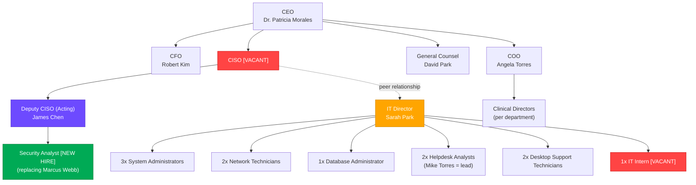

# Structured Environment Summary
## MedDefense Health Systems

---

## 1. Organization Overview

### Sites

| Site | Location Type | Function | Headcount | Key Details |
|------|---------------|----------|-----------|-------------|
| **MedDefense Central** | Downtown hospital | 350-bed acute care facility | ~1,400 | 6 floors + basement (server room); underground staff parking + surface visitor lot |
| **Westside Clinic** | Suburban | Outpatient services | ~180 | 2-story; 12 min from Central; shares some IT with Central but has local server closet |
| **Corporate HQ** | Greenfield Business Park | Administrative offices | ~220 | Leased 3rd floor of 5-story building; 15 min from Central; IT department located here |

**Organization-wide total:** ~2,000 employees

### Departments & Reporting Structure (Security-Relevant)

**Key structural issue:** James (security) has authority over security policy but NO authority over IT operations (Sarah Park). This creates operational friction.

## 2. IT Infrastructure Identified

### Servers

| Name | Location | OS | Function | Status/Concerns |
|------|----------|----|----------|-----------------|
| ehr-srv-01 | Central | Ubuntu 20.04 LTS | EHR Application Server | — |
| ehr-db-01 | Central | Ubuntu 20.04 LTS | EHR Database (PostgreSQL) | DB accessible from entire 10.10.0.0/16 range |
| pacs-srv-01 | Central | Windows Server 2016 | PACS Imaging Server | Shared account access ("raduser") |
| billing-srv-01 | Central | Ubuntu 18.04 LTS | Billing/Claims Processing | Performance issues, restarted frequently |
| ad-dc-01 | Central | Windows Server 2019 | Primary Domain Controller | — |
| ad-dc-02 | Central | Windows Server 2019 | Secondary Domain Controller | — |
| file-srv-01 | Central | Windows Server 2016 | Department File Shares | — |
| print-srv-01 | Central | Windows Server 2012 R2 | Print Server | **[CRITICAL]** End of support Oct 2023 |
| backup-srv-01 | Central | Ubuntu 22.04 LTS | Backup Server (Veeam agent) | Backs up to local NAS in same room/rack/network |
| web-srv-01 | Central | Ubuntu 20.04 LTS | Public Website + Patient Portal | In DMZ |
| ws-srv-01 | Westside | Windows Server 2016 | Local file server + scheduling | — |
| [UNCONFIRMED] | Westside | Unknown | Unknown | Marcus noted possible additional server |

### Network Equipment

| Device | Location | Model/Type | Concerns |
|--------|----------|------------|----------|
| Core Switch | Central | Cisco (model unknown) | — |
| Access Switches | Central | 2x Cisco per floor | — |
| Firewall | Central | Fortinet FortiGate 100F | — |
| Switch | Westside | Unmanaged (brand unknown) | **[CRITICAL]** Not suitable for medical facility |
| Router | Westside | Netgear Nighthawk (consumer-grade) | **[CRITICAL]** No firewall; handles site-to-site VPN |
| WiFi APs | Central | Ubiquiti UniFi (12 units) | Guest WiFi isolation unverified |
| WiFi APs | Westside | Unknown brand/model | — |
| HQ Network | HQ | Building landlord-managed VLAN | ACLs not yet audited |

### Endpoints

| Category | Location | Count | OS/Details | Verification Status |
|----------|----------|-------|------------|---------------------|
| Workstations | Central | ~320 | Windows 10 | Last AD report 8 months ago |
| Thin Clients | Central | ~60 | Unknown | Clinical areas |
| Workstations | Westside | ~45 | Windows 10 | — |
| Workstations | HQ | ~120 | Windows 10/11 | — |
| Laptops | HQ | ~30 | Remote-capable | — |
| iPads | Central | ~25 | Physicians for rounds | Management status unclear |

### Medical Devices (IoT)

| Device | Manufacturer | Quantity | Location | Critical Concerns |
|--------|--------------|----------|----------|-------------------|
| Patient Monitors | Philips IntelliVue | ~80 | Central | Network-connected, same broadcast domain as all systems |
| Infusion Pumps | BD Alaris | ~120 | Central | Network-connected for dosage updates; same network as everything |
| MRI Scanner | Siemens MAGNETOM | 1 | Central, Radiology | **[CRITICAL]** Runs Windows XP |
| CT Scanner | GE Revolution | 1 | Central | OS unknown |
| Nurse Call System | IP-based | Integrated | Central | Integrated with phone system |
| Badge/Access System | HID Global | Integrated | All sites | Connected to AD for some doors |

### Storage/Backup

| Component | Location | Details | Concerns |
|-----------|----------|---------|----------|
| NAS | Central, Server Room | Veeam backup target | Same rack, network, and room as production servers |
| Offsite/Cloud Backup | None deployed | Budget denied | Ransomware would wipe both production and backup |

---

## 3. Data and Services

### Types of Data Handled

| Data Category | Sensitivity | Systems Involved | Users |
|---------------|-------------|------------------|-------|
| Electronic Health Records (EHR) | PHI/Highly Confidential | ehr-srv-01, ehr-db-01 | Clinical staff across all departments |
| Medical Imaging | PHI/Highly Confidential | pacs-srv-01 | Radiology department |
| Billing/Insurance Claims | Financial + PHI | billing-srv-01 | Finance, billing staff |
| Department Files | Internal/PHI mixed | file-srv-01 | All departments |
| Patient Portal Data | PHI | web-srv-01 | Patients via public website |
| Authentication Credentials | Security-critical | ad-dc-01, ad-dc-02 | All authenticated users |
| Directory Information | Organizational | Active Directory | All staff |

### Critical Services Dependent on IT

| Service | Purpose | Dependency Level | Notes |
|---------|---------|------------------|-------|
| Emergency Department Operations | Life-critical patient care | **Mission-critical** | Cannot be interrupted |
| Surgical Procedures | Scheduled and emergency surgery | **Critical** | Requires access to patient data/imaging |
| Medication Administration | Infusion pump programming | **Critical** | Network-connected devices could be compromised |
| Patient Monitoring | ICU/ward monitoring | **Critical** | 80 connected monitors on same network |
| Billing & Insurance Claims | Revenue cycle | **Business-critical** | Previous ransomware attack affected this |
| Clinical Documentation | Daily EHR usage | **Operational-critical** | Used by all clinical staff |
| Medical Imaging Access | Diagnosis and treatment planning | **Critical** | Radiology relies on PACS |

### Security Services (Contracts)

| Vendor | Service | Annual Cost | Coverage Limitations |
|--------|---------|-------------|---------------------|
| Sophos | Endpoint Protection | $18,000 | Uncertainty if current on all machines |
| Veeam | Backup Software | $8,500 | — |
| Fortinet | FortiGate support | $4,200 | — |
| Microsoft | O365 E3 (org-wide) | $432,000 | Main cloud service |
| MedTech Solutions | EHR maintenance | $145,000 | Software updates only, 4hr critical SLA |
| ClearView Security | Guard service (Central) | $96,000 | Mon-Fri 7AM-7PM only; no night/weekend coverage; none at Westside or HQ |

---

## 4. Known Unknowns

### Confirmed Gaps & Ambiguities

| Category | Missing/Unknown Information | Impact |
|----------|-----------------------------|--------|
| **Asset Inventory** | Total accurate endpoint count | Numbers from 8-month-old AD report may be outdated |
| **Asset Inventory** | Exact number and status of iPads | Management status unclear; security implications unknown |
| **Asset Inventory** | Additional server at Westside Clinic | Marcus noted possibility but never confirmed |
| **Asset Inventory** | CT Scanner operating system | Unknown; medical device risk assessment incomplete |
| **Network Architecture** | Complete network diagram | Marcus's draft is acknowledged as "messier" in reality |
| **Network Architecture** | Guest WiFi actual isolation status | Marcus not convinced it's properly isolated |
| **Network Architecture** | HQ VPN ACLs configuration | Not yet audited |
| **Network Architecture** | Complete VLAN/segmentation plan | "Planned for next fiscal year" (was stated 4 months prior) |
| **Network Architecture** | Full scope of cloud services beyond O365 | Suspected but not inventoried |
| **Authentication** | MFA adoption status | Only James's personal account has MFA |
| **Authentication** | SSH key migration progress | Marcus only completed ehr-srv-01 before departure |
| **Authentication** | Full extent of shared accounts | Radiology PACS confirmed; others may exist |
| **Authentication** | Complete password policy effectiveness | 8-char/90-day/complexity in place but effectiveness unknown |
| **Physical Security** | Complete server room access control list | Generic badges used; who actually has access? |
| **Physical Security** | Surveillance camera placement | None in server room corridor; gaps unknown elsewhere |
| **Physical Security** | Westside server closet access controls | Door reportedly doesn't lock |
| **Endpoint Security** | Sophos antivirus deployment completeness | Uncertain if current on all ~530+ workstations |
| **Endpoint Security** | Thin client security posture | No details on hardening/configuration |
| **Endpoint Security** | iPad MDM enrollment status | Unclear if "managed" |
| **Compliance** | HIPAA formal assessment results | Legal claims compliance but has no evidence |
| **Compliance** | Full scope of PHI data flows | Not mapped end-to-end |
| **Incident Response** | Any post-January ransomware improvements | Response was improvised for 4 days |
| **Incident Response** | Full threat landscape analysis for healthcare | Marcus started but didn't complete |
| **Disaster Recovery** | Power failure contingency beyond UPS | UPS lasts ~20 minutes; no DR procedures |
| **Disaster Recovery** | Complete BCP/DRP documentation | None exists per Marcus's notes |
| **Third Party Risk** | Building landlord network security (HQ) | MedDefense has limited visibility/control |
| **Third Party Risk** | ISP connection details (Westside) | Consumer router handling business traffic |
| **Vendor Risk** | All departmental shadow IT/cloud usage | Only O365 confirmed |
| **Staffing** | Security knowledge/training levels across IT team | No formal security training mentioned |
| **Budget** | Approved security improvement budget | Previous budgets denied (offsite backup example) |
| **Timeline** | When previous statements were made ("next fiscal year" for segmentation) | Relative timing ambiguous |
| **Historical Incidents** | Full history beyond January ransomware attack | Marcus referenced "constant pushback" suggesting ongoing issues |

### Contradictions & Red Flags

| Item | Document A Says | Document B Says | Resolution Needed |
|------|-----------------|-----------------|-------------------|
| Westside Network Security | IT director said shares some IT services with Central | Marcus documented consumer-grade router with NO firewall | Which is accurate? |
| Print Server Verification | Listed as [UNVERIFIED] in asset list | Marcus mentions it specifically as Server 2012 R2 problem | Does it even exist/is it still in use? |
| Backup Security | Veeam contract exists | Marcus states offsite/cloud backup budget denied | Is backup actually protected or just local? |
| Security Coverage | Guard service contract listed | Marcus notes no night/weekend coverage; none at Westside/HQ | Is 14 hours/day/2 locations adequate for 24/7 operation? |
| Authority Lines | James hired for security program | James has policy authority but NOT IT operations authority | How are security decisions enforced? |

---

**Summary Assessment:** This environment represents a **high-risk security posture** typical of an organization transitioning from informal IT-based security to a dedicated security function. The flat network architecture, unpatched/unsupported systems, lack of MFA, inadequate physical security, and missing backup isolation create significant exposure for a healthcare organization handling highly sensitive PHI data. The Board's concern following the Change Healthcare breach is well-founded based on these findings.

*Note: As of my knowledge cutoff, the Change Healthcare breach occurred in early 2024, affecting healthcare organizations' billing and claims processing capabilities.*
