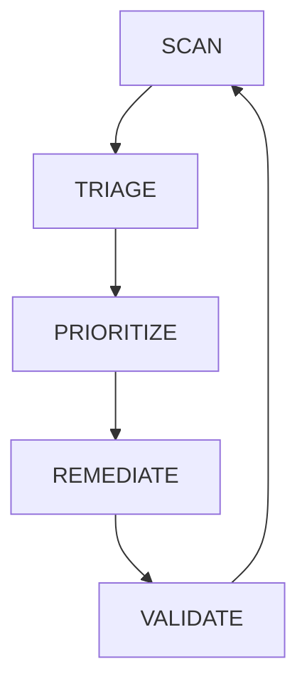

# 23. The Validation Plan
## Post-Remediation Verification and Continuous Monitoring Strategy

**Date:** July 21, 2026  
**Analyst:** Security Department  
**Document:** Project 1x02 — The Weak Links (Vulnerability Assessment Task 23)  

---

## 1. Post-Patch Verification

For the three critical "Immediate" remediations identified in Task 20 (Findings 001, 031, and 010), the following verification tests confirm effective patching within 48 hours of deployment.

| Finding | Remediation Action | Verification Test | Success Criteria | Validator |
|---------|-------------------|-------------------|------------------|-----------|
| **001** (Apache mod_lua RCE) | Upgrade Apache to 2.4.51+ on billing-srv-01 | Run version command: apache2 -v | Output shows version 2.4.51 or higher | IT Infrastructure |
| **001** (Apache mod_lua RCE) | Patch Deployment | Run authenticated OpenVAS scan on billing-srv-01 | CVE-2021-44790 no longer reported | Security Department |
| **001** (Apache mod_lua RCE) | Incident Response | Verify cryptominer processes are gone | No suspicious processes in top or ps aux | Security Department |
| **031** (Ghostcat) | Disable/restrict AJP port 8009 | Run netstat -tulpn | grep 8009 on ehr-srv-01 | Port 8009 listens only on 127.0.0.1 or is CLOSED | IT Infrastructure |
| **031** (Ghostcat) | Configuration Change | Attempt safe AJP exploit from clinical workstation | TCP connection refused or timeout from non-localhost | Security Department |
| **031** (Ghostcat) | File Check | Inspect server.xml for Connector comment tag | Connector element is commented out with <!-- --> | IT Infrastructure |
| **010** (BD Alaris Pumps) | Switch Port ACLs | Attempt SSH/Web access to pump IP from billing subnet | Access denied (TCP Reset) on port 80/22 | Network Engineering |
| **010** (BD Alaris Pumps) | ACL Configuration | Verify switch running config for applied ACLs | ACL name matches policy and is applied to correct ports | Network Engineering |
| **010** (BD Alaris Pumps) | Functional Test | Test from authorized Nursing Station | Web interface accessible and functional | Biomedical Engineering |

---

## 2. Compensating Control Validation

For compensating controls where the underlying vulnerability remains (medical devices on EOL OS), continuous validation ensures the network barrier is intact.

| Control | Target | Validation Method | Frequency | Validator |
|---------|--------|-------------------|-----------|-----------|
| **Medical Device VLAN Isolation** | WS-RAD-01 (MRI) | Nmap scan from Clinical Workstation VLAN targeting MRI IP | Weekly | Security Analyst |
| **Medical Device VLAN Isolation** | WS-RAD-01 (MRI) | Review switch port security logs for MAC address changes | Daily (Automated) | Network Operations |
| **Network ACLs** | BD Alaris Pumps | Packet capture on pump port for unauthorized traffic | Monthly | Security Analyst |
| **Zeek Sensor** | Medical Device VLAN | Check sensor uptime and alert logs | Daily (Dashboard) | Security Operations |
| **File Integrity Monitoring** | billing-srv-01 | Trigger test file change on critical config | Weekly Test Run | IT Infrastructure |

---

## 3. Rescan Schedule

MedDefense must move from annual or ad-hoc scanning to continuous assessment due to the flat network architecture and active compromise status.

| Asset Class | Scan Frequency | Tool | Justification |
|-------------|----------------|------|---------------|
| **Critical Servers** (Billing, EHR, DC) | Weekly | OpenVAS (Authenticated) | High value targets with active threats; weekly cadence detects regressions quickly. |
| **Medical Devices** | Monthly | OpenVAS (Unauthenticated) | Minimize disruption; validate ACLs and firmware versions monthly. |
| **Full Network** (10.10.0.0/16) | Monthly | OpenVAS (Authenticated) | Comprehensive baseline; ensures no new shadow IT or drift has occurred. |
| **Cloud Services** (O365) | Quarterly | CSPM / CASB Tool | External-facing environment requires different scanning frequency than internal LAN. |

**Justification:** The flat network amplifies risk by 6.6x to 12.0x. A vulnerability disclosed today could be weaponized tomorrow. Monthly scanning is insufficient for Tier 1 assets given the active cryptominer breach history. Weekly scanning of critical assets balances resource load with threat velocity.

---

## 4. Continuous Intelligence Integration

Vulnerability management must evolve from reactive scanning to proactive threat intelligence consumption.

| Source | Integration Method | Action | Owner |
|--------|--------------------|--------|-------|
| **CISA Known Exploited Vulnerabilities (KEV)** | Subscribe to weekly email digest; monitor NVD API | Within 24 hours of KEV addition, check asset inventory for affected systems and prioritize patching. | Security Analyst |
| **Vendor Advisories (BD, Philips, Microsoft)** | Set RSS alerts or vendor security mailing lists | Alert triggered on new bulletin for supported products (Apache, Ubuntu, Windows). | IT Infrastructure |
| **Exploit-DB / Metasploit** | Monitor via automated script or daily manual check | If a new exploit appears for an existing CVE on MedDefense assets, escalate priority to Immediate. | Security Analyst |
| **Threat Feed (Generic IOCs)** | Integrate with Zeek/Suricata sensors (Future Phase 1x03) | Alert on outbound C2 communication attempts matching threat intel indicators. | Security Operations |

**Workflow:** When a new threat alert is received:
1. Map CVE to MedDefense Asset Inventory (Task 1x00).
2. Assess Exploit Availability (Task T4 logic).
3. If Exploit = Available AND Asset = Critical, create High Priority Ticket (Task T16).
4. Remediation SLA is 7 days for High, 24 hours for Critical (Task T20).

---

## 5. Continuous Vulnerability Management Lifecycle

The vulnerability management process is a closed loop, not a linear project. Each phase has designated ownership to ensure accountability.

### Text-Based Lifecycle Flow

### Lifecycle Phase Details

| Phase | Action | Frequency | Responsible Party | Input Required | Output Produced |
|-------|--------|-----------|-------------------|----------------|-----------------|
| **SCAN** | Automated discovery of vulnerabilities, misconfigurations, and exposed services | Weekly (Critical), Monthly (All) | Security Analyst | Scanner credentials, asset list | Raw scan report |
| **TRIALGE** | Sort findings into Actionable Critical, Standard, Informational, False Positive | Daily | Security Department | Raw scan report | Triage classification |
| **PRIORITIZE** | Apply environmental CVSS contextualization (Asset Criticality, Kill Chain, Exploitability) | Weekly | Security Manager + IT Director | Triage output, Threat Intel | Priority-ranked list |
| **REMEDIATE** | Apply patches, change configurations, deploy compensating controls | SLA Dependent (24h-90d) | IT Infrastructure, Biomedical, Vendor | Priority list | Fixed systems |
| **VALIDATE** | Confirm fix effectiveness via rescan or manual test | Within 48h of Remediation | Security Department | Remediation tickets | Validation report |
| **INTEL INTEGRATION** | Monitor feeds for new threats impacting existing assets | Continuous | Security Analyst | CISA KEV, Vendor feeds | New alerts fed back to TRIAGE |

---

*Prepared by: Security Department*  
*References: Project 1x00 Asset Registry, Task 16 Triage, Task 17 CVSS Contextualizer, Task 20 Priority Matrix, NIST SP 800-40 Rev 3*  
*Classification: CONFIDENTIAL — INTERNAL USE ONLY*
