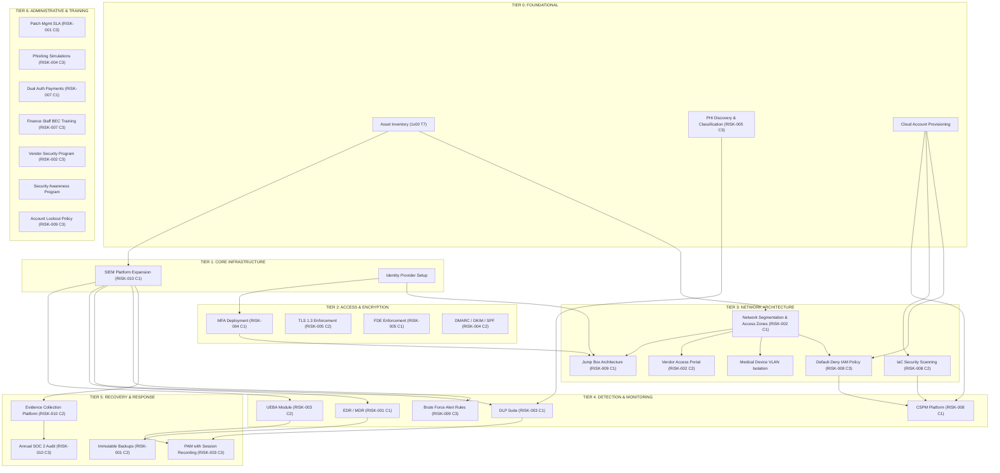

# 11. The Control Selection

## Goal

Select and justify specific security controls for each risk in the register, mapping every choice to CIS Controls and NIST CSF.

## Context

The Risk Register tells you WHAT risks exist. Now you decide WHAT to do about each one. Every control selected must satisfy three criteria: it must reduce the specific risk it targets (effectiveness), it must be affordable within the budget (efficiency), and it must map to a recognized framework so auditors can verify it (traceability).

---

## Control Selections

---

### RISK-001: Ransomware Encrypts EHR System

#### Control 1: Endpoint Detection and Response (EDR) Platform

| Field | Value |
|---|---|
| **Risk** | RISK-001 |
| **Selected Control** | Deploy EDR agent on all endpoints and servers with 24/7 managed detection and response (MDR) coverage |
| **CIS Control Mapping** | CIS v8 Control 10 (Malware Defenses), Safeguard 10.1 (Deploy Anti-Malware Software); CIS v8 Control 13 (Network Monitoring and Defense), Safeguard 13.1 (Centralize Network Traffic Logging) |
| **NIST CSF Mapping** | DE.CM-01 (Networks are monitored to detect potential cybersecurity events); DE.CM-04 (Malicious code is detected) |
| **Control Type** | Detective / Corrective |
| **Control Category** | Technical |
| **Implementation Cost** | $85,000/year (licensing + MDR subscription for ~400 endpoints) |
| **Expected Risk Reduction** | Reduces likelihood from 4 to 2 by detecting ransomware execution within minutes rather than hours; estimated ALE reduction of $1,050,000 |
| **Dependencies** | Requires SIEM platform (Control from RISK-010) for log aggregation and correlation; requires network segmentation (Control from RISK-002) to contain lateral spread |

#### Control 2: Immutable Offline Backup Solution

| Field | Value |
|---|---|
| **Risk** | RISK-001 |
| **Selected Control** | Implement air-gapped immutable backup with quarterly restoration testing for EHR and critical databases |
| **CIS Control Mapping** | CIS v8 Control 11 (Data Recovery), Safeguard 11.1 (Establish and Maintain a Data Recovery Process); Safeguard 11.2 (Perform Automated Backups); Safeguard 11.4 (Establish and Maintain an Isolated Recovery Environment) |
| **NIST CSF Mapping** | RC.RP-01 (Recovery plan is executed during or after a cybersecurity incident); PR.IP-04 (Backups of information are conducted, maintained, and tested) |
| **Control Type** | Corrective |
| **Control Category** | Operational / Technical |
| **Implementation Cost** | $45,000 upfront (hardware + software), $12,000/year ongoing (storage expansion, testing labor) |
| **Expected Risk Reduction** | Reduces impact from 5 to 3 by enabling recovery without paying ransom; estimated ALE reduction of $840,000 |
| **Dependencies** | None — can be implemented independently |

#### Control 3: Critical Patch Management SLA

| Field | Value |
|---|---|
| **Risk** | RISK-001 |
| **Selected Control** | Enforce 7-day patch SLA for critical CVEs (CVSS 9.0+) on all Windows servers and EHR infrastructure |
| **CIS Control Mapping** | CIS v8 Control 7 (Continuous Vulnerability Management), Safeguard 7.1 (Establish and Maintain a Vulnerability Management Process); Safeguard 7.3 (Remediate Detected Vulnerabilities) |
| **NIST CSF Mapping** | ID.RA-01 (Vulnerabilities are identified and documented); PR.IP-12 (A vulnerability management plan is developed and implemented) |
| **Control Type** | Preventive |
| **Control Category** | Operational |
| **Implementation Cost** | $25,000/year (patch management tool licensing + dedicated FTE allocation 0.25) |
| **Expected Risk Reduction** | Reduces likelihood from 4 to 2 by closing exploitable vectors before mass exploitation occurs; estimated ALE reduction of $420,000 |
| **Dependencies** | Requires vulnerability scanner from 1x02 to identify patches; requires asset inventory from 1x00 for coverage verification |

---

### RISK-002: Third-Party Vendor Breach Provides Lateral Access

#### Control 1: Network Segmentation with Access Zones

| Field | Value |
|---|---|
| **Risk** | RISK-002 |
| **Selected Control** | Implement VLAN segmentation dividing the network into clinical, administrative, vendor, guest, and medical device zones with inter-zone firewall policies |
| **CIS Control Mapping** | CIS v8 Control 12 (Network Infrastructure Management), Safeguard 12.4 (Establish and Maintain Architecture Diagram(s)); Safeguard 12.8 (Establish and Maintain a Network Architecture) |
| **NIST CSF Mapping** | PR.AC-05 (Network integrity is protected, incorporating network segregation where appropriate); PR.IP-01 (A baseline configuration of information technology/industrial control systems is created and maintained) |
| **Control Type** | Preventive / Compensating |
| **Control Category** | Technical |
| **Implementation Cost** | $60,000 upfront (firewall appliances, switch reconfiguration, engineering labor), $8,000/year maintenance |
| **Expected Risk Reduction** | Reduces impact from 5 to 3 by containing vendor breach blast radius to a single zone; estimated ALE reduction of $720,000 |
| **Dependencies** | Requires asset inventory from 1x00 to define zone membership; must be completed before medical device isolation (RISK-006 controls) and before EDR zone-based policies (RISK-001) |

#### Control 2: Vendor Access Lifecycle Management

| Field | Value |
|---|---|
| **Risk** | RISK-002 |
| **Selected Control** | Implement vendor access portal with jump box architecture, session recording, time-boxed access grants, and quarterly access recertification |
| **CIS Control Mapping** | CIS v8 Control 15 (Service Provider Management), Safeguard 15.1 (Establish and Maintain an Inventory of Service Providers); Safeguard 15.3 (Secure Service Provider Credentials); CIS v8 Control 6 (Access Control Management), Safeguard 6.8 (Define and Maintain Role-Based Access Control) |
| **NIST CSF Mapping** | PR.AC-01 (Identities and credentials are issued, managed, verified, revoked, and audited for authorized devices, users, and processes); PR.IP-09 (Supply chain risk management is integrated into the organizational risk management process) |
| **Control Type** | Preventive / Detective |
| **Control Category** | Technical / Administrative |
| **Implementation Cost** | $35,000 upfront (PAM solution licensing, jump box infrastructure), $15,000/year ongoing |
| **Expected Risk Reduction** | Reduces likelihood from 3 to 2 by eliminating standing vendor privileges and creating auditable access trail; estimated ALE reduction of $360,000 |
| **Dependencies** | Requires network segmentation (Control above) to enforce zone boundaries; requires SIEM for session log forwarding |

#### Control 3: Vendor Security Assessment Program

| Field | Value |
|---|---|
| **Risk** | RISK-002 |
| **Selected Control** | Establish annual vendor security questionnaire program using standardized assessment (SIG or equivalent) with risk-tiered review cycles |
| **CIS Control Mapping** | CIS v8 Control 15 (Service Provider Management), Safeguard 15.2 (Establish and Maintain a Service Provider Management Policy); Safeguard 15.4 (Secure Service Provider Access) |
| **NIST CSF Mapping** | GV.SC-01 (Cybersecurity supply chain risk management strategy is established and communicated); GV.SC-05 (Cybersecurity requirements are integrated into supplier contracts) |
| **Control Type** | Preventive |
| **Control Category** | Administrative |
| **Implementation Cost** | $8,000/year (questionnaire platform license + analyst time) |
| **Expected Risk Reduction** | Reduces likelihood from 3 to 2 by identifying high-risk vendors before granting access; estimated ALE reduction of $180,000 |
| **Dependencies** | Requires vendor inventory from 1x00 T8; feeds into contract renewal decisions |

---

### RISK-003: Insider Threat Exfiltrates PHI

#### Control 1: Data Loss Prevention (DLP) Suite

| Field | Value |
|---|---|
| **Risk** | RISK-003 |
| **Selected Control** | Deploy DLP across email gateway, endpoints, and cloud storage with PHI-specific content rules and blocking policies |
| **CIS Control Mapping** | CIS v8 Control 3 (Data Protection), Safeguard 3.1 (Establish and Maintain a Data Management Process); Safeguard 3.3 (Configure Data Access Control Lists); Safeguard 3.9 (Enforce Data Retention) |
| **NIST CSF Mapping** | PR.DS-01 (Data-at-rest is protected); PR.DS-02 (Data-in-transit is protected); DE.CM-07 (Monitoring for unauthorized personnel, connections, devices, and software is performed) |
| **Control Type** | Preventive / Detective |
| **Control Category** | Technical |
| **Implementation Cost** | $55,000 upfront (licensing + deployment), $28,000/year ongoing |
| **Expected Risk Reduction** | Reduces impact from 4 to 3 by blocking bulk exfiltration attempts and alerting on anomalous transfers; estimated ALE reduction of $237,500 |
| **Dependencies** | Requires PHI data classification to define content rules; requires SIEM for alert aggregation |

#### Control 2: User and Entity Behavior Analytics (UEBA)

| Field | Value |
|---|---|
| **Risk** | RISK-003 |
| **Selected Control** | Deploy UEBA module integrated with SIEM to establish baseline access patterns and flag anomalies (off-hours access, unusual record volumes, privilege escalation) |
| **CIS Control Mapping** | CIS v8 Control 8 (Audit Log Management), Safeguard 8.1 (Establish and Maintain an Audit Log Management Process); CIS v8 Control 13 (Network Monitoring and Defense), Safeguard 13.4 (Deploy a Host-Based Intrusion Detection/Analysis System) |
| **NIST CSF Mapping** | DE.AE-02 (Detected events are analyzed to understand attack targets and methods); DE.AE-03 (Information is correlated from multiple sources) |
| **Control Type** | Detective |
| **Control Category** | Technical |
| **Implementation Cost** | $30,000/year (UEBA module add-on to existing SIEM) |
| **Expected Risk Reduction** | Reduces likelihood from 3 to 2 by cutting average detection time from 24 months to under 30 days; estimated ALE reduction of $316,667 |
| **Dependencies** | Requires SIEM platform (Control from RISK-010) for log ingestion; requires audit log management policy defining what events are logged |

#### Control 3: Privileged Access Management (PAM) with Session Recording

| Field | Value |
|---|---|
| **Risk** | RISK-003 |
| **Selected Control** | Deploy PAM solution with credential vaulting, just-in-time access elevation, and full session recording for all privileged accounts |
| **CIS Control Mapping** | CIS v8 Control 5 (Account Management), Safeguard 5.4 (Restrict Administrator Privileges to Dedicated Accounts); CIS v8 Control 6 (Access Control Management), Safeguard 6.7 (Implement Password Managers) |
| **NIST CSF Mapping** | PR.AC-01 (Identities and credentials are issued, managed, verified, revoked, and audited); PR.AC-04 (Access permissions and authorizations are managed) |
| **Control Type** | Preventive / Detective |
| **Control Category** | Technical |
| **Implementation Cost** | $40,000 upfront (PAM licensing + implementation), $18,000/year ongoing |
| **Expected Risk Reduction** | Reduces likelihood from 3 to 2 by eliminating standing privileged access; estimated ALE reduction of $158,333 |
| **Dependencies** | Shares infrastructure with vendor access jump boxes (RISK-002 Control 2); requires Active Directory integration |

---

### RISK-004: Credential Compromise via Phishing

#### Control 1: Mandatory Multi-Factor Authentication (MFA)

| Field | Value |
|---|---|
| **Risk** | RISK-004 |
| **Selected Control** | Deploy phishing-resistant MFA (FIDO2 hardware tokens for admin accounts, authenticator app push for general users) across email, VPN, EHR, and all administrative portals |
| **CIS Control Mapping** | CIS v8 Control 6 (Access Control Management), Safeguard 6.3 (Require MFA for Remote Access); Safeguard 6.4 (Require MFA for Administrative Access); Safeguard 6.5 (Require MFA for All Access to Data Repositories) |
| **NIST CSF Mapping** | PR.AC-07 (Users, devices, and other assets are authenticated, as appropriate, to the security of the asset); PR.AC-01 (Identities and credentials are issued, managed, verified, revoked, and audited) |
| **Control Type** | Preventive |
| **Control Category** | Technical |
| **Implementation Cost** | $22,000 upfront (FIDO2 tokens for 40 admins, licensing for general MFA), $14,000/year ongoing |
| **Expected Risk Reduction** | Reduces likelihood from 5 to 2 by rendering stolen credentials alone insufficient for access; estimated ALE reduction of $900,000 |
| **Dependencies** | Requires identity provider (Azure AD or equivalent) configured for conditional access; user enrollment campaign required |

#### Control 2: Advanced Email Security Gateway

| Field | Value |
|---|---|
| **Risk** | RISK-004 |
| **Selected Control** | Deploy cloud email security gateway with sandbox detonation, DMARC enforcement, and external email warning banners |
| **CIS Control Mapping** | CIS v8 Control 9 (Email and Web Browser Protections), Safeguard 9.1 (Ensure Use of Only Fully Supported Browsers and Email Clients); Safeguard 9.4 (Apply Domain-Based Message Authentication); Safeguard 9.6 (Ensure Use of Encrypted Protocols) |
| **NIST CSF Mapping** | PR.DS-02 (Data-in-transit is protected); DE.CM-03 (Personnel activity is monitored to detect potential cybersecurity events) |
| **Control Type** | Preventive / Detective |
| **Control Category** | Technical |
| **Implementation Cost** | $18,000/year (email security gateway subscription) |
| **Expected Risk Reduction** | Reduces likelihood from 5 to 3 by blocking known phishing infrastructure and detonating suspicious attachments; estimated ALE reduction of $300,000 |
| **Dependencies** | Requires DNS control to implement DMARC, DKIM, and SPF records |

#### Control 3: Security Awareness and Phishing Simulation Program

| Field | Value |
|---|---|
| **Risk** | RISK-004 |
| **Selected Control** | Implement quarterly phishing simulation campaigns with automated remedial training for clickers and annual security awareness training covering current threat landscape |
| **CIS Control Mapping** | CIS v8 Control 14 (Security Awareness and Skills Training), Safeguard 14.1 (Establish and Maintain a Security Awareness Program); Safeguard 14.6 (Train Personnel on Recognizing and Reporting Social Engineering Attacks) |
| **NIST CSF Mapping** | PR.AT-01 (Personnel are provided security awareness and training); PR.AT-02 (Personnel are trained to perform their cybersecurity-related duties) |
| **Control Type** | Preventive |
| **Control Category** | Administrative |
| **Implementation Cost** | $12,000/year (simulation platform + training content licensing) |
| **Expected Risk Reduction** | Reduces likelihood from 5 to 4 by decreasing click-through rate from industry average of 18% to below 5%; estimated ALE reduction of $150,000 |
| **Dependencies** | None — can be implemented independently |

---

### RISK-005: HIPAA Violation from Unprotected PHI Transmission

#### Control 1: Full-Disk Encryption (FDE) Enforcement

| Field | Value |
|---|---|
| **Risk** | RISK-005 |
| **Selected Control** | Deploy FDE across all endpoints (laptops, workstations) and server volumes using BitLocker or equivalent with centralized key management |
| **CIS Control Mapping** | CIS v8 Control 3 (Data Protection), Safeguard 3.6 (Encrypt Data on End-User Computing Devices); Safeguard 3.10 (Encrypt Data on Removable Media) |
| **NIST CSF Mapping** | PR.DS-01 (Data-at-rest is protected); PR.IP-01 (A baseline configuration of information technology is created and maintained) |
| **Control Type** | Preventive |
| **Control Category** | Technical |
| **Implementation Cost** | $15,000 upfront (MBAM or equivalent licensing + deployment labor), $5,000/year ongoing |
| **Expected Risk Reduction** | Reduces impact from 4 to 3 by ensuring physical device loss does not result in PHI exposure; estimated ALE reduction of $700,000 |
| **Dependencies** | Requires TPM-enabled hardware on endpoints; requires key escrow infrastructure |

#### Control 2: TLS 1.3 Enforcement and Legacy Protocol Deprecation

| Field | Value |
|---|---|
| **Risk** | RISK-005 |
| **Selected Control** | Enforce TLS 1.3 across all internal and external communications; disable TLS 1.0/1.1 and deprecated cipher suites on all servers, applications, and network devices |
| **CIS Control Mapping** | CIS v8 Control 3 (Data Protection), Safeguard 3.10 (Encrypt Data on Removable Media); CIS v8 Control 4 (Secure Configuration of Enterprise Assets and Software), Safeguard 4.5 (Implement Automated Configuration Management for Software on Enterprise Assets) |
| **NIST CSF Mapping** | PR.DS-02 (Data-in-transit is protected); PR.IP-01 (A baseline configuration of information technology is created and maintained) |
| **Control Type** | Preventive |
| **Control Category** | Technical |
| **Implementation Cost** | $10,000 (engineering labor for configuration migration and compatibility testing) |
| **Expected Risk Reduction** | Reduces likelihood from 4 to 2 by eliminating protocol downgrade and man-in-the-middle attack vectors; estimated ALE reduction of $1,400,000 |
| **Dependencies** | Requires application compatibility testing to avoid breaking legacy integrations; requires coordination with EHR vendor |

#### Control 3: PHI Discovery and Classification Engine

| Field | Value |
|---|---|
| **Risk** | RISK-005 |
| **Selected Control** | Deploy automated data discovery tool to scan file shares, databases, and cloud repositories to identify and tag all PHI locations |
| **CIS Control Mapping** | CIS v8 Control 3 (Data Protection), Safeguard 3.1 (Establish and Maintain a Data Management Process); Safeguard 3.2 (Establish and Maintain a Data Inventory); Safeguard 3.3 (Configure Data Access Control Lists) |
| **NIST CSF Mapping** | ID.AM-05 (Assets are formally managed throughout removal, transfers, and disposition); ID.AM-08 (Systems, hardware, software, and services are inventoried) |
| **Control Type** | Detective |
| **Control Category** | Technical / Administrative |
| **Implementation Cost** | $20,000 upfront (discovery tool licensing + initial scan), $10,000/year ongoing |
| **Expected Risk Reduction** | Reduces likelihood from 4 to 3 by eliminating blind spots in PHI storage that could be transmitted unencrypted; estimated ALE reduction of $350,000 |
| **Dependencies** | Feeds DLP policy rules (RISK-003 Control 1); requires asset inventory for scan scope definition |

---

### RISK-007: Business Email Compromise Results in Fraudulent Wire Transfer

#### Control 1: Dual Authorization Payment Workflow

| Field | Value |
|---|---|
| **Risk** | RISK-007 |
| **Selected Control** | Implement mandatory dual-authorization workflow for all payments exceeding $10,000 with independent verification by a second approver using out-of-band communication |
| **CIS Control Mapping** | CIS v8 Control 5 (Account Management), Safeguard 5.4 (Restrict Administrator Privileges to Dedicated Accounts); CIS v8 Control 6 (Access Control Management), Safeguard 6.8 (Define and Maintain Role-Based Access Control) |
| **NIST CSF Mapping** | PR.AC-04 (Access permissions and authorizations are managed); PR.IP-01 (A baseline configuration of information technology is created and maintained incorporating separation of duties) |
| **Control Type** | Preventive |
| **Control Category** | Administrative |
| **Implementation Cost** | $5,000 (workflow configuration in accounting system + policy development) |
| **Expected Risk Reduction** | Reduces likelihood from 4 to 1 by requiring human verification that defeats email-only social engineering; estimated ALE reduction of $562,500 |
| **Dependencies** | Requires finance department policy update and staff training |

#### Control 2: DMARC Enforcement and Domain Brand Protection

| Field | Value |
|---|---|
| **Risk** | RISK-007 |
| **Selected Control** | Implement DMARC reject policy on MedDefense email domains with SPF and DKIM alignment; register lookalike domains defensively |
| **CIS Control Mapping** | CIS v8 Control 9 (Email and Web Browser Protections), Safeguard 9.4 (Apply Domain-Based Message Authentication) |
| **NIST CSF Mapping** | PR.DS-02 (Data-in-transit is protected); DE.CM-03 (Personnel activity is monitored to detect potential cybersecurity events) |
| **Control Type** | Preventive |
| **Control Category** | Technical |
| **Implementation Cost** | $3,000/year (domain registration for defensive purchases + DNS hosting) |
| **Expected Risk Reduction** | Reduces likelihood from 4 to 3 by preventing domain spoofing that enables BEC impersonation; estimated ALE reduction of $187,500 |
| **Dependencies** | Requires DNS administrative access; shares DNS configuration with RISK-004 email gateway control |

#### Control 3: Finance Staff BEC-Specific Awareness Training

| Field | Value |
|---|---|
| **Risk** | RISK-007 |
| **Selected Control** | Deliver targeted BEC awareness training to all finance staff covering invoice fraud, CEO impersonation, and urgency/secrecy red flags with monthly micro-learning modules |
| **CIS Control Mapping** | CIS v8 Control 14 (Security Awareness and Skills Training), Safeguard 14.1 (Establish and Maintain a Security Awareness Program); Safeguard 14.6 (Train Personnel on Recognizing and Reporting Social Engineering Attacks) |
| **NIST CSF Mapping** | PR.AT-01 (Personnel are provided security awareness and training) |
| **Control Type** | Preventive |
| **Control Category** | Administrative |
| **Implementation Cost** | $2,000/year (targeted training content licensing) |
| **Expected Risk Reduction** | Reduces likelihood from 4 to 3 by improving recognition of BEC social engineering patterns; estimated ALE reduction of $93,750 |
| **Dependencies** | None — can be implemented independently |

---

### RISK-008: Cloud Misconfiguration Exposes Patient Data

#### Control 1: Cloud Security Posture Management (CSPM) Platform

| Field | Value |
|---|---|
| **Risk** | RISK-008 |
| **Selected Control** | Deploy CSPM tool across all cloud subscriptions with real-time configuration scanning, automated remediation playbooks, and drift detection alerts |
| **CIS Control Mapping** | CIS v8 Control 4 (Secure Configuration of Enterprise Assets and Software), Safeguard 4.1 (Establish and Maintain a Secure Configuration Process); Safeguard 4.5 (Implement Automated Configuration Management for Software on Enterprise Assets) |
| **NIST CSF Mapping** | DE.CM-01 (Networks are monitored to detect potential cybersecurity events); DE.CM-07 (Monitoring for unauthorized personnel, connections, devices, and software is performed) |
| **Control Type** | Detective / Preventive |
| **Control Category** | Technical |
| **Implementation Cost** | $24,000/year (CSPM platform subscription based on cloud resource count) |
| **Expected Risk Reduction** | Reduces likelihood from 3 to 1 by catching misconfigurations within minutes rather than weeks; estimated ALE reduction of $593,333 |
| **Dependencies** | Requires cloud administrator access and API integration with cloud providers |

#### Control 2: Infrastructure as Code (IaC) Security Scanning

| Field | Value |
|---|---|
| **Risk** | RISK-008 |
| **Selected Control** | Integrate IaC security scanning (Terraform, ARM template validation) into CI/CD pipeline with blocking gates for high-severity findings |
| **CIS Control Mapping** | CIS v8 Control 4 (Secure Configuration of Enterprise Assets and Software), Safeguard 4.5 (Implement Automated Configuration Management); CIS v8 Control 16 (Application Software Security), Safeguard 16.1 (Establish and Maintain a Secure Software Development Life Cycle) |
| **NIST CSF Mapping** | PR.IP-01 (A baseline configuration of information technology is created and maintained); PR.IP-12 (A vulnerability management plan is developed and implemented) |
| **Control Type** | Preventive |
| **Control Category** | Technical |
| **Implementation Cost** | $8,000/year (IaC scanner licensing + pipeline integration labor amortized) |
| **Expected Risk Reduction** | Reduces likelihood from 3 to 2 by preventing misconfigured infrastructure from reaching production; estimated ALE reduction of $296,667 |
| **Dependencies** | Requires existing CI/CD pipeline; requires IaC adoption for cloud provisioning |

#### Control 3: Default-Deny IAM Policy Framework

| Field | Value |
|---|---|
| **Risk** | RISK-008 |
| **Selected Control** | Establish default-deny IAM policy framework where all permissions require explicit grant with documented justification and 90-day expiration |
| **CIS Control Mapping** | CIS v8 Control 6 (Access Control Management), Safeguard 6.1 (Establish and Maintain an Access Granting/Revoking Process); Safeguard 6.8 (Define and Maintain Role-Based Access Control) |
| **NIST CSF Mapping** | PR.AC-04 (Access permissions and authorizations are managed); PR.AC-01 (Identities and credentials are issued, managed, verified, revoked, and audited) |
| **Control Type** | Preventive |
| **Control Category** | Administrative / Technical |
| **Implementation Cost** | $4,000 (policy development + initial IAM audit and cleanup) |
| **Expected Risk Reduction** | Reduces impact from 4 to 3 by limiting blast radius of any compromised cloud credential; estimated ALE reduction of $222,500 |
| **Dependencies** | Requires CSPM (Control above) to monitor for policy violations; integrates with vendor access lifecycle (RISK-002 Control 2) |

---

### RISK-009: Ransomware via RDP Attack on Billing Infrastructure

#### Control 1: Remove Public RDP Exposure and Deploy Jump Box Architecture

| Field | Value |
|---|---|
| **Risk** | RISK-009 |
| **Selected Control** | Remove all RDP endpoints from public internet; deploy hardened jump box servers with MFA in a restricted management VLAN for all remote administration |
| **CIS Control Mapping** | CIS v8 Control 12 (Network Infrastructure Management), Safeguard 12.4 (Establish and Maintain Architecture Diagram(s)); CIS v8 Control 4 (Secure Configuration), Safeguard 4.1 (Establish and Maintain a Secure Configuration Process) |
| **NIST CSF Mapping** | PR.AC-05 (Network integrity is protected, incorporating network segregation where appropriate); PR.AC-01 (Identities and credentials are managed) |
| **Control Type** | Preventive |
| **Control Category** | Technical |
| **Implementation Cost** | $18,000 upfront (jump box hardware/VMs, firewall rule reconfiguration, hardening labor), $3,000/year maintenance |
| **Expected Risk Reduction** | Reduces likelihood from 4 to 1 by eliminating direct internet exposure of RDP; estimated ALE reduction of $825,000 |
| **Dependencies** | Requires MFA infrastructure (Control from RISK-004); requires network segmentation (Control from RISK-002) for management VLAN isolation |

#### Control 2: Conditional Access Policies for Remote Administration

| Field | Value |
|---|---|
| **Risk** | RISK-009 |
| **Selected Control** | Implement conditional access policies restricting remote administration to managed/compliant devices only, during defined business hours, from approved IP ranges |
| **CIS Control Mapping** | CIS v8 Control 6 (Access Control Management), Safeguard 6.3 (Require MFA for Remote Access); CIS v8 Control 12 (Network Infrastructure Management), Safeguard 12.1 (Ensure Network Infrastructure is Up-to-Date) |
| **NIST CSF Mapping** | PR.AC-05 (Network integrity is protected); PR.AC-07 (Users, devices, and other assets are authenticated) |
| **Control Type** | Preventive |
| **Control Category** | Technical |
| **Implementation Cost** | $5,000 (policy development + identity provider configuration) |
| **Expected Risk Reduction** | Reduces likelihood from 4 to 2 by adding context-aware restrictions on top of jump box architecture; estimated ALE reduction of $275,000 |
| **Dependencies** | Requires identity provider (Azure AD or equivalent); requires device compliance/intune enrollment; depends on jump box deployment (Control above) |

#### Control 3: Account Lockout and Brute Force Protection

| Field | Value |
|---|---|
| **Risk** | RISK-009 |
| **Selected Control** | Enforce account lockout policy (5 failed attempts triggers 30-minute lockout) and deploy SIEM rules to alert on distributed brute-force patterns |
| **CIS Control Mapping** | CIS v8 Control 5 (Account Management), Safeguard 5.2 (Establish and Maintain an Account Audit Log Review Process); CIS v8 Control 8 (Audit Log Management), Safeguard 8.4 (Collect Detailed Audit Logs) |
| **NIST CSF Mapping** | DE.CM-01 (Networks are monitored to detect potential cybersecurity events); PR.AC-01 (Identities and credentials are managed) |
| **Control Type** | Preventive / Detective |
| **Control Category** | Technical |
| **Implementation Cost** | $2,000 (Group Policy engineering + SIEM rule development) |
| **Expected Risk Reduction** | Reduces likelihood from 4 to 3 by slowing automated credential attacks and providing early warning; estimated ALE reduction of $137,500 |
| **Dependencies** | Requires SIEM platform (Control from RISK-010); requires Active Directory Group Policy authority |

---

### RISK-010: SOC 2 Compliance Failure Loses Key Contracts

#### Control 1: SIEM Platform Expansion

| Field | Value |
|---|---|
| **Risk** | RISK-010 |
| **Selected Control** | Expand SIEM platform to ingest logs from all in-scope systems (EHR, billing, Active Directory, firewalls, cloud, endpoints) with 7-year retention and real-time correlation rules |
| **CIS Control Mapping** | CIS v8 Control 8 (Audit Log Management), Safeguard 8.1 (Establish and Maintain an Audit Log Management Process); Safeguard 8.2 (Collect Audit Logs); Safeguard 8.3 (Ensure Adequate Audit Log Storage); Safeguard 8.5 (Collect Alerts and Incidents) |
| **NIST CSF Mapping** | DE.AE-03 (Information is correlated from multiple sources); DE.CM-01 (Networks are monitored); DE.CM-05 (Unauthorized software is detected on network infrastructure) |
| **Control Type** | Detective |
| **Control Category** | Technical |
| **Implementation Cost** | $65,000 upfront (SIEM licensing expansion, log forwarders, storage), $35,000/year ongoing (data ingestion costs, maintenance) |
| **Expected Risk Reduction** | Reduces likelihood from 3 to 1 by satisfying SOC 2 CC7.2 monitoring requirements; enables detection controls for multiple other risks; estimated ALE reduction of $1,666,667 |
| **Dependencies** | This is a foundational control — it must be deployed before UEBA (RISK-003), EDR correlation (RISK-001), brute force alerts (RISK-009), and vendor session monitoring (RISK-002) |

#### Control 2: Automated Control Evidence Collection Platform

| Field | Value |
|---|---|
| **Risk** | RISK-010 |
| **Selected Control** | Deploy compliance evidence collection platform that automatically gathers control artifacts (access reviews, patch status, config baselines, log integrity) for SOC 2 audit readiness |
| **CIS Control Mapping** | CIS v8 Control 8 (Audit Log Management), Safeguard 8.2 (Collect Audit Logs); CIS v8 Control 1 (Inventory and Control of Enterprise Assets), Safeguard 1.1 (Establish and Maintain Detailed Enterprise Asset Inventory) |
| **NIST CSF Mapping** | ID.AM-01 (Inventories exist for all hardware assets); PR.IP-01 (A baseline configuration of information technology is created and maintained); DE.AE-03 (Information is correlated from multiple sources) |
| **Control Type** | Detective / Corrective |
| **Control Category** | Technical / Administrative |
| **Implementation Cost** | $30,000/year (compliance automation platform subscription) |
| **Expected Risk Reduction** | Reduces likelihood from 3 to 2 by eliminating manual evidence gaps that caused prior audit findings; estimated ALE reduction of $833,333 |
| **Dependencies** | Requires SIEM platform (Control above) as primary data source; requires asset inventory for scope definition |

#### Control 3: Annual Third-Party SOC 2 Type II Audit

| Field | Value |
|---|---|
| **Risk** | RISK-010 |
| **Selected Control** | Engage qualified CPA firm to conduct annual SOC 2 Type II audit covering Trust Services Criteria (Security, Availability, Confidentiality) |
| **CIS Control Mapping** | CIS v8 Control 17 (Incident Response Management), Safeguard 17.1 (Designate Personnel to Manage Incident Handling); CIS v8 Control 18 (Penetration Testing), Safeguard 18.1 (Establish and Maintain a Penetration Testing Program) |
| **NIST CSF Mapping** | GV.PO-01 (Cybersecurity roles and responsibilities are established and communicated); ID.RA-01 (Vulnerabilities are identified); RS.CO-04 (Coordination with stakeholders occurs) |
| **Control Type** | Detective |
| **Control Category** | Administrative |
| **Implementation Cost** | $45,000/year (external auditor fees based on organizational scope) |
| **Expected Risk Reduction** | Reduces likelihood from 3 to 2 by providing independent validation of control effectiveness; estimated ALE reduction of $416,667 |
| **Dependencies** | Requires evidence collection platform (Control above) for audit readiness; requires all mapped controls in this document to be operational |

---

## Control Dependency Map

The following text diagram shows the implementation sequence and dependencies between controls across all risk treatments. Controls must be deployed in left-to-right reading order within each tier. Controls in the same tier can be deployed in parallel.

### Dependency Notes

**Critical Path:** Asset Inventory → SIEM Platform → Network Segmentation → EDR/UEBA/DLP → Immutable Backups. This path defines the minimum viable sequence for maximum risk reduction. Any delay in Tier 0 or Tier 1 cascades delays through all subsequent tiers.

**Parallel Tracks:** Once the SIEM (Tier 1) and Identity Provider (Tier 1) are in place, the encryption track (TLS, FDE, DMARC) and the access track (MFA, Patch SLA) can proceed independently and in parallel with the network segmentation track.

**SIEM as Bottleneck:** The SIEM platform expansion (RISK-010 C1) is the single most critical dependency. UEBA, EDR correlation, brute force detection, vendor session recording, and compliance evidence collection all depend on it. Delays here block seven downstream controls across five risks.

**Network Segmentation as Gatekeeper:** Medical device isolation (supporting RISK-006 transfer treatment), jump box architecture (RISK-009), vendor access zoning (RISK-002), and EDR zone-based policies (RISK-001) all require the segmentation foundation (RISK-002 C1) to be completed first.
