# MEDDEFENSE HEALTH SYSTEMS
## SECURITY STRATEGY DOCUMENT

**Document ID:** STRAT-SEC-001  
**Version:** 1.0  
**Date:** July 22, 2026  
**Prepared For:** MedDefense Board of Directors  
**Prepared By:** James Chen, CISO  
**Review Date:** Annual (July 2027)

---

## 1. EXECUTIVE SUMMARY

MedDefense Health Systems currently operates at **HIGH residual risk** due to a flat network architecture, insufficient endpoint protection, lack of multi-factor authentication, and limited vulnerability management capabilities. Recent threat landscape analysis identified 5 critical kill chains, with ransomware via RDP and phishing representing the highest probability threats to clinical continuity and patient data integrity.

Our strategic approach adopts the **NIST Cybersecurity Framework** as the organizing structure, supplemented by **CIS Controls v8** for specific technical implementation priorities. The framework enables alignment with healthcare sector standards (HIPAA Security Rule, HICPAA) while providing measurable maturity targets.

**Total Investment Requested: $732,000 over 6 months** (Year 1 budget allocation) plus **$350,000 annual ongoing operations**. Expected outcome: Reduce inherent risk scores by 50-70% across all top 10 risks, achieving MEDIUM residual risk posture within 6 months and LOW for 3 key risks (RISK-004, RISK-007, RISK-009).

**Top 3 Priority Actions:**
1. **Disable public RDP exposure** on billing-srv-01 (immediate, 1-day implementation, 90% risk reduction on RISK-009)
2. **Deploy EDR/MDR platform** with 24/7 monitoring ($85,000/year, reduces ransomware likelihood from 4 to 2)
3. **Implement network segmentation** into 5 zones ($60,000 upfront, disrupts 72% of attack steps across top 5 kill chains)

This strategy represents the minimum viable security baseline for a healthcare organization of our size serving 15,000+ patients monthly. Delay increases breach probability by 15% per quarter based on industry threat velocity metrics.

---

## 2. GOVERNANCE FRAMEWORK

### 2.1 Framework Selection Rationale

MedDefense evaluated three frameworks during the posture assessment (1x00): ISO 27001, NIST CSF, and CIS Controls. NIST CSF was selected because it provides **outcome-based guidance** aligned with healthcare regulatory requirements (HIPAA §164.308), accommodates our existing IT infrastructure without requiring wholesale architecture changes, and enables **measurable maturity progression** through Current vs Target profiles. CIS Controls supplements NIST CSF by specifying exact technical implementations in priority order, enabling our team to focus on highest-impact activities first.

### 2.2 NIST CSF Current vs Target Profile

| NIST Function | Current Maturity | Target Maturity (6 Months) | Gap |
|--------------|------------------|----------------------------|-----|
| **IDENTIFY** | Level 1 (Ad Hoc) | Level 2 (Repeatable) | Asset inventory exists but is not actively maintained; risk assessment is reactive |
| **PROTECT** | Level 1 (Ad Hoc) | Level 3 (Defined) | MFA absent on critical systems; no endpoint detection; encryption inconsistent |
| **DETECT** | Level 1 (Ad Hoc) | Level 2 (Repeatable) | No SIEM aggregation; zero 24/7 monitoring capability |
| **RESPOND** | Level 1 (Ad Hoc) | Level 2 (Repeatable) | Incident response plan exists but untested; contact tree outdated |
| **RECOVER** | Level 2 (Repeatable) | Level 3 (Defined) | Backups exist but are not immutable; recovery testing quarterly goal not met |

### 2.3 CIS Controls Maturity Scorecard

| Implementation Group | Current Score | Target Score | Key Milestones |
|---------------------|---------------|--------------|----------------|
| **IG1 (Basic Hygiene)** | 45% | 85% | MFA deployment, account lockout policy, USB blocking, firewall enablement |
| **IG2 (Foundational)** | 20% | 60% | EDR platform, SIEM expansion, vulnerability management SLA, email gateway |
| **IG3 (Advanced)** | 5% | 30% | Network segmentation, PAM vault, DLP suite, UEBA (Year 2) |

### 2.4 Governance Structure and Roles

| Role | Responsibility | Decision Authority |
|------|----------------|-------------------|
| **Board of Directors** | Oversees cybersecurity investment, approves risk appetite statement | Accept risks scoring 16+, approve $500K+ expenditures |
| **CISO** | Manages security program execution, monitors KRIs, chairs Security Steering Committee | Accept risks scoring 12-15, allocate budget within approved envelope |
| **CIO** | Implements technical controls, manages vendor relationships, executes segmentation | Approves architecture changes, manages IT infrastructure budget |
| **CFO** | Reviews cost-benefit analysis, approves ALE justification for investments | Validates budget requests, participates in RISK-006 acceptance |
| **Chief Medical Officer** | Ensures clinical safety priorities, validates medical device risk decisions | Leads RISK-006 treatment decisions, signs off on clinical workflow impacts |
| **Compliance Officer** | Verifies HIPAA/SOC 2 control alignment, prepares for audits | Approves data handling policies, validates regulatory compliance claims |
| **Security Steering Committee** | Monthly review of risk register, KRI breaches, incident trends | Recommends risk acceptance to CISO/CFO, escalates critical issues to Board |

---

## 3. QUANTITATIVE RISK ANALYSIS

### 3.1 Top 5 Risks by ALE

| Rank | Risk ID | Risk Description | Inherent Risk Score | ALE (Annual Loss Expectancy) |
|------|---------|------------------|---------------------|------------------------------|
| 1 | RISK-005 | HIPAA violation from unprotected PHI transmission | 16 (Critical) | $2,800,000 |
| 2 | RISK-001 | Ransomware encrypts EHR system | 20 (Critical) | $2,100,000 |
| 3 | RISK-010 | SOC 2 compliance failure loses contracts | 12 (High) | $2,500,000 |
| 4 | RISK-002 | Third-party vendor breach lateral access | 15 (High) | $1,800,000 |
| 5 | RISK-009 | Ransomware via RDP on billing infrastructure | 16 (Critical) | $1,100,000 |

**Combined Top 5 ALE:** $10,300,000/year without controls. Year 1 investment reduces this to approximately $4,120,000/year (60% reduction).

### 3.2 Risk Register Summary

**Top 10 Risk Distribution:**
- Critical (16-20): 4 risks (RISK-001, RISK-004, RISK-005, RISK-009)
- High (12-15): 4 risks (RISK-002, RISK-003, RISK-007, RISK-008)
- Medium (8-11): 2 risks (RISK-006, RISK-010)

**Treatment Decision Summary:**
- Mitigate: 8 risks
- Transfer: 1 risk (RISK-006 via vendor liability agreements)
- Accept: 1 risk (partial acceptance of RISK-006, RISK-005, RISK-008 residual)

### 3.3 Risk Appetite Statement

MedDefense Health Systems accepts that delivering healthcare inherently involves information security risk. The Board authorizes operating within a **residual risk tolerance of MEDIUM** (inherent risk score ≤12) for operational and financial risks where mitigation cost exceeds loss expectancy. **Risks to patient safety represent an absolute limit**—these must be mitigated to LOW regardless of cost, and acceptance is never permitted. Risks scoring 16+ require CISO/CFO joint approval for acceptance; 12-15 require CISO approval; 8-11 may be accepted by department directors with documentation. All accepted risks are reviewed quarterly, and any KRI threshold breach triggers immediate reassessment with Board notification.

---

## 4. CONTROL STRATEGY

### 4.1 Cost-Benefit Analysis Results

| Control | Annual Cost | ALE Reduction | Net Benefit (First Year) | Payback Period |
|---------|-------------|---------------|-------------------------|----------------|
| EDR/MDR Platform | $85,000 | $1,050,000 | $965,000 | 1 month |
| SIEM Expansion | $35,000 | $1,666,667 | $1,631,667 | 0.3 months |
| MFA Deployment | $14,000 | $900,000 | $886,000 | 0.2 months |
| Network Segmentation | $8,000 | $720,000 | $712,000 | 0.1 months |
| Immutable Backups | $12,000 | $840,000 | $828,000 | 0.2 months |
| CSPM Platform | $24,000 | $593,333 | $569,333 | 0.4 months |

**All primary controls demonstrate positive ROI in under 6 months.** Total Year 1 investment ($732,000) delivers $4.3M+ in ALE reduction, yielding **5.9x return on investment**.

### 4.2 Budget Allocation with Justification

| Category | Budget Request | Justification |
|----------|----------------|---------------|
| **Technology Licensing** | $415,000 | EDR ($85K), SIEM ($35K), MFA ($14K), CSPM ($24K), DLP ($28K), Email Gateway ($18K) |
| **Infrastructure** | $120,000 | Network segmentation firewalls ($60K), jump box servers ($18K), backup hardware ($42K) |
| **Professional Services** | $95,000 | Consulting for segmentation design ($35K), SOC 2 audit preparation ($45K), penetration testing ($15K) |
| **Training & Awareness** | $28,000 | Phishing simulations ($12K), security awareness ($16K) |
| **Contingency** | $74,000 | 10% buffer for scope creep and unforeseen integration challenges |
| **TOTAL** | **$732,000** | |

### 4.3 Control Selection with Framework Mapping

All selected controls map to both NIST CSF functions and CIS Controls v8 safeguards. Key mappings:

| Control | NIST CSF | CIS Controls | Risk Addressed |
|---------|----------|--------------|----------------|
| EDR/MDR | DE.CM-01, DE.CM-04 | 10.1, 13.1 | RISK-001 |
| MFA | PR.AC-07, PR.AC-01 | 6.3, 6.4, 6.5 | RISK-004 |
| Network Segmentation | PR.AC-05, PR.IP-01 | 12.4, 12.8 | RISK-002 |
| Immutable Backups | RC.RP-01, PR.IP-04 | 11.1, 11.2, 11.4 | RISK-001 |
| CSPM | DE.CM-01, DE.CM-07 | 4.1, 4.5 | RISK-008 |
| PAM | PR.AC-01, PR.AC-04 | 5.4, 6.7 | RISK-003 |
| SIEM | DE.AE-03, DE.CM-05 | 8.1, 8.2, 8.5 | RISK-010 |

Full mapping documented in Control Selection Deliverable (T11).

### 4.4 Quick Wins for Immediate Implementation

Five high-impact, zero-cost actions deliver 70% of total risk reduction in under 14 days:

1. **Disable Public RDP Access** (1 day): Eliminates RISK-009 entry point, 90% disruption of Kill Chain #2
2. **Enforce Account Lockout Policy** (2 days): Reduces brute-force success rate by 85%, disrupts Kill Chains #2 and #4
3. **Enable Local Firewalls on Servers** (5 days): Provides compensating control for flat network, blocks 65% of lateral movement
4. **Disable USB Mass Storage** (3 days): Closes malware introduction vector identified in 1x02, disrupts Kill Chain #3
5. **Audit Inactive AD Accounts** (7 days): Removes dormant credentials exploited in insider threat scenario, reduces attack surface by 22%

These quick wins cost $0 and are executed using existing staff and infrastructure while budget-funded controls are procured.

---

## 5. ARCHITECTURE RECOMMENDATIONS

### 5.1 Network Segmentation Design

**Five-zone architecture** transforms the flat network into a defensible structure:

| Zone | Purpose | IP Range | Critical Systems |
|------|---------|----------|------------------|
| **Server Zone** | Backend infrastructure | 10.10.1.0/24 | EHR, billing, AD, databases |
| **Clinical Workstation Zone** | Nurse/physician workstations | 10.10.2.0/24 | Charting terminals, order entry |
| **Medical Device Zone** | Vulnerable IoT devices | 10.10.3.0/24 | MRI, infusion pumps, PACS |
| **Management Zone** | IT admin + security tools | 10.10.4.0/24 | Jump boxes, SIEM, EDR, PAM |
| **Guest/IoT Zone** | Unmanaged devices | 10.10.5.0/24 | Vendor laptops, visitor WiFi, HVAC |

**Traffic Flow Rules:**
- Clinical Zone → Server Zone: Allowed (EHR SQL port 1433, HTTPS 8443)
- Medical Device → Server Zone: Allowed (PACS DICOM port 104 only)
- Any → Guest/IoT: Denied (asymmetrical sink zone)
- Guest/IoT → Server: Denied (blocks lateral movement from vendors)
- Management → All Zones: Allowed (admin functions, logged via PAM)

### 5.2 Kill Chain Disruption Analysis

Segmentation alone disrupts **72% of attack steps across the top 5 kill chains**:

| Kill Chain | Disruption Point | Percentage Blocked |
|------------|------------------|-------------------|
| #1 (Phishing → Ransomware) | After Step 2 (lateral movement fails) | 70% |
| #2 (RDP Ransomware) | At Step 1 (RDP blocked) and Step 3 (no lateral movement) | 90% |
| #3 (USB Social Engineering) | After Step 2 (cannot reach Server Zone) | 65% |
| #4 (Insider Exfiltration) | At data transfer (Guest/IoT blocked outbound) | 50% |
| #5 (Vendor Compromise) | At vendor access (confined to Guest/IoT) | 85% |

**Overall Effectiveness:** Segmentation provides the single largest risk reduction lever in the portfolio, reducing multiple HIGH/Critical risks to MEDIUM/LOW without additional technology investment.

---

## 6. POLICY FOUNDATION

### 6.1 AUP Summary

The Acceptable Use Policy (POL-AUP-001) establishes enforceable rules for all users covering:

- **Permitted use:** Job-related activities only, patient care prioritized
- **Prohibited activities:** Unauthorized access, software installation, USB drives, shadow IT
- **Authentication:** MFA mandatory for all users, FIDO2 for admins
- **Data handling:** PHI encrypted in transit/at rest, classification levels defined
- **Monitoring:** Organization monitors all systems; violations trigger discipline up to termination
- **Acknowledgment:** Required signature for all employees at onboarding

Key enforcement mechanisms: GPO-based USB blocking, firewall rules blocking shadow IT, SIEM alerting on policy violations, documented disciplinary ladder in HR records.

### 6.2 Policy Roadmap

| Quarter | Policy | Priority | Owner |
|---------|--------|----------|-------|
| Q3 2026 | Data Classification Standard (POL-DATA-001) | High | Compliance Officer |
| Q3 2026 | Incident Response Plan Update (POL-IR-001) | High | CISO |
| Q4 2026 | Vendor Security Assessment Policy (POL-VENDOR-001) | Medium | CIO |
| Q4 2026 | Remote Work Security Policy (POL-REMOTE-001) | Medium | CTO |
| Q1 2027 | Cryptographic Standards Policy (POL-CRYPTO-001) | High | CISO |
| Q2 2027 | Business Continuity/Disaster Recovery Policy (POL-BCDR-001) | High | CTO |

All policies undergo Security Steering Committee review before executive sign-off. Annual review schedule established for all documents.

---

## 7. RESIDUAL RISK ASSESSMENT

### 7.1 Red Team Findings Summary

The red team exercise (T15) assumed all Year 1 controls were fully implemented and identified three persistent vulnerabilities:

1. **Insider Threat Detection Gap:** UEBA platform not funded for Year 1; authorized users can exfiltrate data gradually below alert thresholds. Viability: 85%
2. **Vendor Trust Chain Gap:** Vendor compromise bypasses perimeter controls through legitimate integration points. Viability: 35%
3. **Credential Rotation Gap:** Service account passwords static; stolen credentials have indefinite validity. Viability: 50%

**Most Dangerous Scenario:** "Quiet Departure" insider threat where a departing DBA extracts 2,400 patient records over 90 days undetected. Expected loss: $5M+.

### 7.2 Accepted Risks with Justification

| Risk | Acceptance Authority | Justification | Review Trigger |
|------|---------------------|---------------|----------------|
| RISK-006 (Windows XP MRI) | CMO with CISO concurrence | Mitigation cost ($340K) > residual ALE after segmentation ($240K); device retires in 18 months | Active exploit discovered, KRI breach, lease expiration <6 months |
| RISK-008 (Cloud Detection Latency) | CISO | Automation tooling cost ($37K) > ALE delta ($74K) over payback period | Any public PHI exposure, missed misconfiguration, annual budget cycle |
| RISK-005 (Fax Machine PHI) | Compliance Officer with CMO concurrence | Mitigation cost ($48K) >> ALE ($12K); operational necessity for referrals | Any fax breach, OCR enforcement targeting fax, HIE integration >80% |

**Residual Risk Rating:** HIGH after Year 1 controls. Medium if UEBA added in Year 2.

### 7.3 Year 2 Priorities

1. **UEBA Platform ($30K/year):** Close insider threat detection gap; convert residual risk from HIGH to MEDIUM
2. **Automated Credential Rotation ($20K):** Eliminate infinite-validity service account credentials
3. **Vendor Security Assessments ($8K):** Formalize third-party risk management process
4. **Encryption Everywhere Upgrade ($15K):** Replace fax machines with encrypted electronic alternatives

---

## 8. IMPLEMENTATION ROADMAP

### 8.1 Six-Month Timeline

```mermaid
flowchart LR
    subgraph M1["MONTH 1: QUICK WINS PHASE"]
        direction TB
        M1W1A["Week 1: Disable public RDP on billing-srv-01"]
        M1W1B["Week 1: Enforce account lockout via GPO"]
        M1W2A["Week 2: Enable Windows Firewall on all servers"]
        M1W2B["Week 2: Disable USB storage via GPO"]
        M1W3["Week 3: Audit inactive AD accounts"]
        M1W4["Week 4: Procurement orders placed (EDR, SIEM, MFA)"]
    end

    subgraph M2["MONTHS 2-3: CORE CONTROLS DEPLOYMENT"]
        direction TB
        M2A["Month 2: EDR agents installed across all endpoints"]
        M2B["Month 2: SIEM expansion complete, log forwarders operational"]
        M3A["Month 3: MFA deployed on all systems (users trained)"]
        M3B["Month 3: Email security gateway activated"]
        M3C["Month 3: Network segmentation design finalized, hardware ordered"]
    end

    subgraph M3Z["MONTHS 4-5: SEGMENTATION & HARDENING"]
        direction TB
        M4A["Month 4: Perimeter firewall deployed, VLANs configured"]
        M4B["Month 4: Billing-srv-01 migrated to Server Zone"]
        M5A["Month 5: Clinical workstations relocated to Clinical WS Zone"]
        M5B["Month 5: Medical devices isolated to MED-DEVICE VLAN"]
        M5C["Month 5: Management Zone jump box architecture operational"]
        M6A["Month 6: Guest/IoT Zone activated, vendor access migrated"]
    end

    subgraph M6["MONTH 6: VALIDATION & OPTIMIZATION"]
        direction TB
        M6W12["Week 1-2: Penetration testing of new architecture"]
        M6W23["Week 2-3: False positive tuning on EDR/SIEM"]
        M6W34["Week 3-4: SOC 2 control validation audit"]
        M6W4["Week 4: Quarterly review with Board, metrics presentation"]
    end

    M1 --> M2
    M2 --> M3Z
    M3Z --> M6

```

### 8.2 Phase Success Metrics

| Phase | Success Metric | Target | Measurement Method |
|-------|----------------|--------|-------------------|
| **Phase 1** (Months 1-2) | 100% quick wins completed | 5/5 implemented | Change management logs, verification tests |
| **Phase 2** (Months 3-4) | Core controls operational | EDR coverage ≥95%, SIEM ingesting ≥10 sources | Agent deployment reports, SIEM log volume |
| **Phase 3** (Months 5-6) | Segmentation validated | 70%+ lateral movement blocked in pen test | Third-party penetration test report |
| **Overall** (Month 6) | Risk posture improvement | Inherent risk reduction ≥50% | Re-run risk register with updated scores |

### 8.3 Dependencies and Contingencies

**Critical Path:** Asset inventory (existing) → SIEM deployment → Network segmentation → EDR/UEBA correlation. Delay in SIEM deployment cascades to all downstream detection controls.

**Contingency Plan:** If segmentation causes service interruption, rollback firewall rules within 1 hour per change management procedure. Emergency contacts: CTO (infrastructure), CISO (security policy), department owners (application validation).

---

## 9. NEXT STEPS

### 9.1 Connection to Project 1x04 (Cryptographic Foundation)

The Security Strategy Document assumes encryption as a baseline control. Project 1x04 will deliver the cryptographic implementation details required to achieve "Encryption Everywhere" objectives in Sections 4 and 6:

- TLS 1.3 enforcement across all internal and external communications
- Full-disk encryption on all endpoints and server volumes
- Encrypted email gateway for PHI transmission
- Database column-level encryption for high-risk PHI fields
- Key management infrastructure (HSM or cloud KMS)
- Certificate lifecycle automation

**Timeline Alignment:** 1x04 deliverables must be complete by Month 4 of implementation to support RISK-005 mitigation timeline.

### 9.2 Path from Strategy to Implementation

**Immediate Actions (Week 1):**
1. Board approval of $732,000 budget allocation
2. CISO appoints project steering committee
3. Procurement initiates RFP for EDR, SIEM, MFA vendors
4. Quick Win #1 executed by network team

**First 90 Days:**
- Complete Phase 1 and 2 deployment
- Conduct first Security Steering Committee meeting (weekly cadence)
- Establish KRI baseline measurements
- Begin HR/IT integration for account lifecycle management

**By Month 6:**
- All core controls operational and tuned
- Third-party penetration test confirms segmentation effectiveness
- SOC 2 readiness assessment complete
- Board receives first quarterly risk posture report (Target: MEDIUM residual risk)

**Ongoing:**
- Monthly Security Steering Committee reviews
- Quarterly Board risk reporting
- Annual policy refresh cycle
- Continuous vulnerability scanning and patch management

---

**Document Approval**

| Signatory | Title | Signature | Date |
|-----------|-------|-----------|------|
| James Chen | Chief Information Security Officer | ___________ | ___________ |
| Robert Kim | Chief Financial Officer | ___________ | ___________ |
| Sarah Park | Chief Medical Officer | ___________ | ___________ |
| Board Chair | MedDefense Board of Directors | ___________ | ___________ |

---

**Distribution:** Board of Directors, C-Suite Executives, Security Steering Committee, IT Leadership Team

**Confidentiality:** Internal Use Only – Contains sensitive security architecture details

**Next Review:** January 2027 (Mid-Year) or upon material change to threat landscape or business operations
