# 10. The CSR Workshop

## Goal

Generate a Certificate Signing Request for the MedDefense patient portal, making every field decision deliberately and documenting the reasoning.

## Context

The patient portal certificate expires in 18 days. James Chen has approved the renewal. You are generating the CSR that will be submitted to the Certificate Authority. Every field in the CSR becomes a field in the certificate, and every field matters. A wrong Common Name locks out patients. A missing SAN entry breaks mobile access. A weak key algorithm undermines the entire purpose.

---

## Part 1 - Key Generation Decision

### Algorithm Selection: RSA-2048

**Chosen algorithm: RSA-2048**

RSA-2048 is selected over RSA-4096 and ECC P-256 for the patient portal based on four factors. First, RSA-2048 provides 112-bit security, which meets NIST SP 800-57 minimum requirements for use through 2030 and aligns with the MedDefense Algorithm Reference Table (Task 6) approval criteria. Second, the web server (web-srv-01) handles approximately 800 patient connections per day, a moderate load where RSA-2048's TLS handshake overhead of 15-25ms is negligible compared to RSA-4096's 60-100ms per handshake, which would add measurable latency for elderly patients accessing the portal on older mobile devices. Third, RSA-2048 guarantees compatibility with all browsers and devices including older Android phones and legacy clinical workstations that may not support ECC cipher suites. Fourth, the CA/Browser Forum Baseline Requirements mandate a maximum 398-day certificate validity, meaning the key will be rotated annually, so RSA-2048's security margin is adequate for the certificate lifetime.

While ECC P-256 would offer faster handshakes and smaller key sizes, the compatibility risk with older patient devices outweighs the performance benefit at 800 connections per day. RSA-4096 would provide a longer security margin but doubles handshake computation time with no practical security advantage for a 1-year certificate.

### Key Generation Command

#### Generate RSA-2048 private key

```bash
openssl genrsa -out portal_key.pem 2048
```

#### Verify the key was created and check its properties

```bash
❯ openssl rsa -in portal_key.pem -text -noout | head -5
Private-Key: (2048 bit, 2 primes)
modulus:
    00:b7:98:ed:9f:be:f9:b2:92:d4:c3:7d:14:30:97:
    b8:a3:08:17:fd:af:7d:48:2b:5d:e3:88:f5:9b:1e:Field Justifications

| Field | Value | Reasoning |
|---|---|---|
| C (Country) | US | MedDefense is headquartered in San Francisco, California, USA |
| ST (State) | California | Primary facility location |
| L (Locality) | San Francisco | Corporate office location |
| O (Organization) | MedDefense Health Syst
...17851 more characters
[file_contains] Pattern not found: portal.meddefense.local
    ca:20:16:14:a2:d5:99:17:77:dc:f7:3e:ca:93:c5:
```

#### Protect the private key

```bash
~/projects/cert/meddef
❯ chmod 600 portal_key.pem

~/projects/cert/meddef
❯ ll
.rw------- 1.7k steve 27 Jul 17:38  portal_key.pem
```

---

## Part 2 - CSR Generation

### Create OpenSSL Configuration File

Rather than passing all parameters on the command line, an `openssl.cnf` file provides explicit control over every field and ensures SAN entries are included (a common omission when using command-line `-subj` alone, which does not reliably populate SANs in all OpenSSL versions).

```bash
~/projects/cert/meddef
❯cat > openssl.cnf << 'EOF'
[req]
default_bits       = 2048
default_md         = sha256
distinguished_name = req_distinguished_name
req_extensions     = req_ext
prompt             = no

[req_distinguished_name]
C  = US
ST = California
L  = San Francisco
O  = MedDefense Health Systems
OU = Information Technology
CN = portal.meddefense.local

[req_ext]
subjectAltName = @alt_names
basicConstraints = CA:FALSE
keyUsage = digitalSignature, keyEncipherment
extendedKeyUsage = serverAuth

[alt_names]
DNS.1 = portal.meddefense.local
DNS.2 = patient.meddefense.local
DNS.3 = www.portal.meddefense.local
DNS.4 = api.meddefense.local
EOF
```
---

### Field Justifications

| Field | Value | Reasoning |
|---|---|---|
| **C (Country)** | US | MedDefense is headquartered in San Francisco, California, USA |
| **ST (State)** | California | Primary facility location |
| **L (Locality)** | San Francisco | Corporate office location |
| **O (Organization)** | MedDefense Health Systems | Legal entity name as registered with the CA; must match business registration records for OV validation |
| **OU (Organizational Unit)** | Information Technology | Department responsible for the portal; provides internal organizational context |
| **CN (Common Name)** | portal.meddefense.local | Primary FQDN patients use to access the portal; the URL printed on patient materials and appointment reminders |
| **SAN DNS.1** | portal.meddefense.local | Primary domain (mirrors CN) |
| **SAN DNS.2** | patient.meddefense.local | Alternate URL some patients use based on marketing campaigns referencing "patient portal" |
| **SAN DNS.3** | www.portal.meddefense.local | Handles patients who prepend www. out of habit |
| **SAN DNS.4** | api.meddefense.local | Backend API endpoint used by the mobile responsive portal for AJAX calls; must be covered by the same certificate to avoid mixed-content warnings |
| **basicConstraints** | CA:FALSE | This is an end-entity certificate, not a CA certificate |
| **keyUsage** | digitalSignature, keyEncipherment | Required for TLS server authentication per RFC 5280 |
| **extendedKeyUsage** | serverAuth | Restricts certificate to TLS server authentication only |

---

### Generate the CSR

```bash
openssl req -new -key portal_key.pem -out portal.csr -config openssl.cnf
```

### Verify the CSR was created

```bash
~/projects/cert/meddef
❯ ll
.rw-r--r--  556 steve 27 Jul 17:45  openssl.cnf
.rw-r--r-- 1.3k steve 27 Jul 17:47  portal.csr
.rw------- 1.7k steve 27 Jul 17:38  portal_key.pem
```

---

## Part 3 - CSR Inspection

### Inspect the Complete CSR

```bash
~/projects/cert/meddef
❯ openssl req -text -noout -in portal.csr
Certificate Request:
    Data:
        Version: 1 (0x0)
        Subject: C=US, ST=California, L=San Francisco, O=MedDefense Health Systems, OU=Information Technology, CN=portal.meddefense.local
        Subject Public Key Info:
            Public Key Algorithm: rsaEncryption
                Public-Key: (2048 bit)
                Modulus:
                    00:b7:98:ed:9f:be:f9:b2:92:d4:c3:7d:14:30:97:
                    b8:a3:08:17:fd:af:7d:48:2b:5d:e3:88:f5:9b:1e:
                    ca:20:16:14:a2:d5:99:17:77:dc:f7:3e:ca:93:c5:
                    e5:bd:2f:bf:c7:a6:04:69:f0:db:96:ec:2b:f1:a3:
                    31:dd:7a:f5:c9:6e:c3:e1:6b:a3:33:31:a2:2b:7a:
                    61:e6:16:55:6c:f7:d8:c7:e1:33:1a:f8:ea:a7:ea:
                    16:55:42:e5:35:03:aa:1d:2f:09:2e:08:ea:21:8a:
                    4f:6d:ad:c6:dd:c6:0c:79:cd:ad:67:57:e4:21:e1:
                    45:1f:ad:94:8a:4e:59:07:ac:ca:dd:93:77:ca:8f:
                    2e:b6:aa:9d:f8:c2:af:30:c3:76:3b:42:1d:a2:3d:
                    aa:7f:19:9e:15:63:5a:ca:06:4a:79:a5:aa:20:53:
                    bb:31:99:93:53:27:7d:83:b4:63:bf:be:62:6b:fd:
                    ff:18:f3:05:87:fb:9e:d3:51:d9:93:1d:e2:ad:3b:
                    18:0b:47:81:16:1b:5f:6e:33:1f:81:56:60:5c:f2:
                    84:5b:99:39:55:3f:f8:d4:32:d2:9b:e1:c3:32:b0:
                    60:e5:d1:d8:8c:63:05:3d:0d:cc:6d:ca:14:42:57:
                    67:fd:1d:9c:3a:4f:bf:e4:42:b5:66:12:0f:d7:8e:
                    57:e7
                Exponent: 65537 (0x10001)
        Attributes:
            Requested Extensions:
                X509v3 Subject Alternative Name: 
                    DNS:portal.meddefense.local, DNS:patient.meddefense.local, DNS:www.portal.meddefense.local, DNS:api.meddefense.local
                X509v3 Basic Constraints: 
                    CA:FALSE
                X509v3 Key Usage: 
                    Digital Signature, Key Encipherment
                X509v3 Extended Key Usage: 
                    TLS Web Server Authentication
    Signature Algorithm: sha256WithRSAEncryption
    Signature Value:
        0a:71:54:03:e7:46:6e:2e:68:6f:dc:82:a0:10:26:32:7a:fd:
        7e:79:e7:70:a0:97:12:77:fe:1c:b4:ed:81:9d:d3:ae:6c:89:
        27:da:ac:25:cc:bb:cb:a6:6f:75:44:d9:3e:41:7f:25:3b:82:
        c2:f4:92:65:74:c0:e9:8a:7e:6d:d2:f5:a4:41:ed:17:93:c1:
        57:6b:0f:48:4e:f1:43:d8:bb:6e:8c:65:3d:8a:1d:ab:02:f7:
        71:46:0b:53:27:e2:64:55:18:b5:56:a5:c4:12:70:51:e4:9e:
        f3:1d:a4:6a:12:60:98:86:f6:77:89:a0:c6:7d:11:fa:d9:7e:
        d0:94:0e:8c:6f:f5:0e:d8:a0:ae:1a:4f:23:cf:85:6f:06:25:
        8a:52:fa:54:ad:fd:91:08:b0:fb:3d:3c:a6:cf:09:ca:9a:8c:
        fb:f2:8e:a2:e8:3b:87:71:33:fd:8f:a8:55:5a:e9:e9:2d:06:
        11:37:b2:8f:58:31:1c:2f:2c:df:27:f0:a7:ac:32:c8:c2:6c:
        22:7e:86:99:27:d0:71:4d:0c:25:e2:ea:92:86:7e:b4:9c:91:
        bb:8d:d6:3d:ef:6b:1b:69:36:87:12:63:40:3e:86:23:01:64:
        3b:2c:34:5d:27:ca:c2:23:df:61:05:f3:27:54:10:95:b0:61:
        b2:67:ac:0b
```

---

### Verification Checklist

| Field | Expected Value | Verified |
|---|---|---|
| Subject C | US | ✅ |
| Subject ST | California | ✅ |
| Subject L | San Francisco | ✅ |
| Subject O | MedDefense Health Systems | ✅ |
| Subject OU | Information Technology | ✅ |
| Subject CN | portal.meddefense.local | ✅ |
| Public Key Algorithm | RSA | ✅ |
| Key Size | 2048 bits | ✅ |
| SAN DNS.1 | portal.meddefense.local | ✅ |
| SAN DNS.2 | patient.meddefense.local | ✅ |
| SAN DNS.3 | www.portal.meddefense.local | ✅ |
| SAN DNS.4 | api.meddefense.local | ✅ |
| Basic Constraints | CA:FALSE | ✅ |
| Key Usage | Digital Signature, Key Encipherment | ✅ |
| Extended Key Usage | TLS Web Server Authentication | ✅ |
| Signature Algorithm | sha256WithRSAEncryption | ✅ |

---

### Confirm SAN Entries Are Present

```bash
~/projects/cert/meddef
❯ openssl req -text -noout -in portal.csr | grep -A1 "Subject Alternative Name"
                X509v3 Subject Alternative Name: 
                    DNS:portal.meddefense.local, DNS:patient.meddefense.local, DNS:www.portal.meddefense.local, DNS:api.meddefense.local
```

All four SAN entries are present. This confirms that patients using any of the four portal URLs will be served a valid certificate without browser warnings.


### Compare the modulus of the private key and the CSR

```bash
~/projects/cert/meddef
❯ openssl rsa -in portal_key.pem -modulus -noout | openssl md5
MD5(stdin)= 430609bc3750d4dc26862303d575368c

~/projects/cert/meddef
❯ openssl req -in portal.csr -modulus -noout | openssl md5
MD5(stdin)= 430609bc3750d4dc26862303d575368c

```

Matching MD5 hashes confirm the CSR was generated from the correct private key.

---

## Part 4 - The Full Lifecycle

### Certificate Lifecycle Procedure for MedDefense Patient Portal

#### Phase 1: Preparation (Completed)

**Step 1: Key Generation (Done)**
- RSA-2048 private key generated on an air-gapped workstation
- Key file (`portal_key.pem`) stored with 600 permissions
- Key backed up to encrypted USB drive stored in the data center safe

**Step 2: CSR Generation (Done)**
- CSR created with all required fields
- SAN entries verified
- Key-to-CSR modulus match confirmed

#### Phase 2: CA Selection and Submission

**Step 3: Select Certificate Authority**

MedDefense will use **DigiCert** as the Certificate Authority for the patient portal. This decision is based on:

| Factor | DigiCert (Selected) | Let's Encrypt (Not Selected) |
|---|---|---|
| **Certificate Type** | Organization Validation (OV) — verifies MedDefense's legal identity | Domain Validation (DV) only — no identity verification |
| **Validity Period** | Up to 398 days | 90 days (requires ACME automation) |
| **Support** | 24/7 enterprise support with phone escalation | Community support only |
| **Revocation** | Emergency revocation within hours via phone | Must use ACME API; no emergency phone support |
| **Audit Trail** | OV validation documentation available for HIPAA/SOC 2 audits | No identity verification records |
| **Cost** | ~$399/year per certificate | Free |

For a healthcare portal handling PHI, the OV certificate from DigiCert is justified because patients need visual confirmation that the certificate belongs to a verified organization, and the compliance audit trail supports HIPAA and SOC 2 requirements.

**Step 4: Submit CSR to CA**
- Log in to DigiCert CertCentral portal
- Upload `portal.csr` file
- Select certificate product: GeoTrust or DigiCert OV TLS Certificate
- Select validity period: 1 year (398 days)
- Submit organization validation documents if not already on file (Articles of Incorporation, business license, phone verification via callback to published business number)

#### Phase 3: Validation Process

**Step 5: CA Validation (DigiCert performs)**

DigiCert will verify the following before issuing the certificate:

| Validation Step | What the CA Verifies | How |
|---|---|---|
| **Domain Control Validation (DCV)** | MedDefense controls portal.meddefense.local | DNS TXT record, email to admin@meddefense.local, or HTTP file upload to /.well-known/pki-validation/ |
| **Organization Validation (OV)** | MedDefense Health Systems is a legitimate registered business | Dun & Bradstreet lookup, Secretary of State business registry, or Articles of Incorporation |
| **Address Validation** | 1234 Healthcare Blvd, San Francisco, CA is a real business address | Utility bill, lease agreement, or government registration |
| **Telephone Validation** | MedDefense's phone number is a valid business line | Callback to the phone number listed in the business registry |
| **Order Verification** | The person submitting the CSR is authorized to act for MedDefense | Phone call to a verified MedDefense contact, employment verification |

This validation process typically takes 1-3 business days for a new account, or 1-2 hours for an existing DigiCert account with validated organization information on file.

#### Phase 4: Certificate Issuance and Installation

**Step 6: Receive Certificate from CA**
- DigiCert sends an email notification when the certificate is issued
- Download the certificate from CertCentral in PEM format
- Download the intermediate certificate bundle
- Save files as: `portal.crt`, `intermediate.crt`

**Step 7: Install Certificate on Web Server**

- Transfer certificate files to the web server

```bash
scp portal.crt admin@web-srv-01:/tmp/ scp intermediate.crt admin@web-srv-01:/tmp/ scp portal_key.pem admin@web-srv-01:/tmp/
```

- SSH to the web server

```bash
ssh admin@web-srv-01
```

- Move files to correct locations

```bash
sudo mv portal.crt /etc/ssl/certs/portal.meddefense.local.crt 
sudo mv intermediate.crt /etc/ssl/certs/portal.meddefense.local.intermediate.crt 
sudo mv portal_key.pem /etc/ssl/private/portal.meddefense.local.key 
sudo chmod 600 /etc/ssl/private/portal.meddefense.local.key 
sudo chown root:root /etc/ssl/private/portal.meddefense.local.key
```

- Combine leaf and intermediate for full chain file

```bash
sudo cat /etc/ssl/certs/portal.meddefense.local.crt /etc/ssl/certs/portal.meddefense.local.intermediate.crt > /etc/ssl/certs/portal.meddefense.local.fullchain.crt
```

- Back up the current Apache configuration

```bash
sudo cp /etc/apache2/sites-available/meddefense-ssl.conf /etc/apache2/sites-available/meddefense-ssl.conf.bak.$(date +%Y%m%d)
```

- Update Apache configuration

```
SSLCertificateFile /etc/ssl/certs/portal.meddefense.local.fullchain.crt
SSLCertificateKeyFile /etc/ssl/private/portal.meddefense.local.key
SSLUseStapling On
SSLStaplingCache shmcb:/var/run/ocsp(128000)
```

- Test Apache configuration syntax

```bash
sudo apachectl configtest
```

- Reload Apache to apply the new certificate

```bash
sudo systemctl reload apache2
```

---

#### Phase 5: Verification

**Step 8: Verify the New Certificate Is Serving Correctly**

- Test from an external machine

```bash
openssl s_client -connect portal.meddefense.local:443 -servername portal.meddefense.local </dev/null 2>/dev/null | openssl x509 -noout -subject -issuer -dates -serial
```

- Verify the full chain

```bash
openssl s_client -connect portal.meddefense.local:443 -servername portal.meddefense.local -showcerts </dev/null 2>/dev/null | grep -E "depth|verify"
```

- Check OCSP Stapling

```bash
echo | openssl s_client -connect portal.meddefense.local:443 -servername portal.meddefense.local -status 2>/dev/null | grep "OCSP Response Status"
```

- Test with curl

```bash
curl -vI https://portal.meddefense.local 2>&1 | grep -E "subject|issuer|SSL"
```

- Test each SAN entry

```bash
for domain in portal.meddefense.local patient.meddefense.local www.portal.meddefense.local api.meddefense.local; do echo "Testing: $domain" openssl s_client -connect "domain:443"−servername"{domain}" </dev/null 2>/dev/null | openssl x509 -noout -subject done
```

---

#### Phase 6: Decommission

**Step 9: Decommission the Old Certificate**

- Archive the old certificate and key

```bash
sudo mkdir -p /etc/ssl/archive/portal.old.$(date +%Y%m%d) 
sudo mv /etc/ssl/certs/portal.meddefense.local.crt.old /etc/ssl/archive/portal.old.$(date +%Y%m%d)/ 
sudo mv /etc/ssl/private/portal.meddefense.local.key.old /etc/ssl/archive/portal.old.$(date +%Y%m%d)/
```

- Retain the old certificate for signature verification of historical documents (Records signed with the old certificate may need verification during audit)

```bash
sudo chmod 700 /etc/ssl/archive/portal.old.$(date +%Y%m%d)/
```

- Revoke the old certificate at the CA if the private key is being decommissioned early (Not necessary if the old certificate has already expired naturally)

- Contact DigiCert support with the old certificate serial number if early revocation is required

- Delete the temporary backup files from /tmp

```bash
rm -f /tmp/portal.crt /tmp/intermediate.crt /tmp/portal_key.pem
```

--- 

#### Phase 7: Monitoring

**Step 10: Set Up Monitoring for the Next Renewal**

- Create a monitoring script

```bash
#!/bin/bash
DOMAIN="portal.meddefense.local"
WARN_DAYS=60
CRIT_DAYS=14
ADMIN_EMAIL="steve@meddefense.local"

# Extract expiry date from certificate
EXPIRY_DATE=$(echo | openssl s_client -connect "${DOMAIN}:443" -servername "${DOMAIN}" 2>/dev/null |
              openssl x509 -noout -enddate 2>/dev/null | sed 's/notAfter=//')

if [[ -z "${EXPIRY_DATE}" ]]; then
    echo "[CRITICAL] Could not retrieve certificate for ${DOMAIN}" |
    mail -s "CERT ALERT: ${DOMAIN}" "${ADMIN_EMAIL}"
    exit 2
fi

EXPIRY_EPOCH=$(date -d "${EXPIRY_DATE}" +%s)
NOW_EPOCH=$(date +%s)
DAYS_LEFT=$(( (EXPIRY_EPOCH - NOW_EPOCH) / 86400 ))

if [[ ${DAYS_LEFT} -le ${CRIT_DAYS} ]]; then
    echo "[CRITICAL] Certificate for ${DOMAIN} expires in ${DAYS_LEFT} days (${EXPIRY_DATE})" |
    mail -s "CERT CRITICAL: ${DOMAIN} expires in ${DAYS_LEFT} days" "${ADMIN_EMAIL}"
    exit 2
elif [[ ${DAYS_LEFT} -le ${WARN_DAYS} ]]; then
    echo "[WARNING] Certificate for ${DOMAIN} expires in ${DAYS_LEFT} days (${EXPIRY_DATE})" |
    mail -s "CERT WARNING: ${DOMAIN} expires in ${DAYS_LEFT} days" "${ADMIN_EMAIL}"
    exit 1
else
    echo "[OK] Certificate for ${DOMAIN} expires in ${DAYS_LEFT} days (${EXPIRY_DATE})"
    exit 0
fi
``` 

```bash
sudo chmod +x /usr/local/bin/check_cert_expiry.sh
```

- Add daily cron job

```bash
echo "0 8 * * * /usr/local/bin/check_cert_expiry.sh" | sudo tee /etc/cron.d/check_cert_expiry
```

- Also add to the IT team calendar manually:

```
Renewal deadline: June 28, 2027 (30 days before expiry)
CSR generation: June 14, 2027
CA submission: June 21, 2027
```

---

## Lifecycle Summary

| Phase | Step | Status | Owner | Deadline |
|---|---|---|---|---|
| **Preparation** | Key generation | ✅ Complete | Steve | Done |
| **Preparation** | CSR generation | ✅ Complete | Steve | Done |
| **CA Selection** | Choose CA (DigiCert OV) | ✅ Complete | Steve | Done |
| **Submission** | Submit CSR to DigiCert | Pending | Steve | Day 1 |
| **Validation** | DCV + OV validation | Pending | DigiCert | Days 1-3 |
| **Issuance** | Download certificate from CertCentral | Pending | Steve | Day 3 |
| **Installation** | Deploy certificate to web-srv-01 | Pending | Steve + SysAdmin | Day 4 |
| **Verification** | Confirm new cert is live and correct | Pending | Steve | Day 4 |
| **Decommission** | Archive old certificate | Pending | Steve | Day 4 |
| **Monitoring** | Set up expiry alerts | Pending | Steve | Day 5 |
| **Next Cycle** | Begin renewal process | Scheduled | Steve | June 2027 |

### Certificate Renewal Timeline

```mermaid
flowchart TD
    Start([July 27, 2026]) --> Phase1[CSR Generated]
    
    Phase1 --> Sub1[Day 1]
    Sub1[Day 1] --> Milestone1["Submit CSR to DigiCert"]
    
    Milestone1 --> Phase2["Days 1-3"]
    Phase2["Days 1-3"] --> Validation["DigiCert validates<br/>organization & domain"]
    
    Validation --> Milestone3[Day 3]
    Milestone3 --> Issue["Certificate issued<br/>by DigiCert"]
    
    Issue --> Milestone4[Day 4]
    Milestone4 --> Deploy["Install certificate,<br/>verify, decommission old"]
    
    Deploy --> Milestone5[Day 5]
    Milestone5 --> Monitor["Monitoring active"]
    
    Monitor --> Validity["─── 358 days of<br/>certificate validity ───"]
    
    Validity --> Warning[June 28, 2027]
    Warning --> Alert60["⚠️ Alert triggered<br/>(60 days before expiry)"]
    
    Alert60 --> Escalation[July 14, 2027]
    Escalation --> Alert14["🔴 Alert escalated<br/>(14 days before expiry)"]
    
    Alert14 --> Expiry[July 28, 2027]
    Expiry --> End(["🛑 Certificate expires<br/>if not renewed"])
    
    %% Styling
    classDef milestone fill:#6d4aff,color:white,stroke-width:2px
    classDef alert fill:#ff9800,color:black,stroke-width:2px
    classDef critical fill:#f44336,color:white,stroke-width:2px
    classDef phase fill:#e0e0e0,color:black
    
    class Start,Milestone1,Milestone3,Milestone4,Milestone5 milestone
    class Warning,Escalation alert
    class Expiry,End critical
    class Phase1,Phase2,Validity,Deploy,Monitor,Alert60,Alert14 phase
```



---

Script [`10-generate_csr.sh`](https://github.com/sreilly1977/dlh-cyber_security/blob/main/blue_team/1x04_crypto_foundation/10-generate_csr.sh) automates steps 1-3 of the key generation and CSR creation process.

---
