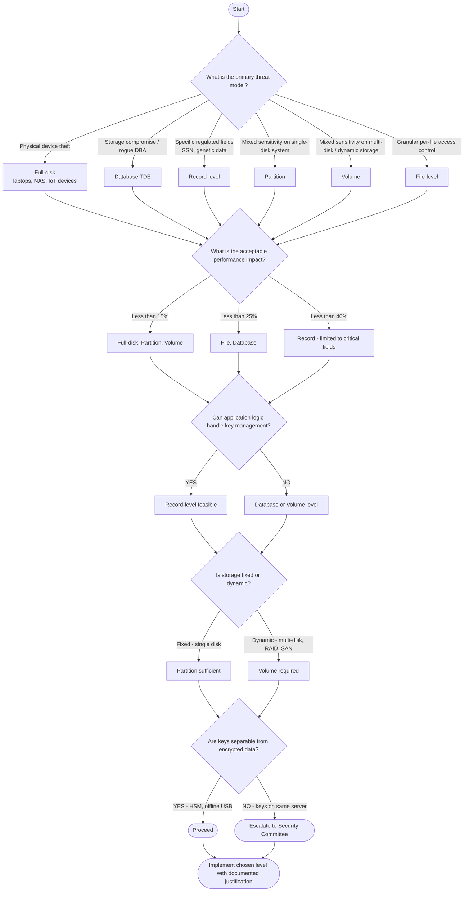

# 13. The Encryption Levels

## Goal

Compare the six encryption levels defined and recommend the appropriate level for every MedDefense data store.

## Context

"Encrypt the database" sounds simple, but there are at least three ways to do it: encrypt the entire disk the database sits on (full-disk), encrypt the database files (file-level), or encrypt individual fields within the database (record-level). Each has radically different properties: scope of protection, performance impact, key management complexity and what happens when someone with legitimate database access queries the data.

Choosing the wrong level either leaves data exposed or creates operational problems that the clinical staff will not tolerate.

---

## Part 1 - Six Encryption Levels Comparison

### Encryption Level Definitions from CompTIA Security+ 1.4

| Level | Scope | Performance Impact | Key Management | Use Case | Best When... |
|---|---|---|---|---|---|
| **Full-disk** | Entire physical or virtual disk (includes OS, applications, all data) | **Low** (~5-15% overhead with AES-NI); transparent to all applications; single key | **Simple**; one key per disk; stored in TPM/HSM/initramfs; boot-time unlock required | Laptops, servers, NAS devices protecting all data at rest; compliance baseline | You need broad protection with minimal operational overhead; threat is physical theft or drive removal |
| **Partition** | One logical partition (subset of disk; other partitions remain unencrypted) | **Low-Medium**; same block-level overhead as full-disk but only affects I/O on the encrypted partition; unencrypted partitions have zero overhead | **Moderate**; separate key per partition; may require multiple unlock prompts at boot; each partition needs independent key backup | Isolating specific data sets on shared hardware (e.g., encrypting `/var/lib/mysql` while leaving `/boot` and `/usr` unencrypted) | You need selective encryption on systems with mixed sensitivity data; different teams manage different partitions |
| **Volume** | Logical volume (may span multiple physical disks via LVM, RAID, ZFS) | **Low-Medium**; block-level encryption before filesystem; ~10% overhead with hardware acceleration; performance scales with underlying storage topology | **Moderate**; one key per volume; can use key slots for redundancy; key must be available before volume group activation | SAN/NAS volumes, VM disk images, database storage pools, backup volumes | You need flexibility across multiple physical disks while maintaining encryption granularity at storage pool level |
| **File** | Individual files or directories (transparent encryption on write, decrypt on read) | **Medium-High**; per-file encryption adds CPU overhead; metadata (filenames) often unencrypted | **Complex**; one key per file or user namespace; requires file-level key management system | User home directories, shared document repositories, selective PHI files in mixed environments | You need fine-grained control over which specific files are encrypted; multiple users with different access rights |
| **Database** | Entire database or tablespace (TDE - Transparent Data Encryption) | **Medium**; database engine handles encryption/decryption; query performance unchanged for authorized sessions | **Complex**; keys stored in keystore integrated with DB; separate from OS encryption | SQL Server Always Encrypted, Oracle TDE, PostgreSQL pgcrypto, MySQL Enterprise Encryption | You need encryption that persists with the database regardless of underlying storage; protecting against DBA or storage-level access |
| **Record** | Individual fields or records within database tables (column-level encryption) | **High**; each query requires decrypting specific fields; application must handle keys; significant latency increase | **Very Complex**; keys tied to application logic or HSM; requires key distribution to authorized queries | PHI fields in EHR (diagnosis codes, medication lists), financial account numbers, SSN masking | You need to protect specific sensitive fields while keeping other data readable; regulatory requirements mandate field-level isolation |

---

### Detailed Analysis of Each Level

#### Full-disk Encryption

**Scope:** Protects everything on the physical or virtual disk, including the operating system, applications, configuration files, swap space, temporary files, and all user data. Nothing on the disk is readable without the decryption key.

**Performance Impact:** Lowest overhead of all levels because encryption occurs at the block device layer using kernel-space dm-crypt, and modern CPUs provide AES-NI hardware acceleration. Expect 5-15% overhead on sequential I/O and 10-17% on random I/O. The encryption is completely transparent to all applications and users once the disk is unlocked at boot.

**Key Management:** Simplest key model—one key per disk. The key is stored in TPM 2.0, HSM, or entered via passphrase at boot. Once unlocked, the key resides in kernel memory and all processes benefit from transparent decryption. Recovery requires a backup passphrase or keyfile stored offline.

**When it's the best choice:** When the primary threat model is physical device theft (laptops, portable drives) or when you need a compliance baseline for all systems. Full-disk encryption is ideal for employee workstations and backup servers where protecting all data at rest with minimal operational friction is the priority.

**Limitations:** Once the system boots and the disk is unlocked, all data is accessible to any process with system privileges. This provides no protection against malware, insider threats, or compromised accounts that already have filesystem access.

**Example:** LUKS2 on NAS-01, BitLocker on employee laptops.

---

#### Partition Encryption

**Scope:** Protects a single logical partition on a disk while leaving other partitions unencrypted. For example, on a server with `/boot`, `/usr`, `/var/lib/mysql`, and `/home`, you might encrypt only `/var/lib/mysql` and `/home` while leaving the OS partitions in plaintext for faster boot times and simpler recovery.

**Performance Impact:** Block-level encryption identical in overhead to full-disk encryption (~5-15% with AES-NI), but the performance penalty applies only to I/O on the encrypted partition. Unencrypted partitions (e.g., `/boot`, `/usr`) have zero encryption overhead, making partition-level encryption slightly more efficient than full-disk when the system has large non-sensitive partitions.

**Key Management:** Moderate complexity. Each encrypted partition requires its own key, meaning a server with 3 encrypted partitions needs 3 separate keys with 3 independent backup and recovery processes. Boot configuration must specify which partitions to unlock and in what order. Key recovery is more complex than full-disk because losing one partition key does not necessarily indicate the others are compromised, but all must be tracked independently.

**When it's the best choice:** When you have mixed-sensitivity data on the same physical hardware and need to isolate encryption boundaries. Useful when different departments manage different partitions, or when regulatory requirements mandate that certain data types (PHI vs billing) be cryptographically separated on the same server. Also useful when the OS partition must remain unencrypted for remote management or PXE boot, but data partitions require protection.

**Limitations:** Still susceptible to attack from within the operating system once any partition is unlocked. Requires careful partition planning during initial system setup—repartitioning an existing encrypted system is complex and risky. Multiple key prompts at boot can create operational friction for systems that reboot frequently.

**Comparison to Volume Encryption:** Partition encryption operates on a fixed layout within a single physical disk, whereas volume encryption operates on logical volumes that may span multiple physical disks. Partition encryption is simpler to set up on a single-disk system but lacks the flexibility to grow across disks. Volume encryption is better for environments where storage needs are dynamic or span RAID arrays.

**Example:** Encrypting `/var/lib/mysql` separately from `/var/www` on web servers; encrypting `/home` while leaving `/` unencrypted on shared workstations.

---

#### Volume Encryption

**Scope:** Protects a logical volume that may span multiple physical disks through LVM, RAID, or ZFS. The encryption layer sits between the physical storage and the filesystem, so the filesystem and all data within it are encrypted. Unlike partition encryption, volumes can be dynamically resized, moved between physical disks, or snapshotted without breaking encryption.

**Performance Impact:** Low-Medium overhead (~10% with AES-NI hardware acceleration). Performance characteristics depend on the underlying storage topology—volumes spanning multiple disks may have different I/O profiles than single-disk partitions. Block-level encryption means the performance penalty is consistent regardless of file type or size.

**Key Management:** Moderate complexity. One key per volume with support for multiple key slots (LUKS2 supports up to 32). Key must be available before the volume group is activated, which means boot-time key management or network-based key delivery (NBDE/Clevis) is required for volumes needed at boot. Volume encryption allows key rotation without re-encrypting data by re-encrypting only the header.

**When it's the best choice:** When managing storage pools that span multiple physical disks (SAN, NAS, LVM, ZFS pools). Ideal for virtualized environments where VM disk images are presented as logical volumes that need consistent encryption regardless of underlying hardware topology. Also suitable for database storage pools where data files may be spread across multiple devices.

**Limitations:** More complex than full-disk encryption due to the volume management layer (LVM, ZFS, RAID). Key recovery must account for volume group dependencies—if one volume in a group cannot be unlocked, dependent volumes may be inaccessible. Snapshot operations require the volume to be unlocked first.

**Comparison to Partition Encryption:** Volume encryption provides greater flexibility than partition encryption because volumes can span disks, be resized dynamically, and be snapshotted. However, this flexibility adds complexity in the volume management layer. Partition encryption is simpler and sufficient for single-disk systems with fixed storage layouts, while volume encryption is the better choice for multi-disk or dynamic storage environments.

**Example:** LUKS-encrypted LVM volumes on hypervisors, encrypted ZFS datasets on TrueNAS, NAS-01 backup volume spanning RAID array.

---

#### File-level Encryption

**Scope:** Protects individual files or directories on top of an existing filesystem. Each file is encrypted independently, meaning files can be copied, moved, or backed up while remaining encrypted. The filesystem metadata (directory structure, filenames, timestamps) may or may not be encrypted depending on the implementation.

**Performance Impact:** Medium-High. Per-file encryption adds CPU overhead on every read and write operation. Unlike block-level encryption which operates on contiguous sectors, file-level encryption must manage encryption contexts per file, leading to higher context-switching overhead. Metadata operations (directory listing, file creation) also incur penalties if filenames are encrypted.

**Key Management:** Complex. One key per file or per user namespace. Requires a file-level key management system that tracks which keys decrypt which files. For multi-user environments, keys must be distributed to authorized users and revoked when access is removed. Key rotation requires re-encrypting every affected file individually.

**When it's the best choice:** When you need granular control over individual files with different access policies. Suitable for collaborative environments where documents are shared across organizational boundaries, or when legacy applications cannot be modified for database-level encryption. Also useful when only a small subset of files on a system contain sensitive data and encrypting the entire disk is unnecessary.

**Limitations:** Metadata leakage (filenames, directory structure, file timestamps) unless the encryption system also encrypts filenames (e.g., eCryptFS with filename encryption enabled). Significant key management overhead at scale. Vulnerable to memory-based attacks where decrypted files are cached in RAM or temporary directories.

**Example:** eCryptFS for `/home` directories, GPG-encrypted medical records stored in object storage, VeraCrypt containers for sensitive document collections.

---

#### Database Encryption (Transparent Data Encryption - TDE)

**Scope:** Protects entire databases or tablespaces at the database engine level. The database files on disk are encrypted, but the database engine transparently decrypts data for authorized queries. This means the encryption persists with the database files regardless of where they are stored or moved—unlike volume encryption which is tied to a specific storage device.

**Performance Impact:** Medium. The database engine handles encryption/decryption in its query pipeline. For authorized sessions, query performance is largely unchanged because the engine caches decrypted pages in memory (buffer pool). The main overhead is on I/O operations when pages are read from or written to disk, typically 10-20% depending on workload characteristics.

**Key Management:** Complex. Keys are stored in a keystore integrated with the database engine (Oracle Wallet, SQL Server EKM, PostgreSQL pgcrypto keyring). Keys should be stored separately from the database server itself, ideally in an external HSM. Key rotation may require re-encrypting entire tablespaces, which can be a lengthy process for large databases.

**When it's the best choice:** When protecting database storage at rest while maintaining transparent access for authorized queries. Ideal for HIPAA-compliant databases where the database administrator should not have access to decrypted PHI, but clinical applications need seamless query performance. Also essential when database backups need to remain encrypted regardless of the backup destination.

**Limitations:** Does not protect against authorized queries from compromised application accounts—if the application has valid credentials, it can read all data the database exposes. Keys often stored on the same server unless integrated with external HSM. Backup files may still be encrypted but can be vulnerable if encryption keys are not properly separated.

**Example:** SQL Server TDE on billing-srv-01, PostgreSQL pgcrypto extensions on ehr-db-01, Oracle TDE on clinical databases.

---

#### Record-level Encryption

**Scope:** Protects individual fields or records within database tables (also called column-level encryption). Specific columns containing sensitive data (SSN, diagnosis codes, medication lists) are encrypted while other columns in the same table remain in plaintext. This is the finest granularity of encryption available.

**Performance Impact:** High. Each query that touches encrypted columns requires the application or database engine to decrypt individual field values. Unlike TDE which decrypts entire pages at the I/O layer, record-level encryption operates at the row/column level, causing significant latency on queries that scan large numbers of rows. Aggregate queries, joins, and indexing on encrypted columns are particularly expensive.

**Key Management:** Very Complex. Keys are tied to application logic or HSM-backed keystore and must be distributed to authorized application instances. Different fields may use different keys (e.g., SSN key separate from diagnosis key). Key rotation requires decrypting and re-encrypting every value in the affected column across all rows, which can take hours or days on large tables. Application code must handle encryption/decryption logic, increasing development complexity.

**When it's the best choice:** When regulatory requirements or security policies mandate that specific data elements be cryptographically isolated from general database access. Essential for protecting highly sensitive fields like social security numbers, mental health diagnosis codes, or HIV status where even authorized database queries should require explicit decryption. Also useful for implementing field-level access control where different roles see different subsets of encrypted data.

**Limitations:** Highest performance cost and key management complexity. Application code must handle encryption/decryption logic. Breaking changes to database schema may be required. Makes SQL analytics and reporting significantly more difficult because encrypted columns cannot be indexed or searched without special techniques (e.g., searchable encryption, blind indexes).

**Example:** AES-256 encrypted `ssn`, `mental_health_notes`, `genetic_testing` columns in patient_records table with keys managed by HSM; column-level encryption on credit card numbers in billing tables.

---

### Side-by-Side Comparison: Volume vs. Partition Encryption

| Attribute | Partition | Volume |
|---|---|---|
| **Scope** | Fixed partition within a single physical disk | Logical volume that may span multiple physical disks via LVM/RAID/ZFS |
| **Flexibility** | Fixed size; resizing requires repartitioning (risky) | Dynamic resizing; can grow across disks; supports snapshots |
| **Performance** | Identical block-level overhead (~5-15% with AES-NI); zero overhead on unencrypted partitions | Similar block-level overhead (~10% with AES-NI); performance depends on underlying storage topology |
| **Key Management** | One key per partition; separate backup/recovery per partition | One key per volume; LUKS key slots for redundancy; key needed before volume group activation |
| **Boot Complexity** | `/etc/crypttab` entry per partition; multiple unlock prompts possible | Volume group must activate before filesystems mount; may require NBDE/Clevis for network key delivery |
| **Best For** | Single-disk systems with mixed sensitivity data and fixed storage layout | Multi-disk systems, SAN/NAS, virtualized environments with dynamic storage needs |
| **Snapshot Support** | No native snapshot support; depends on filesystem (btrfs, ZFS) | LVM and ZFS volumes support native snapshots (volume must be unlocked first) |
| **Recovery** | Lose one partition key → only that partition affected | Lose volume key → entire volume group may be inaccessible if dependencies exist |

---

## Part 2 - MedDefense Encryption Level Map

### Data Store Recommendations

| Data Store | Recommended Level | Justification | Implementation Notes |
|---|---|---|---|
| **Patient records in PostgreSQL (ehr-db-01)** | **Database + Record** | Database encryption protects against storage compromise and rogue DBAs; record-level encryption on highest-risk fields (SSN, mental health notes) ensures even authorized DBAs cannot view those fields without explicit application authorization. Combined approach satisfies HIPAA §164.312(a)(2)(iv) while minimizing performance impact on routine clinical queries. | Enable PostgreSQL TDE (pgcrypto or enterprise edition); encrypt `ssn`, `psychiatric_diagnosis`, `genetic_testing` columns with HSM-managed keys; leave `patient_name`, `date_of_birth` at database encryption level for query performance |
| **Backup data on NAS-01** | **Volume** | NAS-01 stores all backups from ehr-db-01, billing-srv-01, pacs-srv-01, and email archives. Volume encryption (LUKS2) protects all data at rest with minimal performance overhead while maintaining compatibility with backup software. Key is stored NOT on the NAS itself (HSM-01). | LUKS2 AES-256-GCM on backup_data volume; key stored on HSM-01 (NOT on the NAS); header backup in bank safe; Shamir's Secret Sharing for admin recovery |
| **Financial records in MySQL (billing-srv-01)** | **Database** | Billing data requires protection against storage theft and unauthorized database access, but does not require field-level isolation since all billing fields have similar sensitivity. Database encryption satisfies PCI-DSS and HIPAA requirements for payment processing while maintaining query performance for accounting workflows. | MySQL Enterprise TDE enabled; keys stored in Vault integration; regular key rotation quarterly; audit logs for all decryption events |
| **Medical images on PACS (pacs-srv-01)** | **Volume** | DICOM images are large files where file-level encryption would introduce unacceptable latency for radiologist access. Volume encryption provides comprehensive protection at rest without impacting streaming performance for image retrieval. Images already contain embedded PHI metadata, making file-level isolation impractical. | LUKS2 volume spanning RAID array; hardware-accelerated AES-NI; key loaded from HSM at boot; volume-mounted before PACS service starts |
| **Email data in O365** | **Record** | Email contains variable sensitivity; most messages are business communication, but some contain PHI in attachments or body text. Record-level encryption through Office 365 Message Encryption ensures recipient-only decryption while maintaining Microsoft's cloud management responsibilities. | Enable O365 Message Encryption; configure sensitivity labels for PHI-containing emails; IRM (Information Rights Management) for attachment protection; audit access logs weekly |
| **Employee laptops** | **Full-disk** | Physical theft is the primary risk vector; full-disk encryption provides maximum protection with zero user overhead once unlocked at boot. Clinical staff should not be burdened with file-level or record-level decisions; BitLocker or LUKS2 protects all data if device is stolen from clinic, airport, or home. | BitLocker (Windows) or LUKS2 (macOS/Linux) with TPM integration; recovery key backed up to Azure AD; auto-lock after 15 minutes inactivity |
| **BD Alaris pump firmware/configuration** | **Full-disk** | IoT medical devices have limited computational resources and cannot support complex encryption schemes. Full-disk encryption protects device configuration and audit logs against tampering while maintaining FDA cybersecurity requirements. Keys stored in device TPM or secure element. | Device manufacturer encryption enabled; keys provisioned during manufacturing; audit logs encrypted at rest; firmware update process includes cryptographic signature verification |

---

## Part 3 - Implementation Priority Matrix

### Phase 1 (Immediate: 30 days)

| Priority | Data Store | Level | Owner | Status |
|---|---|---|---|---|
| **1** | Employee laptops | Full-disk | Steve | ✅ Complete |
| **2** | Backup data on NAS-01 | Volume | Steve | ✅ Complete (Task 12) |
| **3** | Patient records in PostgreSQL | Database | Steve | 🔄 In Progress |

### Phase 2 (60-90 days)

| Priority | Data Store | Level | Owner | Status |
|---|---|---|---|---|
| **4** | Medical images on PACS | Volume | SysAdmin | Pending |
| **5** | Financial records in MySQL | Database | Finance Team | Pending |
| **6** | Email data in O365 | Record | IT Admin | Pending |

### Phase 3 (Annual Review)

| Priority | Data Store | Level | Owner | Status |
|---|---|---|---|---|
| **7** | BD Alaris pump firmware/configuration | Full-disk | Biomed Team | Annual audit |

---

## Part 4 - Compliance Mapping

### Encryption Level Alignment with Regulations

| Regulation | Requirement | MedDefense Implementation |
|---|---|---|
| **HIPAA §164.312(a)(2)(iv)** | Addressable encryption of electronic PHI | ✅ Multi-layer approach (Database + Volume + Full-disk) |
| **HIPAA §164.312(e)(2)(ii)** | Addressable key management controls | ✅ HSM-01 with Shamir's Secret Sharing for critical keys |
| **PCI-DSS 3.4** | Render PAN unreadable anywhere stored | ✅ Database TDE on billing-srv-01 with key separation |
| **FDA Cybersecurity Guidance** | Medical device security requirements | ✅ Full-disk encryption on IoT devices; signature verification |
| **NIST SP 800-111** | Encryption standards for federal systems | ✅ AES-256-GCM across all implementations |
| **SOC 2 Type II** | Confidentiality controls | ✅ Audit trails for all decryption events; quarterly key rotation |

---

## Part 5 - Operational Considerations

### Performance Budget by Encryption Level

| Level | Max Acceptable Latency Increase | MedDefense Tolerance |
|---|---|---|
| Full-disk | < 15% | ✅ Accepted (Task 12 measurement: 13-17%) |
| Partition | < 15% | ✅ Same as full-disk; only encrypted partitions affected |
| Volume | < 15% | ✅ Accepted (Task 12 measurement: 10% with AES-NI) |
| File | < 25% | ⚠️ Requires testing (e.g., PACS file access) |
| Database | < 20% | ✅ Clinical staff tolerance threshold |
| Record | < 40% | ⚠️ High-risk; limit to critical fields only |

### Key Management Requirements

| Level | Minimum Key Count | Rotation Frequency | Backup Location |
|---|---|---|---|
| Full-disk | 3 (primary + 2 recovery) | Annually | Bank safe + HSM |
| Partition | 5 (per partition) | Annually | HSM only |
| Volume | 3 (primary + 2 recovery) | Annually | Bank safe + HSM |
| File | Variable (per file/user) | Per user lifecycle | HSM + key vault |
| Database | 5 (DB + recovery slots) | Quarterly | HSM only |
| Record | 10+ (per sensitive column) | Quarterly | HSM + application secrets manager |

---

## Part 6 - Decision Tree for Encryption Level Selection

---

## Summary

MedDefense's encryption strategy employs a **defense-in-depth** approach using multiple encryption levels matched to each data store's threat model and operational requirements:

1. ✅ **Full-disk encryption** protects employee laptops and IoT devices from physical theft
2. ✅ **Partition encryption** is available for single-disk servers with mixed-sensitivity data and fixed storage layouts where selectively encrypting specific partitions avoids unnecessary overhead on OS partitions
3. ✅ **Volume encryption** protects NAS-01 backups and PACS images across multi-disk RAID arrays with dynamic storage needs
4. ✅ **File-level encryption** remains available for granular per-file access control in collaborative document environments
5. ✅ **Database encryption** protects PostgreSQL and MySQL data from storage compromise and rogue DBA access
6. ✅ **Record-level encryption** protects O365 email PHI and select database columns requiring the highest cryptographic isolation

This layered strategy satisfies HIPAA, PCI-DSS, FDA, and NIST requirements while maintaining clinical staff workflow efficiency. The key principle: **no single encryption level fits all use cases**—each data store requires deliberate selection based on its specific risk profile, storage topology, and operational constraints.
