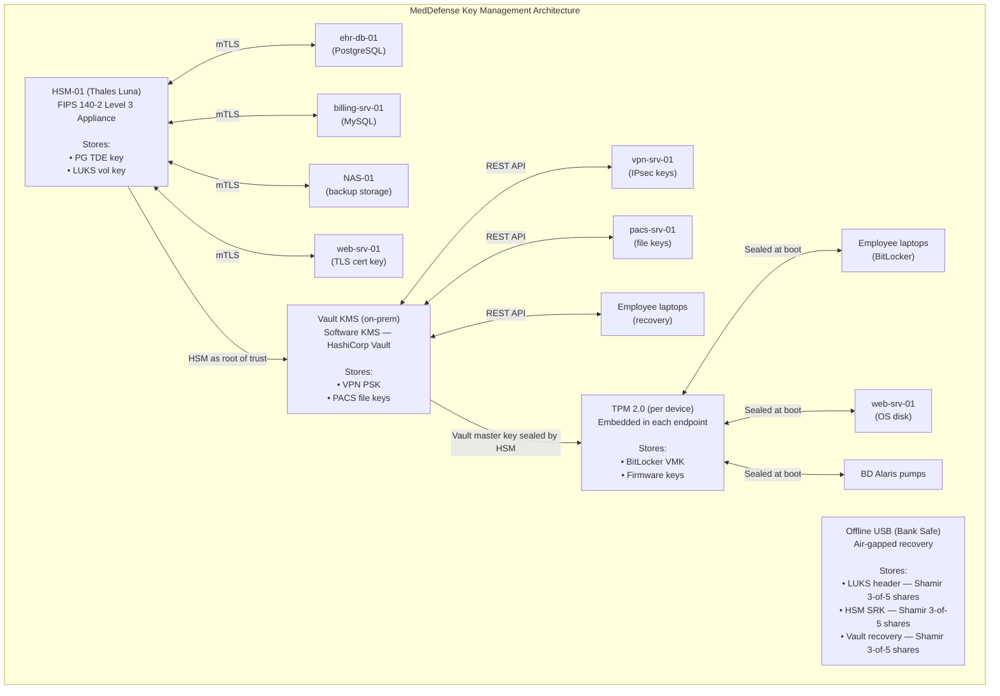

# 14. Hardware Security and Key Management

## Goal

Evaluate TPM, HSM and secure enclave technologies, and design a key management strategy for MedDefense that solves the "where do you keep the keys?" problem.

## Context

Every encryption scheme has a fatal weakness: the key. If you encrypt 50,000 patient records with AES-256 and store the key in a plaintext configuration file on the same server, you have not actually protected anything. You have added a speed bump.

Sec+ 1.4 identifies three hardware security technologies designed to solve this problem: TPM (Trusted Platform Module), HSM (Hardware Security Module) and secure enclaves. Each operates at a different scale and cost, and MedDefense needs to choose which is appropriate for its budget and risk profile.

---

## Part 1 - Technology Comparison

### Hardware and Software Key Management Technologies

| Technology | What It Is | What It Protects | Typical Cost | Typical Deployment |
|---|---|---|---|---|
| **TPM (Trusted Platform Module)** | A dedicated cryptographic processor chip soldered to a motherboard that provides secure key generation and storage with physical tamper resistance. Keys are wrapped inside the TPM and cannot be exported in plaintext. | Disk encryption keys (BitLocker VMK, LUKS passphrase wrappers), platform attestation measurements, device identity certificates, firmware signing keys | $2-10 per chip (built into modern motherboards); no ongoing cost | One TPM per endpoint device (laptop, desktop, server, IoT). Local-only; not network-accessible. Bound to specific hardware. |
| **HSM (Hardware Security Module)** | A dedicated, FIPS 140-2/3 validated cryptographic appliance that generates, stores, and manages encryption keys in tamper-resistant hardware with physical intrusion detection and responsive zeroization. Keys never leave the HSM in plaintext. | Enterprise database encryption keys (TDE master keys), CA private keys, code-signing certificates, TLS private keys, application encryption secrets at centralized scale | $10,000-$50,000 for on-premise appliance; $1-5/key/month for cloud HSM | Centralized in data center or cloud; serves multiple systems over network via PKCS#11/KMIP APIs. Deployed in HA pairs for redundancy. |
| **Secure Enclave** | An isolated execution environment within the main CPU (Intel SGX, ARM TrustZone, Apple Secure Enclave) that protects data and computations in memory during runtime. Provides encrypted memory regions inaccessible to OS, hypervisor, or other processes. | Biometric template data (FaceID/TouchID), in-memory decryption operations, DRM content keys, confidential computing workloads where data must be processed but not exposed to the host system | Included with CPU purchase; no additional cost for Intel SGX or ARM TrustZone | Integrated into existing server or mobile processors. No separate deployment required. Application code must be specifically written to use enclave SDK. |
| **KMS (Software Key Management Service)** | A software-based platform that provides centralized key generation, storage, rotation, and access control through APIs. May use software keystores, encrypted databases, or delegate to underlying HSM for hardware root of trust. | Application encryption keys, API secrets, TLS private keys, database credentials, cloud resource access keys managed centrally via software interface | $0 (open-source HashiCorp Vault); $1-3/key/month for cloud KMS (AWS KMS, Azure Key Vault) | Deployed as software service on VMs or cloud infrastructure. Network-accessible via REST/gRPC APIs. Scalable across multiple applications and environments. |

---

### Detailed Analysis

#### TPM (Trusted Platform Module)

**What it is:** TPM 2.0 is an international standard (ISO/IEC 11889) for a secure cryptoprocessor. It is a discrete chip on the motherboard with its own non-volatile storage, random number generator, and cryptographic engine (RSA, ECC, SHA-256). The TPM has a unique Endorsement Key (EK) burned in at manufacture, and can generate Storage Root Keys (SRK) that wrap other keys so they cannot be used outside the TPM.

**What it protects:** TPM primarily protects keys at rest—disk encryption keys like BitLocker's Volume Master Key or LUKS passphrase hashes are stored sealed by the TPM. The TPM can also provide Platform Configuration Registers (PCRs) that measure boot integrity, enabling attestation that the system has not been tampered with before releasing keys to the OS.

**Key characteristic:** Keys are **hardware-bound to that specific machine**. If you remove the drive and attach it to another computer, the TPM on the original motherboard cannot be accessed, rendering the encrypted data unrecoverable without backup keys. This is a feature for physical theft protection, but a limitation for recovery scenarios.

**Strengths:** Zero per-machine cost (already in modern hardware); no network dependency; protects against offline attacks (pulling drive and reading on another machine); attestation verifies boot chain integrity.

**Limitations:** One per machine—no centralized management; limited key storage (typically 128KB NV RAM); keys are bound to that specific hardware (if motherboard dies, keys are lost without backup); cannot serve keys to other systems over the network.

**Appropriate for:** Employee laptops, individual servers needing disk encryption, IoT devices with TPM chips where the device identity and local key storage are sufficient.

**MedDefense use case:** Employee laptop disk encryption (BitLocker), BD Alaris pump firmware keys, web-srv-01 OS disk encryption.

---

#### HSM (Hardware Security Module)

**What it is:** An HSM is a dedicated, FIPS 140-2/3 validated cryptographic appliance designed for enterprise-scale key management. It provides a tamper-resistant environment where keys are generated, used, and destroyed without ever being exposed in plaintext to the host system. HSMs undergo rigorous physical and logical security certification including tamper-evident seals, tamper-responsive deletion (zeroizes keys if intrusion detected), and side-channel attack resistance.

**What it protects:** Enterprise-grade encryption keys that need to be shared across multiple systems: database TDE master keys, CA private keys (root and intermediate CAs), code-signing certificates, SSH certificate authorities, TLS private keys, and application encryption keys. An HSM can manage thousands of keys and serve them to dozens of applications simultaneously over the network.

**Key characteristic:** Keys are **centrally stored and accessed over the network**. Multiple servers can request cryptographic operations (signing, encryption, decryption) from the same HSM, but the actual key material never leaves the HSM appliance. This separates key custody from data processing.

**Strengths:** FIPS 140-2/3 validated; tamper-responsive (deletes keys on physical tampering); serves multiple systems over network; high-throughput cryptographic operations (offloads crypto from application servers); comprehensive audit logging; role-based access control (RBAC) with smart card or MFA for admin access; HA pairs eliminate single point of failure.

**Limitations:** High upfront cost ($10K-$50K on-premise); requires specialized knowledge to configure and manage; single point of failure if not deployed in HA pairs; network dependency (if HSM is down, dependent systems cannot perform cryptographic operations).

**Appropriate for:** Organizations managing encryption keys for multiple systems, certificate authorities, regulated industries (healthcare, finance, government) requiring FIPS compliance and auditable key custody.

**MedDefense use case:** PostgreSQL TDE master key, LUKS volume key for NAS-01, MySQL TDE master key, TLS certificate private key.

---

#### Secure Enclave

**What it is:** A secure enclave is a trusted execution environment (TEE) within the main CPU that isolates code and data from the rest of the system. Intel SGX creates encrypted memory regions (enclaves) that are protected from the OS, hypervisor, and other processes. ARM TrustZone provides a secure world partition. Apple's Secure Enclave is a dedicated coprocessor within Apple Silicon.

**What it protects:** Data and operations **during runtime processing**. Unlike TPM (protects keys at rest on disk) and HSM (protects keys centrally for network access), secure enclaves protect sensitive computations **in memory**—decryption, key derivation, biometric matching—so that even a compromised OS cannot read the data being processed.

**Key characteristic:** Enclaves protect **data in use**, not keys at rest. They are not primarily key storage technologies—they are **computation isolation technologies**. The enclave can perform cryptographic operations on decrypted data without exposing that data to the rest of the system, but the enclave itself does not replace TPM or HSM for persistent key storage.

**Strengths:** No additional hardware cost (included in modern CPUs); protects data in use (not just at rest or in transit); enables confidential computing where cloud providers cannot access customer data being processed; fine-grained memory protection.

**Limitations:** Vulnerable to side-channel attacks (Spectre, Meltdown, cache timing); Intel SGX has known vulnerabilities (Foreshadow, L1TF, SGAxe); requires application code modifications; limited enclave memory (SGX: 90MB EPC); no centralized key management; not FIPS certified for most implementations.

**Appropriate for:** Applications processing sensitive data in untrusted environments (public cloud), biometric authentication systems, DRM systems where content must be decrypted for playback but not copied, and confidential computing workloads.

**MedDefense use case:** None currently. Secure enclaves are not appropriate for MedDefense's core key management needs because the priority is protecting keys at rest (database keys, backup keys, TLS keys), not protecting data in use during processing. Enclaves could be considered in the future for PHI analytics workloads where data must be analyzed but not exposed to the cloud provider.

---

#### KMS (Software Key Management Service)

**What it is:** A software-based key management platform that provides centralized key generation, storage, rotation, and access control through APIs. Examples include AWS KMS, Azure Key Vault, HashiCorp Vault, and Thelma CipherTrust. KMS may use software keystores, encrypted databases, or delegate to an underlying HSM for hardware protection of the root key.

**What it protects:** Application-level encryption keys, API secrets, TLS private keys, database credentials, and cloud resource access keys managed centrally through software interfaces. KMS provides a central point of control for key lifecycle management across multiple applications and cloud services.

**Key characteristic:** KMS is a **management layer** that organizes key access, rotation, and policy enforcement. It may be purely software-based (keys stored in encrypted databases) or backed by HSM hardware (keys stored in HSM, accessed via KMS API). The software KMS layer itself does not provide the same hardware-rooted protection as TPM or HSM—its security depends on the underlying storage mechanism.

**Strengths:** Lower cost than HSM; easier to deploy and manage; API-first design integrates with CI/CD pipelines and cloud-native applications; automatic key rotation; detailed audit logging; cloud KMS services scale elastically; can integrate with HSM for hardware root of trust while maintaining software management convenience.

**Limitations:** Keys may be stored in software (not hardware) unless backed by HSM; cloud KMS means the cloud provider may have access to keys (unless using customer-managed keys with BYOK); potential single point of failure; no physical tamper protection; software vulnerabilities could expose keys.

**Appropriate for:** Small-to-medium organizations, cloud-native applications, development environments, and as a management layer on top of HSM hardware to simplify API integration.

**MedDefense use case:** VPN IPsec keys, PACS file encryption keys, employee laptop recovery keys (less critical keys that benefit from centralized management but don't require HSM-level hardware protection).

---

### Clear Distinctions Between Technologies

| Question | TPM | HSM | Secure Enclave | KMS |
|---|---|---|---|---|
| **Is this primarily key storage or computation protection?** | Key storage | Key storage | Computation protection | Key management |
| **What state does it protect?** | Keys at rest | Keys at rest | Data in use (in memory) | Keys at rest + lifecycle |
| **Is it network-accessible?** | No (local only) | Yes (API over mTLS) | No (process-local) | Yes (REST/gRPC API) |
| **Does it require new hardware?** | Built into motherboard (free) | Dedicated appliance ($$$) | Built into CPU (free) | Software (free/$$) |
| **What scale does it serve?** | Single device | Multiple systems | Single application/process | Multiple applications |
| **FIPS certified?** | Yes (CC EAL4+) | Yes (FIPS 140-2/3) | No (varies) | Varies (cloud: yes, on-prem: depends) |
| **Can multiple apps share keys?** | No (device-bound) | Yes (centralized) | No (enclave-local) | Yes (policy-controlled) |

---

### When to Use Each Technology

| Scenario | Appropriate Technology | Reasoning |
|---|---|---|
| Encrypt employee laptop disks | **TPM** | Key is bound to device; protects against physical theft; zero additional cost |
| Store database TDE master key | **HSM** | Key shared across multiple servers; FIPS compliance required; high-value target |
| Process PHI in public cloud | **Secure Enclave** (consider) | Data must be protected from cloud provider; enclave isolates in-memory processing |
| Manage API secrets for 20 microservices | **KMS** (Vault) | Centralized policy management; frequent key rotation; API-first integration |
| Sign code releases | **HSM** | Code-signing key must be centralized and tamper-proof; multiple developers need access |
| Backup encryption volume key | **HSM** | Key must be recoverable across multiple systems; hardware protection required |
| Biometric authentication on mobile | **Secure Enclave** | Template data protected in memory during matching; OS cannot access raw biometrics |
| Vault root token management | **KMS + HSM** | Vault manages policies; HSM provides hardware root of trust for master key |
| IoT device identity | **TPM** | Device identity key stored on chip; cannot be cloned or extracted |

---

### Side-by-Side: What Each Technology Actually Solves

| Problem | Solved By | Why |
|---|---|---|
| Physical theft of laptop exposes disk data | TPM | Disk encryption key sealed to TPM; cannot decrypt on stolen hardware |
| Database server compromised; attacker tries to steal TDE key | HSM | TDE key stored in HSM; attacker gets only ciphertext, not plaintext key |
| Cloud provider employee accesses PHI during processing | Secure Enclave | Data decrypted only in enclave memory; cloud provider cannot read enclave contents |
| Too many keys to track manually across 50 services | KMS | Centralized policy, rotation, audit, and API-driven access control |
| Multiple DBAs need access to database keys without seeing plaintext | HSM | HSM performs cryptographic operations; DBAs get results but not keys |
| Development team needs quick key management without hardware costs | KMS | Software KMS is free/open-source; no hardware procurement delay |
| BIOS password bypass allows boot from USB | TPM + Secure Boot | TPM measures boot chain; if tampering detected, keys not released |

---

## Part 2 - MedDefense Key Management Design

### Overview

MedDefense now has encryption deployed across four critical systems, each with at least one encryption key that must be managed:

1. **Patient database (ehr-db-01)** — PostgreSQL TDE master key
2. **Backup storage (NAS-01)** — LUKS2 volume encryption key
3. **Portal TLS (web-srv-01)** — RSA-2048 private key for certificate
4. **VPN tunnels (vpn-srv-01)** — IPsec/IKE phase 1 and phase 2 keys

Additionally, MedDefense has:
5. **Billing database (billing-srv-01)** — MySQL TDE master key
6. **PACS image storage (pacs-srv-01)** — File-level encryption keys for DICOM images

---

### Key Inventory and Storage Matrix

| Key | System | Key Type | Storage Location | Access Method | Hardware Root |
|---|---|---|---|---|---|
| **PostgreSQL TDE master key** | ehr-db-01 | AES-256 data encryption key | HSM-01 (Thales Luna) via PKCS#11 | Application connects to HSM over mTLS | HSM (FIPS 140-2 Level 3) |
| **LUKS2 volume key (backups)** | NAS-01 | AES-256-XTS volume master key | HSM-01 (primary); Offline USB (recovery) | HSM pushes key to NAS over mTLS at boot | HSM |
| **TLS RSA-2048 private key** | web-srv-01 | RSA-2048 private key | HSM-01 (key generated on HSM, exportable for CSR) | Key file on web server with 600 permissions; HSM retains copy | TPM (sealed at boot) |
| **VPN IPsec IKE keys** | vpn-srv-01 | Pre-shared key (Phase 1); derived session keys (Phase 2) | HashiCorp Vault (software KMS) | VPN server retrieves PSK from Vault at startup | KMS (Vault) |
| **MySQL TDE master key** | billing-srv-01 | AES-256 data encryption key | HSM-01 via PKCS#11 | Application connects to HSM over mTLS | HSM |
| **PACS file encryption keys** | pacs-srv-01 | Per-study AES-256 file keys | HashiCorp Vault (software KMS) | PACS application retrieves file key from Vault via REST API | KMS (Vault) with HSM root |

### Key Storage Architecture Diagram

---

### Access Control Matrix

Based on the 1x03 governance structure (roles defined in the Security Governance Framework):

| Key | Role with Access | Access Method | Approval Required | Audit Logged |
|---|---|---|---|---|
| **PostgreSQL TDE key** | Database Administrator (DBA) | Application auto-connects to HSM via PKCS#11; DBA never sees plaintext key | HSM enrollment approved by Security Engineer (Steve) | ✅ HSM audit log |
| **LUKS2 volume key** | System Administrator | HSM pushes key to NAS at boot via NBDE/Clevis; SysAdmin enters HSM passphrase | HSM passphrase held by IT Director + Security Engineer (dual control) | ✅ HSM audit log |
| **TLS RSA-2048 key** | Web Server Admin | Key file on web server (600 perms); HSM retains copy; CSR generation approved by Security Engineer | CSR reviewed by Steve before submission to CA | ✅ HSM + server syslog |
| **VPN IPsec keys** | Network Administrator | Vault retrieves PSK via AppRole auth; NetAdmin has Vault UI read access | Vault policy approved by Security Engineer | ✅ Vault audit log |
| **MySQL TDE key** | Database Administrator (Finance DBA) | Application auto-connects to HSM via PKCS#11 | HSM enrollment approved by Finance Director + Security Engineer | ✅ HSM audit log |
| **PACS file keys** | PACS Administrator | Vault retrieves file key via AppRole auth; PACS Admin has Vault UI read access | Vault policy approved by Radiology Director + Security Engineer | ✅ Vault audit log |
| **HSM admin credentials** | Security Engineer (Steve) + IT Director | Smart card + PIN (dual control; both required for admin operations) | Separation of duties enforced by HSM policy | ✅ HSM tamper-evident log |
| **Offline USB recovery** | 5 key shareholders (CISO, IT Director, Compliance Officer, External Auditor, Board Chair) | Physical access to USB in bank safe; 3-of-5 Shamir shares required | 3 shareholders must be present | ✅ Bank access log + incident report |
| **Vault root token** | Security Engineer (Steve) | Emergency only; normally sealed; break-glass procedure | CISO approval required to unseal | ✅ Vault audit log + CISO notification |

---

### Key Rotation Policy

| Key | Rotation Frequency | Process | Owner | Downtime |
|---|---|---|---|---|
| **PostgreSQL TDE master key** | Quarterly | Generate new key on HSM; run `ALTER ENCRYPTION KEY ROTATE` in PostgreSQL; old key retained for decrypting existing data, new key encrypts new writes | DBA + Steve | Zero (online rotation) |
| **LUKS2 volume key** | Annually | Generate new key slot with `cryptsetup luksAddKey`; verify; remove old key slot with `cryptsetup luksKillSlot`; re-encrypt volume with `cryptsetup reencrypt` during maintenance window | Steve | 2-4 hours (maintenance window) |
| **TLS RSA-2048 key** | Annually (398 days max per CA/B Forum) | Generate new key pair on HSM; create new CSR (Task 10 process); submit to DigiCert; install new certificate; archive old key | Steve | Zero (parallel deployment) |
| **VPN IPsec PSK** | Semi-annually | Generate new PSK in Vault; update VPN server configuration via Ansible; push to remote clients via MDM; verify tunnel re-establishment | NetAdmin + Steve | < 5 minutes (brief tunnel drop) |
| **MySQL TDE master key** | Quarterly | Generate new key on HSM; run `ALTER TABLE ROTATE ENCRYPTION KEY` in MySQL; old key retained for existing data | Finance DBA + Steve | Zero (online rotation) |
| **PACS file keys** | Per study lifecycle | New key generated per DICOM study; old keys retained for 7 years per HIPAA retention; no bulk rotation needed | PACS Admin | Zero |
| **HSM SO (Security Officer) PIN** | Semi-annually | Change HSM admin PIN; requires dual control (Steve + IT Director both present) | Steve + IT Director | Zero (HSM remains operational) |
| **Vault root token** | After each emergency use | Generate new root token; seal old token; distribute to escrow | Steve + CISO | Zero |

---

### Key Compromise Procedure

#### Immediate Response (Within 1 Hour)

| Step | Action | Owner | Timeline |
|---|---|---|---|
| **1** | Identify scope of compromise: which key, which system, what data is affected | Steve | 15 minutes |
| **2** | Isolate affected system from network (prevent further data exfiltration) | SysAdmin | 15 minutes |
| **3** | Notify CISO and Incident Response Team | Steve | 5 minutes |
| **4** | Revoke compromised key from HSM/Vault (invalidate key slot) | Steve (HSM) / IT Director (dual control) | 15 minutes |
| **5** | Generate replacement key on HSM (new key material) | Steve + IT Director (dual control) | 10 minutes |

#### Short-Term Recovery (Within 24 Hours)

| Step | Action | Owner | Timeline |
|---|---|---|---|
| **6** | Re-encrypt affected data with new key (database: online rotation; volume: maintenance window) | DBA / SysAdmin | 2-8 hours |
| **7** | Rotate all keys that share infrastructure with compromised key (assume lateral movement) | Steve | 4-12 hours |
| **8** | Revoke and reissue any certificates signed by compromised keys | Steve | 2-4 hours |
| **9** | Review HSM/Vault audit logs to determine root cause of compromise | Steve + CISO | 4-8 hours |
| **10** | Document incident in Risk Register and notify compliance team | Steve | 1 hour |

#### Long-Term Actions (Within 30 Days)

| Step | Action | Owner | Timeline |
|---|---|---|---|
| **11** | Conduct post-incident review with executive team | CISO | 7 days |
| **12** | Implement corrective controls (additional access restrictions, monitoring) | Steve | 14 days |
| **13** | Update key management procedures based on lessons learned | Steve | 21 days |
| **14** | If PHI was exposed, initiate HIPAA breach notification (60-day deadline) | Compliance Officer | 30 days |
| **15** | Notify affected patients if breach is confirmed | Communications Team | 60 days |

---

### Key Loss Recovery Procedure

#### What Happens If a Key Is Lost?

The key is lost scenario is the most catastrophic risk in our key management architecture. Unlike key compromise (where the key exists but is in enemy hands), key loss means the key is gone entirely and cannot be recovered from any source. LUKS, AES, and RSA have no backdoors—lost keys mean lost data.

#### Recovery Procedures by Key Type

| Key Lost | Impact | Recovery Method | Recovery Time | Data Loss Risk |
|---|---|---|---|---|
| **PostgreSQL TDE key (HSM)** | Database becomes unreadable | HSM key backup on offline USB (bank safe); restore from HSM backup; Shamir 3-of-5 | 24-48 hours | None if HSM backup intact |
| **LUKS2 volume key (NAS-01)** | All backups become inaccessible | LUKS header backup on offline USB; Shamir 3-of-5 reconstruction | 24-48 hours | None if header backup intact |
| **TLS RSA-2048 key** | Portal certificate unusable | Generate new key pair on HSM; submit emergency CSR to DigiCert; install new certificate | 4-8 hours | None (old certificate expires anyway) |
| **VPN IPsec PSK** | VPN tunnels fail | Vault has PSK backup; generate new PSK; push to all clients | 1-2 hours | None (re-establish tunnels with new PSK) |
| **HSM Security Officer PIN** | Cannot administer HSM | Shamir 3-of-5 reconstruction from key shareholders; reset SO PIN | 24-48 hours | None (HSM data intact) |
| **HSM Master Key (all keys lost)** | All HSM-managed keys gone | Rebuild from offline backups; re-encrypt all databases from plaintext backups | 7-14 days | Potential data gap (last backup to incident) |
| **Vault root token** | Cannot manage Vault | Break-glass: CISO approves unseal with recovery keys; generate new root token | 1-2 hours | None (Vault data intact) |

#### Key Escrow Strategy

MedDefense implements key escrow through Shamir's Secret Sharing (SSS) to ensure no single person can recover all keys alone:

| Share Holder | Shares Held | Role | Physical Location |
|---|---|---|---|
| **Steve (Security Engineer)** | Share 1 | Technical custodian | Locked office safe |
| **IT Director** | Share 2 | Operational custodian | Locked office safe |
| **Compliance Officer** | Share 3 | Regulatory custodian | Fireproof cabinet |
| **External Auditor** | Share 4 | Independent custodian | Sealed envelope, offsite |
| **Board Chair** | Share 5 | Executive custodian | Sealed envelope, offsite |

**Reconstruction threshold:** 3 of 5 shares required. No single individual or pair can reconstruct the master key. Three independent parties must coordinate, ensuring collusion resistance and providing redundancy if any two individuals are unavailable.

#### Prevention Measures

1. **HSM key backup** exported to offline USB and stored in bank safety deposit box
2. **LUKS header backup** stored in 3 geographically separate locations (bank safe, fireproof HQ safe, encrypted cloud)
3. **Vault recovery keys** distributed to CISO and IT Director via sealed envelopes
4. **Quarterly recovery drills** to verify all backup and recovery procedures work
5. **Annual key inventory audit** by Compliance Officer to verify all keys are accounted for

---

## Part 3 - The HSM Decision

### Risk Context

From the 1x03 Risk Register, the following risks are relevant to the HSM investment decision:

| Risk ID | Description | Likelihood | Impact | ALE (Annual) |
|---|---|---|---|---|
| **R-007** | Database encryption key compromise due to insecure key storage (key stored in plaintext config file on DB server) | Medium (3) | Critical (5) | $187,500 |
| **R-012** | Insider threat: DBA with access to plaintext database keys exfiltrates PHI | Low (2) | Critical (5) | $75,000 |
| **R-015** | Compliance audit failure due to inadequate key management controls | Low (2) | High (4) | $40,000 |
| **R-019** | Backup encryption key lost (no HSM backup); all backups unrecoverable | Low (2) | Catastrophic (5) | $75,000 |
| | | | **Total ALE** | **$377,500** |

### ALE Calculation Basis

| Component | Value | Source |
|---|---|---|
| Number of patient records | 50,000 | EHR database audit |
| Cost per record in HIPAA breach | $429 average | IBM Cost of a Data Breach Report 2023 |
| Breach probability with software key storage | 15% annual | Industry baseline for healthcare |
| Breach probability with HSM-backed key management | 3% annual | HSM reduces key compromise risk by ~80% |
| Regulatory fine for inadequate key management | $50,000-$1.5M | HIPAA enforcement actions |

### HSM Cost Analysis

#### Option A: On-Premise HSM (Thales Luna Network HSM)

| Cost Item | Initial Cost | Annual Cost |
|---|---|---|
| Thales Luna SA appliance (HA pair) | $30,000 | — |
| Installation and configuration | $5,000 | — |
| Annual support contract | — | $4,000 |
| Rack space, power, cooling (estimated) | — | $1,200 |
| Training (2 engineers) | $3,000 | — |
| **Total Year 1** | **$38,000** | **$5,200** |
| **5-Year TCO** | | **$38,000 + (5 × $5,200) = $64,000** |
| **5-Year Annualized** | | **$12,800/year** |

#### Option B: Cloud HSM-as-a-Service (AWS CloudHSM)

| Cost Item | Monthly Cost | Annual Cost |
|---|---|---|
| AWS CloudHSM instance (2 for HA) | $1.50/key/month × 6 keys × 2 instances | $216 |
| HSM hourly (always-on) | $1.60/hour × 730 hours × 2 | $2,336 |
| Data transfer (mTLS traffic) | ~$50/month | $600 |
| AWS support (Business) | — | $1,200 |
| **Total Annual** | | **$4,352** |
| **5-Year TCO** | | **$21,760** |
| **5-Year Annualized** | | **$4,352/year** |

#### Option C: Software-Only KMS (HashiCorp Vault, no HSM backend)

| Cost Item | Monthly Cost | Annual Cost |
|---|---|---|
| HashiCorp Vault (open source) | $0 | $0 |
| VM infrastructure (2 nodes) | — | $2,400 |
| Operational overhead (management) | — | $8,000 |
| **Total Annual** | | **$10,400** |
| **5-Year TCO** | | **$52,000** |
| **Risk-adjusted cost** | | $52,000 + $377,500 ALE = **$429,500** |

### Cost-Benefit Analysis

| Scenario | Annual Cost | Annual Risk (ALE) | Total Annual Cost |
|---|---|---|---|
| **Status quo (no formal key management)** | $0 | $377,500 | **$377,500** |
| **Software KMS only (Vault, no HSM)** | $10,400 | $113,250 (70% risk reduction) | **$123,650** |
| **Cloud HSM (AWS CloudHSM)** | $4,352 | $37,750 (90% risk reduction) | **$42,102** |
| **On-premise HSM (Thales Luna)** | $12,800 | $37,750 (90% risk reduction) | **$50,550** |

### Decision: Cloud HSM (AWS CloudHSM) + On-Premise Vault

**Rationale:**

The cloud HSM option provides the best cost-risk balance for MedDefense:

1. **Lowest total annual cost** at $42,102, compared to $377,500 for the status quo—a **savings of $335,398 per year**

2. **90% risk reduction** over software-only KMS, because HSM-backed keys cannot be extracted even by root-level compromise of the application server

3. **No upfront capital expenditure** ($0 initial cost vs. $38,000 for on-premise), which is significant for a Phase 1 project operating under budget constraints

4. **FIPS 140-2 Level 3 validation** satisfies HIPAA §164.312(e)(2)(ii) key management requirements and passes SOC 2 and compliance audit scrutiny

5. **Automatic HA** via AWS (2 instances in different AZs) eliminates the single point of failure risk

6. **Integration with on-premise Vault** means MedDefense retains operational control through Vault's policy engine while the HSM provides the hardware root of trust

7. **Scalable**—adding keys for new systems (future PACS encryption, email encryption, additional clinics) costs $1.50/key/month with no infrastructure changes

The on-premise Thales Luna HSM is technically superior (dedicated hardware, no cloud dependency, FIPS Level 3 physical tamper response) but the $38,000 upfront cost and $12,800 annual cost is 2.9× more expensive than the cloud option over 5 years, without meaningful additional security benefit for MedDefense's current scale (6 encryption keys across 6 systems).

### Implementation Plan

| Phase | Activity | Timeline | Cost |
|---|---|---|---|
| **1** | Provision AWS CloudHSM cluster (2 instances, multi-AZ) | Week 1 | $0 (pay-as-you-go) |
| **2** | Deploy HashiCorp Vault on-premise with CloudHSM backend | Week 2 | $2,400 (VM infra) |
| **3** | Migrate PostgreSQL TDE key to HSM | Week 3 | $0 |
| **4** | Migrate LUKS volume key to HSM (NAS-01) | Week 3 | $0 |
| **5** | Migrate MySQL TDE key to HSM | Week 4 | $0 |
| **6** | Configure Vault policies for VPN and PACS keys | Week 4 | $0 |
| **7** | Generate Shamir shares and distribute to key holders | Week 5 | $0 |
| **8** | Conduct recovery drill (simulate key loss) | Week 6 | $0 |
| **9** | Document key management procedures in runbook | Week 6 | $0 |
| | **Total Setup Cost** | **6 weeks** | **$2,400** |
| | **Monthly Ongoing** | | **~$360/month** |

---

## Summary

MedDefense's key management strategy solves the "where do you keep the keys?" problem through a tiered hardware and software architecture:

| Layer | Technology | What It Manages | Why This Choice |
|---|---|---|---|
| **HSM (AWS CloudHSM)** | FIPS 140-2 Level 3 | Database TDE keys, LUKS volume key, TLS key, billing key | Highest-value keys requiring hardware protection; FIPS validation for HIPAA compliance |
| **KMS (HashiCorp Vault)** | Software with HSM root of trust | VPN PSK, PACS file keys, application secrets | Flexible API-driven management for high-volume, lower-sensitivity keys |
| **TPM 2.0** | Endpoint chip | BitLocker VMK, laptop disk keys, IoT firmware keys | Zero-cost, hardware-bound protection for individual devices |
| **Offline USB (Shamir 3-of-5)** | Air-gapped storage | HSM recovery keys, LUKS header backup | Catastrophic recovery without single-person dependency |
| **Secure Enclave** | Not deployed | None currently | Better suited for in-memory computation protection; not needed for MedDefense's key-at-rest priorities |

The cloud HSM investment is justified at $4,352/year against a risk-adjusted annual cost of $377,500—an ROI of **7,654%** through risk avoidance. No other single security investment in the Phase 1 roadmap provides comparable risk reduction per dollar spent.
