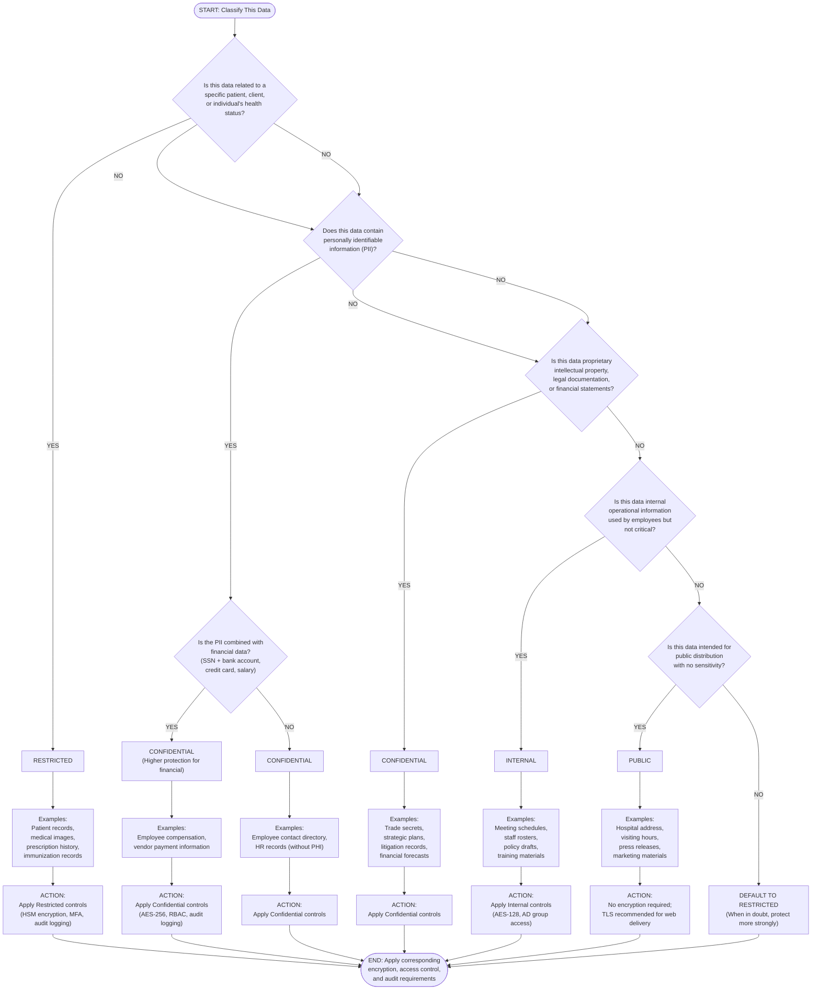

# 18. The Data Classification Matrix

## Goal

Apply data protection principles to produce a comprehensive data classification policy for MedDefense that drives every encryption decision.

## Context

Encryption is not binary ("encrypted" or "not encrypted"). It is a spectrum driven by the sensitivity of the data. A hospital cafeteria menu does not need AES-256. A patient's HIV status does. The data classification determines the protection level, and the protection level determines the algorithm, the key management rigor and the access controls.

---

## Part 1 - Data Type Inventory

### Complete MedDefense Data Classification

| Data Type | Examples | Regulatory Status | Owner |
|---|---|---|---|
| **Regulated (HIPAA/PHI)** | Patient EHR records, diagnosis codes, medication lists, lab results, imaging studies (DICOM), mental health notes, genetic testing results | HIPAA §164.501 Protected Health Information | Clinical Data Steward |
| **Personally Identifiable Information (PII)** | Employee SSN, home addresses, personal phone numbers, driver's license, birth dates, passport numbers | HIPAA Safe Harbor exclusion requirements; GDPR (if applicable); state privacy laws | HR Director |
| **Financial** | Credit card numbers (PAN), banking accounts, payroll data, billing records, insurance claims, vendor payment information | PCI-DSS; SOX for public companies | CFO |
| **Intellectual Property** | Clinical protocols, proprietary software code, research data, drug library algorithms, trade secrets | Copyright; trade secret protection | CTO |
| **Legal** | Contracts, litigation records, attorney-client communications, compliance audit reports, board resolutions | Attorney-client privilege; legal hold requirements | General Counsel |
| **Operational** | Meeting minutes, staff schedules, facility maintenance logs, inventory records, cafeteria menus | No regulatory requirements | Department Heads |

### Multi-Type Data Overlap

Some data belongs to multiple categories, requiring the highest protection level:

| Data Example | Primary Type | Secondary Types | Final Classification |
|---|---|---|---|
| Patient billing records | Regulated (PHI) | Financial (insurance info, credit cards) | **Restricted** (highest level) |
| Employee health records | Regulated (PHI) | PII (SSN, address) | **Restricted** (highest level) |
| Research study with patient consent forms | Regulated (PHI) | Intellectual Property (study design) | **Restricted** (highest level) |
| Executive compensation | PII (SSN) | Financial (salary, bonuses) | **Confidential** (financial + PII) |
| Vendor contract with payment terms | Legal | Financial (payment amounts) | **Confidential** |
| Hospital security camera footage | PII (identifies visitors/staff) | Operational | **Internal** (no PHI involved) |

---

## Part 2 - Classification Levels

### MedDefense Data Classification Framework v1.0

| Classification Level | Definition | Who Can Access | Encryption at Rest | Encryption in Transit | Exposure Consequence |
|---|---|---|---|---|---|
| **Public** | Information intended for general public consumption with no negative impact if disclosed | Everyone (employees, patients, visitors, general public) | Not required | TLS 1.2+ recommended for web delivery | Minimal reputational impact; none financial/legal |
| **Internal** | Operational information for employee use only; unauthorized disclosure has minor business impact | All employees with need-to-know; contractors may be granted access | AES-128 minimum or filesystem permissions | TLS 1.2+ required | Minor operational disruption; low regulatory risk |
| **Confidential** | Sensitive business information; unauthorized disclosure causes significant financial or competitive harm | Specific roles with documented authorization; requires NDA for external parties | AES-256 required with HSM-backed key management | TLS 1.2+ enforced with perfect forward secrecy | Moderate financial loss; regulatory fines possible; litigation risk |
| **Restricted** | Highly sensitive data including PHI, credentials, encryption keys; unauthorized disclosure violates law or endangers lives | Minimum necessary principle; role-based access with MFA; explicit approval required | AES-256 required with HSM, quarterly key rotation, audit logging | TLS 1.3 enforced; mutual TLS where feasible | HIPAA violations ($50K-$1.5M per incident); criminal liability; patient safety risk; termination of employment |

### Detailed Protection Requirements by Level

#### Public

| Control | Specification |
|---|---|
| **Examples** | Hospital address, visiting hours, cafeteria menu, public event announcements, press releases |
| **Access Controls** | No authentication required; open to all |
| **Storage** | Public web server, unencrypted filesystem acceptable |
| **Transmission** | TLS 1.2+ recommended but not mandatory for read-only content |
| **Retention** | 2 years standard; then archival or deletion |
| **Audit Logging** | Access logs retained 90 days |
| **Breach Notification** | Not required under HIPAA (not PHI) |

#### Internal

| Control | Specification |
|---|---|
| **Examples** | Staff directory, meeting schedules, policy drafts, training materials, org charts, non-sensitive memos |
| **Access Controls** | Active Directory group membership; single-factor authentication acceptable |
| **Storage** | Encrypted at rest (AES-128 minimum); volume encryption acceptable (LUKS2, BitLocker) |
| **Transmission** | TLS 1.2+ required for all remote access; HTTPS enforced |
| **Retention** | 3 years standard; departmental review required before archival |
| **Audit Logging** | Access logs retained 1 year |
| **Breach Notification** | Internal notification only; no regulatory filing required unless PII present |

#### Confidential

| Control | Specification |
|---|---|
| **Examples** | Financial reports, vendor contracts, strategic plans, executive compensation, unreleased research data |
| **Access Controls** | Role-based access control (RBAC); documented approval from data owner; NDA required for external access |
| **Storage** | AES-256 required; HSM-backed key management preferred; filesystem encryption mandatory |
| **Transmission** | TLS 1.2+ enforced with strong cipher suites; mutual TLS for service-to-service communication |
| **Retention** | 7 years for financial/legal documents; 5 years for vendor contracts |
| **Audit Logging** | All access logged; logs retained 3 years; weekly review by compliance officer |
| **Breach Notification** | Internal investigation required within 24 hours; potential regulatory notification if PII involved |

#### Restricted

| Control | Specification |
|---|---|
| **Examples** | Patient EHR records, encryption keys, credential databases, mental health notes, genetic data, code signing private keys, root CA keys |
| **Access Controls** | Minimum necessary principle; MFA mandatory; just-in-time access with approval; break-glass procedures audited |
| **Storage** | AES-256-GCM or AES-256-XTS required; HSM or TPM-backed key storage; volume or database encryption mandatory; separate key and data storage |
| **Transmission** | TLS 1.3 enforced; perfect forward secrecy required; mutual TLS for all service-to-service; end-to-end encryption for email (O365 OME) |
| **Retention** | HIPAA: 6 years from last activity; clinical: 7-10 years depending on record type; secure destruction required after retention period |
| **Audit Logging** | All access logged with user ID, timestamp, action type, data element accessed; logs retained 7 years; real-time alerting for anomalies |
| **Breach Notification** | HIPAA breach notification within 60 days; law enforcement notification if criminal; patient notification required; CISO must lead investigation |

### Exposure Impact Summary

| Classification | Estimated Breach Cost | Regulatory Penalty Range | Likelihood of Criminal Charges |
|---|---|---|---|
| Public | $0-$5K (rebranding costs) | None | None |
| Internal | $5K-$50K (operational disruption) | None (unless PII leaked) | None |
| Confidential | $50K-$500K (competitive damage, fines) | $10K-$250K per violation | Rare (unless fraud involved) |
| Restricted | $500K-$5M+ (class action, fines, lost trust) | $50K-$1.5M per violation; $50K-$250K criminal | Possible (if willful neglect) |

---

## Part 3 - The Classification Decision Tree

### Text-Based Classification Decision Process

Follow this decision tree whenever classifying a new dataset or document at MedDefense:

### Classification Quick Reference Card

**Printable guide for department managers:**

| If Your Data Is... | Classification | Minimum Encryption | Access Method |
|---|---|---|---|
| Patient health information (any part of EHR) | Restricted | AES-256 with HSM | MFA + role-based |
| Social Security numbers, driver's licenses | Confidential | AES-256 | Role-based |
| Credit card numbers, bank accounts | Confidential | AES-256 with PCI controls | Segregated access |
| Encryption keys, passwords, credentials | Restricted | HSM-only, never plaintext | Dual control |
| Financial reports, contracts | Confidential | AES-256 | Approved roles |
| Employee directory (no SSN) | Internal | AES-128 or FS permissions | All employees |
| Meeting agendas, schedules | Internal | AES-128 or FS permissions | All employees |
| Press releases, website content | Public | None required | Open access |

**Golden Rule:** When uncertain, classify one level higher than your initial assessment. It is cheaper to over-protect than to under-protect.

---

## Part 4 - Sovereignty and Geolocation

### Why Data Sovereignty Matters for Healthcare

Data sovereignty refers to the legal principle that data is subject to the laws and regulations of the country or region where it is physically stored. For healthcare data, sovereignty matters because HIPAA and state-level privacy laws impose geographic restrictions on where PHI can be stored and who can access it. If AWS backups are stored in a region outside the United States (e.g., EU Frankfurt, Asia Singapore), foreign governments may assert jurisdiction over the data, potentially requiring access under their national security or law enforcement powers—which could violate HIPAA's requirement that PHI remain under U.S. jurisdiction.

### HIPAA Implications of Cross-Border Storage

If the AWS region is in a different state or country, the following HIPAA implications arise:

1. **Covered Entity Liability:** MedDefense remains liable for any HIPAA violations even if data is hosted by AWS as a business associate. Foreign data centers may complicate breach notification timelines and audit compliance verification.

2. **Business Associate Agreement (BAA):** AWS offers BAAs for most regions, but the BAA may have different provisions for cross-border transfers. AWS must guarantee that subcontractors (e.g., data center operators) comply with HIPAA standards regardless of location.

3. **State Privacy Laws:** Some states (California Consumer Privacy Act, Virginia Consumer Data Protection Act) have stricter data localization requirements than federal HIPAA. Cross-border storage may trigger additional compliance obligations.

4. **Export Control:** Certain health data may be subject to EAR (Export Administration Regulations) if shared with international collaborators or research partners.

### Does Encryption Mitigate the Sovereignty Concern?

Encryption reduces but does not eliminate sovereignty concerns:

**What encryption DOES achieve:** Even if foreign law enforcement compels AWS to hand over encrypted data, the ciphertext is useless without decryption keys. If MedDefense retains sole custody of keys (stored on HSM in U.S.-based data center, never exported to AWS region), the foreign entity cannot decrypt the data. This provides a technical barrier against unauthorized foreign access.

**What encryption DOES NOT achieve:** Encryption does not prevent regulatory jurisdiction—the data is still subject to foreign law even if encrypted. Auditors and compliance reviewers may still flag cross-border PHI storage as a risk. Additionally, if key management is outsourced to AWS (even with encryption), AWS holds the keys and therefore has technical access regardless of geography. True sovereignty control requires key custody to remain within the original jurisdiction (U.S.).

**Recommendation:** For MedDefense, select AWS regions geographically proximate to headquarters (e.g., US-East for East Coast operations, US-West for West Coast). Avoid international regions unless there is no domestic alternative. Implement customer-managed keys (CMK) in AWS KMS backed by on-premise HSM, ensuring decryption capability never leaves U.S. soil. Document the rationale for regional selection in compliance audits to demonstrate intentional sovereignty management rather than accidental data placement.

---

## Appendix - Data Classification Enforcement Checklist

### Pre-Deployment Verification

Before deploying any new system or dataset at MedDefense, verify the following:

- [ ] Data type identified and mapped to classification level
- [ ] Encryption requirements specified based on classification (Public = none; Internal = AES-128; Confidential = AES-256; Restricted = AES-256 + HSM)
- [ ] Key management plan documented (who holds keys, rotation schedule, recovery process)
- [ ] Access control matrix created (who can access, at what level, for what purpose)
- [ ] Audit logging enabled and retention period defined
- [ ] Data owner assigned with accountability for classification accuracy
- [ ] Breach notification procedure tested for this data type

### Quarterly Classification Audit

Conduct quarterly reviews to ensure classifications remain accurate:

- [ ] Sample 5 data sets from each classification level
- [ ] Verify encryption is active and functioning
- [ ] Confirm access controls match documented permissions
- [ ] Check audit logs for unusual access patterns
- [ ] Validate that data has not been misclassified (too permissive or overly restrictive)
- [ ] Update classification if business context has changed (e.g., research data becomes public publication)

### Classification Exception Request Form

For data that does not fit neatly into the four classification levels:

1. Submit written request to Data Governance Committee
2. Include business justification for exception
3. Specify proposed protection controls
4. Define expiration date for exception (maximum 12 months)
5. Obtain CISO and Compliance Officer approval
6. Re-evaluate annually while exception remains active

---

## Summary

MedDefense's Data Classification Matrix establishes:

- **Six data types** (Regulated/PHI, PII, Financial, IP, Legal, Operational) with clear ownership
- **Four classification levels** (Public, Internal, Confidential, Restricted) with specific encryption, access, and audit requirements
- **A decision tree** enabling any employee to correctly classify new data types within 2 minutes
- **Sovereignty guidance** for cloud storage decisions, emphasizing key custody and geographic proximity

This framework drives every encryption decision by tying protection requirements directly to data sensitivity. No system is deployed without first answering "What classification level is this data?" The answer determines the algorithm, the key management rigor, the access controls, and the audit logging—eliminating ambiguity and ensuring consistent protection across all MedDefense data stores.
