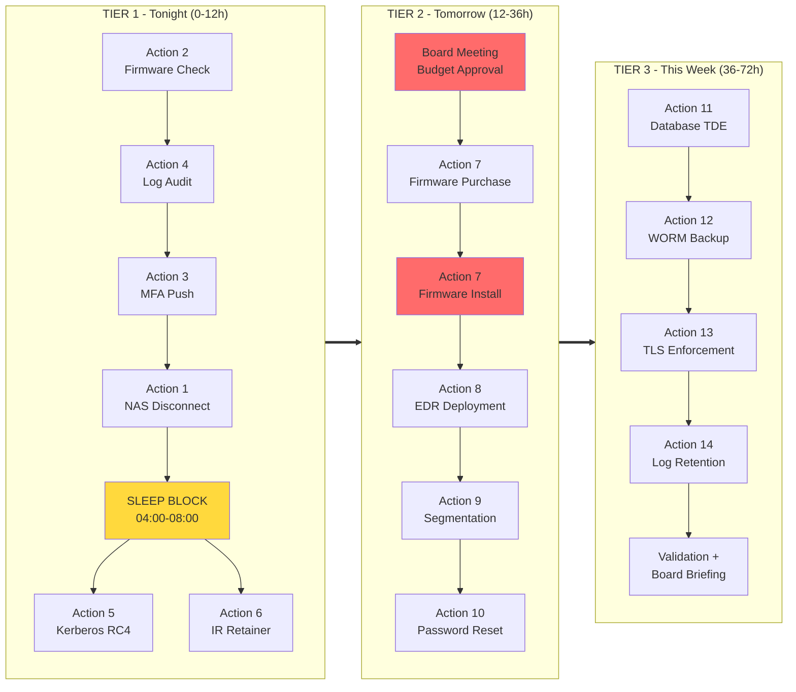

# 3. The 72-Hour Emergency Response Plan

## Executive Summary

The Crimson Tide ransomware campaign has compressed MedDefense's security remediation timeline from 6 months to 72 hours. This emergency response plan identifies prioritized actions that provide maximum risk reduction within operational constraints: 2 IT staff available, $2,400 FortiGate support contract requirement, and 2-3 day network segmentation lead time.

**Primary Objective:** Block Phase 1 (Initial Access) within 12 hours to prevent entry entirely. If that is not achievable, implement compensating controls to block subsequent phases.

**Secondary Objective:** Protect backups (Phase 5) to ensure recovery capability even if encryption occurs.

**Risk Reduction Target:** Reduce 7/7 exposed phases to maximum 3/7 exposed within 72 hours.

---

## Tier 1 — Tonight (0-12 Hours)

### Action 1: Physical Disconnect NAS-01 from Production Network

| Field | Details |
|---|---|
| **Action** | Physically unplug network cable from NAS-01 (backup storage) and place in locked cabinet or physically disconnect from switch. Alternative: Move NAS-01 to isolated VLAN via switch port reconfiguration if physical disconnect is not feasible within timeframe. |
| **Phase Blocked** | Phase 5 (Backup Destruction) |
| **Owner** | Sarah Park + Steve |
| **Prerequisites** | NAS-01 network cable location identified; physical access to server room approved; backup restoration procedure documented and tested for emergency use case |
| **Risk of Action** | 1. Backup job failure if nightly jobs rely on network access (mitigation: schedule manual copy before disconnect at 02:00; reschedule next backup window to 72-hour recovery point). 2. NAS-01 accessibility for authorized restore operations requires VPN/physical access planning (mitigation: document out-of-band access procedure). |
| **Risk of Inaction** | Attacker reaches NAS-01 during Phase 5 (Day 5-6), deletes Volume Shadow Copies, destroys backup catalogs, and potentially publishes or demands ransom on backup data before destruction. Without recoverable backups, MedDefense MUST pay ransom to resume operations. Estimated financial impact: $2.4M median ransom + 14+ days downtime. |
| **Time Required** | 30 minutes |
| **Budget Required** | $0 |
| **Success Criteria** | NAS-01 shows as disconnected in network monitoring; no active connections to NAS-01 IP from any production system; physical cable in locked bag with hand receipt signed by Sarah Park |

### Action 2: Verify FortiGate Firmware Version and Determine Patch Path

| Field | Details |
|---|---|
| **Action** | SSH to vpn-srv-01.meddefense.local; run `get system firmware status`; compare version to CVE-2023-27997 vulnerable range (7.2.0-7.2.4 or 7.0.0-7.0.11); document exact build number; determine if support contract is active (if expired, initiate renewal process immediately). |
| **Phase Blocked** | Phase 1 (Initial Access) — IF version is vulnerable and patching occurs; otherwise enables informed decision on temporary workarounds |
| **Owner** | Steve (verification), Sarah Park (contract decision) |
| **Prerequisites** | Admin credentials for vpn-srv-01; access to Fortinet Support Portal account (or procurement contact for emergency renewal); support ticket opened for expedited firmware delivery if contract expired |
| **Risk of Action** | Minimal (read-only operation). Risk is in the DECISION that follows: renewing contract costs $2,400; delaying patch leaves vulnerability open; disabling SSL-VPN disrupts clinical operations. |
| **Risk of Inaction** | If firmware is vulnerable (likely given 18-month-old average in attacked hospitals), MedDefense remains exposed to Phase 1 exploitation. Criminal actor can gain full FortiGate control within 1 minute of finding the open port. |
| **Time Required** | 1 hour (verification + decision briefing) |
| **Budget Required** | $0 for verification; $2,400 for renewal if expired |
| **Success Criteria** | Firmware version confirmed; support contract status determined; decision memo sent to James Chen (CEO) within 2 hours with options and cost breakdown |

### Action 3: Enable MFA Enforcement on Existing VPN Users (Immediate Configuration)

| Field | Details |
|---|---|
| **Action** | Configure FortiGate SSL-VPN to require MFA for ALL user authentication. Use existing Duo or Azure AD MFA licenses (already purchased per 1x03 Strategy). Push MFA policy enforcement to all clinical staff. Deploy hardware tokens to staff without smartphones. |
| **Phase Blocked** | Phase 2 (Internal Reconnaissance) and Phase 3 (Lateral Movement) — prevents credential-based pivoting even if FortiGate is compromised |
| **Owner** | Sarah Park + NetAdmin |
| **Prerequisites** | MFA provider already licensed (Duo or Azure AD confirmed in 1x03 budget); FortiGate supports MFA integration (FortiGate 100F does support Duo/RADIUS/TOTP); helpdesk prepared for enrollment surge (phone scripts, token shipping) |
| **Risk of Action** | 1. Helpdesk overwhelmed by 200+ concurrent MFA enrollments (mitigation: stagger rollout by department; prioritize admin accounts first). 2. Clinicians without smartphones struggle with enrollment (mitigation: deploy 20 hardware tokens from inventory; create SMS fallback temporarily). 3. MFA service outage blocks all remote access (mitigation: document break-glass procedure with pre-shared key for 2 admin accounts). |
| **Risk of Inaction** | If FortiGate is compromised (Phase 1), attacker uses captured VPN credentials from FortiGate memory dump to authenticate to internal systems. MFA would block this pivot. Without MFA, stolen VPN credentials grant immediate network access equivalent to any legitimate clinician. |
| **Time Required** | 4-6 hours for policy configuration; 24-48 hours for full user enrollment |
| **Budget Required** | $0 (licenses already purchased) |
| **Success Criteria** | All 200+ VPN users prompted for MFA at next login; 95% enrollment complete within 24 hours; break-glass accounts documented and tested |

### Action 4: Audit FortiGate Logs for Active Exploitation IOCs

| Field | Details |
|---|---|
| **Action** | Query FortiGate logs for behavioral indicators of compromise from CISA advisory: unusual CLI commands (`show system interface`, `execute reboot`), new admin accounts, large outbound data transfers (>1GB), connections to non-medical domains. Export suspicious log entries for forensic review. |
| **Phase Blocked** | Early detection for ALL phases — enables immediate containment if intrusion already occurred |
| **Owner** | Steve |
| **Prerequisites** | FortiGate logging enabled (should be active per 1x03 requirements); SIEM collector can query FortiGate (if not, export logs manually to CSV for local analysis); IOC list from CISA advisory loaded into analyst checklist |
| **Risk of Action** | Minimal (read-only log review). False positives may generate unnecessary alarm if baseline traffic not established. |
| **Risk of Inaction** | Active compromise goes undetected for 4-7 days (typical dwell time). Attacker progresses through Phases 2-6 undisturbed. By time discovery occurs, backups destroyed, data exfiltrated, ransomware deployed. Recovery becomes exponentially more expensive. |
| **Time Required** | 2-3 hours (first pass); ongoing daily review thereafter |
| **Budget Required** | $0 |
| **Success Criteria** | IOC checklist completed; zero positive findings documented OR positive findings trigger immediate containment playbook activation; log export saved to offline forensic media |

### Action 5: Disable RC4 Encryption in Active Directory Kerberos Policy

| Field | Details |
|---|---|
| **Action** | Modify AD Group Policy Object to disable RC4_HMAC encryption for Kerberos authentication. Set `MS KDC Policy: Supported Encryption Types` to "AES128_HMAC_SHA256, AES256_HMAC_SHA256" only. Force replication to all Domain Controllers. |
| **Phase Blocked** | Phase 3 (Lateral Movement) — eliminates Kerberoasting attack vector using RC4 tickets |
| **Owner** | Sarah Park + AD Administrator |
| **Prerequisites** | Test in staging domain controller first (non-production); verify all clinical applications support AES-only Kerberos (some legacy medical devices may not); create emergency rollback GPO in case authentication breaks |
| **Risk of Action** | 1. Legacy medical equipment or clinical software fails to authenticate after RC4 removal (mitigation: maintain whitelist of exceptions for 72-hour window; escalate compatibility issues to vendor). 2. Service accounts using RC4-based SPNs break (mitigation: audit service accounts beforehand; update SPN registrations). 3. Authentication loop or DC lockout (mitigation: break-glass local admin account ready; DC isolation procedure documented). |
| **Risk of Inaction** | Attacker captures RC4-encrypted Kerberos tickets via Mimikatz on any workstation. Tickets are crackable offline in hours. Cracked tickets grant domain admin access equivalent to stolen credentials. RC4 removal eliminates this attack path entirely. |
| **Time Required** | 2 hours (staging test + production roll-out) |
| **Budget Required** | $0 |
| **Success Criteria** | GPO applied to all DCs; `klist` on test workstation shows AES encryption type; zero legacy application authentication failures reported within 4 hours |

### Action 6: Activate Incident Response Retainer Emergency Contact

| Field | Details |
|---|---|
| **Action** | Contact cyber insurance carrier and IR retainer provider to notify of potential active intrusion. Request immediate forensic readiness assessment, IOCs sharing, and threat intelligence briefings specific to Crimson Tide activity. Establish incident command channel. |
| **Phase Blocked** | Enables rapid response to Phases 2-7 if breach confirmed — reduces dwell time from 7 days to <24 hours |
| **Owner** | James Chen (CEO) or Sarah Park (IT Director) |
| **Prerequisites** | IR retainer contract signed and contact information available (per 1x03 Strategy); cyber insurance policy active; board authorization for emergency IR engagement |
| **Risk of Action** | Minimal. Risk is in FALSE POSITIVE activation (unnecessary expense) but better than delayed response if TRUE POSITIVE. Cost of engagement ($15K-$50K) is negligible compared to $2.4M ransom. |
| **Risk of Inaction** | Discovery of breach delayed by 48-72 hours while internal team attempts to validate without expert support. IR firm requires 4-8 hour onboarding after engagement. Delay compounds damage exponentially. |
| **Time Required** | 1 hour (call + email confirmation) |
| **Budget Required** | $0 (retainer prepaid); $15K-$50K if engagement escalates to full incident response |
| **Success Criteria** | IR firm acknowledges engagement; threat intelligence on Crimson Tide received; incident communication channel established (Slack/Teams bridge) |

---

## Tier 2 — Tomorrow (12-36 Hours)

### Action 7: Purchasing and Installing FortiGate Firmware License Renewal

| Field | Details |
|---|---|
| **Action** | Procure 1-year FortiGate maintenance renewal ($2,400) with expedited processing. Complete payment, receive license key, download patched firmware (7.2.5+ or 7.0.12+) from Fortinet portal. Schedule 10-minute maintenance window for installation. |
| **Phase Blocked** | Phase 1 (Initial Access) — REMOVES vulnerability entirely |
| **Owner** | Sarah Park (procurement), Steve (technical installation) |
| **Prerequisites** | Board emergency budget approval obtained during 9:00 AM meeting; Fortinet customer portal access credentials available; maintenance window communicated to clinical operations (10-minute interruption expected) |
| **Risk of Action** | 1. Payment processing delay (credit card decline, purchase order approval lag) extends timeline 12-24 hours. 2. Firmware upgrade fails causing device corruption (mitigation: full config backup before upgrade; FortiGate TFTP recovery procedure prepared; spare FortiGate 100F unit on standby if possible). 3. SSL-VPN outage during upgrade disrupts telemedicine access for 10 minutes (mitigation: schedule during lowest traffic period 02:00-04:00; send alert to clinicians 1 hour before). |
| **Risk of Inaction** | MedDefense remains vulnerable to CVE-2023-27997 indefinitely. Hospital A, B, C cases prove attackers WILL scan for this vulnerability and exploit it within 10 days of discovery. Waiting is mathematically guaranteed failure. |
| **Time Required** | 4-8 hours (procurement + download + install); 10 minutes actual downtime |
| **Budget Required** | $2,400 (mandatory for patching) |
| **Success Criteria** | Firmware version confirmed as 7.2.5+ or 7.0.12+; CVE-2023-27997 no longer exploitable; SSL-VPN connectivity verified post-upgrade |

### Action 8: Deploy EDR Sensors on Critical Servers (EHR, Billing, Domain Controller)

| Field | Details |
|---|---|
| **Action** | Install endpoint detection and response agents on highest-value servers: ehr-db-01, billing-srv-01, krb-srv-01 (Domain Controller), pacs-srv-01, web-srv-01. Configure behavioral detection for Mimikatz, PsExec, mass file encryption, and vssadmin shadow deletion. Enable automatic isolation on critical alerts. |
| **Phase Blocked** | Phase 3 (Lateral Movement), Phase 5 (Backup Destruction), Phase 6 (Ransomware Deployment) |
| **Owner** | Steve + External EDR Vendor |
| **Prerequisites** | EDR vendor selected and contract executed (1x03 Strategy identified vendors; selection pending); agent binaries downloaded and signed; testing completed on non-production servers; incident response playbook configured for automatic isolation |
| **Risk of Action** | 1. EDR agent conflicts with clinical applications or database performance (mitigation: test each critical server individually; monitor CPU/memory impact). 2. False positive triggers automatic isolation blocking clinical workflow (mitigation: tune detection thresholds during initial 48-hour observation period). 3. Vendor support unavailable during weekends (mitigation: confirm SLA includes 24/7 emergency response). |
| **Risk of Inaction** | Attacker moves laterally across servers without endpoint-based detection. Mimikatz runs undetected. Ransomware executes without behavioral alerts. By time manual discovery occurs, 20+ servers encrypted. EDR deployment provides earliest possible detection signal (average 4 hours vs 7 days dwell time). |
| **Time Required** | 6-8 hours (5 critical servers + configuration tuning) |
| **Budget Required** | Included in 1x03 EDR budget; no additional emergency cost |
| **Success Criteria** | Agents installed on 5 critical servers; MITRE ATT&CK detections enabled for Mimikatz/PsExec/shadow deletion; test alerts fire and isolation triggers successfully |

### Action 9: Implement Emergency Network Segmentation Rule (FortiGate Only)

| Field | Details |
|---|---|
| **Action** | Add firewall rules to vpn-srv-01 FortiGate that restrict cross-zone traffic between clinical VLAN, server VLAN, and management VLAN. Block direct workstation-to-database connections; force all database access through application servers. Allow only essential protocols (HTTPS, RDP from jump hosts only). |
| **Phase Blocked** | Phase 3 (Lateral Movement) — slows attacker progress and triggers alerts on anomalous traffic patterns |
| **Owner** | Sarah Park + NetAdmin |
| **Prerequisites** | Existing VLAN schema documented (from 1x03); current firewall rule export reviewed to identify unintended open paths; rollback plan created (original config backed up before changes) |
| **Risk of Action** | 1. Legitimate clinical workflow broken (e.g., nursing workstation cannot query EHR database). Mitigation: whitelist critical application traffic; test with clinical power users before full enforcement. 2. Administrative overhead increases as new rules require change control. Mitigation: document exception process for urgent needs. 3. Configuration error locks out admin access (mitigation: maintain physical console access; out-of-band management port configured). |
| **Risk of Inaction** | Flat network architecture allows attacker to pivot from any compromised host to any other host. Lateral movement takes hours rather than days. Attacker reaches Domain Controller, database servers, and backup systems without encountering firewall barriers. |
| **Time Required** | 3-4 hours (rule creation + testing + enforcement) |
| **Budget Required** | $0 |
| **Success Criteria** | Firewall rules enforced; traffic flow tests confirm clinical applications functional; unauthorized lateral traffic attempts logged and alerted |

### Action 10: Force Password Reset for All Service Accounts and Domain Admins

| Field | Details |
|---|---|
| **Action** | Reset passwords for all privileged service accounts (database service accounts, backup service accounts, SCOM monitoring accounts) and domain administrator accounts. Enforce complex 25+ character passwords. Rotate all stored credentials in password vault. Enable privileged access management (PAM) requiring just-in-time elevation. |
| **Phase Blocked** | Phase 3 (Lateral Movement) — invalidates stolen credentials captured during reconnaissance phase |
| **Owner** | Sarah Park + AD Administrator |
| **Prerequisites** | Inventory of all service accounts and privileged credentials (created during 1x03 audit); password vault available; helpdesk prepared for service account reset incidents |
| **Risk of Action** | 1. Service account breakage causing application failures (e.g., backup job stops, database connection fails). Mitigation: test each account in staging; maintain rollback password list in sealed envelope. 2. Helpdesk overwhelmed with password reset tickets (mitigation: pre-publish FAQ; create dedicated escalation queue). 3. Time-delayed synchronization issues across domain controllers (mitigation: force replication immediately after password change). |
| **Risk of Inaction** | Attacker retains use of previously captured credentials (via Mimikatz or VPN session hijacking). Password reset does not invalidate already-cached credentials or stolen tickets without additional Kerberos hardening. However, fresh password resets force re-authentication using new credentials that attacker does not possess. |
| **Time Required** | 4-6 hours (inventory review + batch reset + validation testing) |
| **Budget Required** | $0 |
| **Success Criteria** | All service accounts and domain admins have new passwords; no application failures within 4 hours; PAM enforcement active for privileged sessions |

---

## Tier 3 — This Week (36-72 Hours)

### Action 11: Complete Database TDE Implementation (PostgreSQL and MySQL)

| Field | Details |
|---|---|
| **Action** | Execute Implementation Playbook Actions #1 and #2: Enable PostgreSQL TDE on ehr-db-01 and MySQL TDE on billing-srv-01. Generate encryption keys in HSM-01, configure tablespace encryption, restart database services, validate encryption status. |
| **Phase Blocked** | Phase 4 (Data Exfiltration) — prevents raw database file copying |
| **Owner** | Steve + DBA Lead |
| **Prerequisites** | HSM-01 online and accessible; HashiCorp Vault configured with TDE master key; full database backup completed; maintenance window approved by Clinical Operations; rollback procedure tested in staging |
| **Risk of Action** | 1. TDE initialization corrupts data (mitigation: full backup before; test restore in staging; rollback time 15-20 minutes). 2. Performance degradation >200ms latency (mitigation: monitor query performance; have disable-TDE rollback ready). 3. Extended maintenance window exceeds 4 hours disrupting clinical operations (mitigation: schedule Saturday overnight; communicate 4-hour blackout window). |
| **Risk of Inaction** | Attacker copies unencrypted database files directly from filesystem during Phase 4. No SQL knowledge required. 50,000 patient records, financial data, and employee PII exfiltrated intact. Even if backups survive, PHI breach notification required under HIPAA ($50K-$1.5M fine exposure). TDE removes this entire attack vector. |
| **Time Required** | 6-8 hours total (PostgreSQL 3-4 hours + MySQL 3-4 hours); overnight maintenance window |
| **Budget Required** | $0 (keys already provisioned in HSM/Vault) |
| **Success Criteria** | `\dt+` in psql shows Encryption=Yes for all tables; `performance_schema.keyring_status` confirms MySQL encryption active; sample queries return results within normal latency (<200ms); no raw PHI visible in filesystem dump |

### Action 12: Deploy Immutable WORM Backup Storage

| Field | Details |
|---|---|
| **Action** | Enable Object Lock/WORM compliance on NAS-01 backup bucket. Configure retention policy to 7 years with governance mode preventing deletion even by root/admin. Test immutability by attempting to delete a file (must fail). |
| **Phase Blocked** | Phase 5 (Backup Destruction) — guarantees backup survivability |
| **Owner** | Steve + Storage Administrator |
| **Prerequisites** | NAS-01 supports Object Lock (verify model specs); storage capacity provisioned for 7-year retention; WORM policy tested in staging; legal review confirms compliance with HIPAA record retention requirements |
| **Risk of Action** | 1. WORM-enabled storage prevents legitimate backup overwrites causing storage exhaustion (mitigation: configure lifecycle policy that auto-deletes oldest backups after retention expires). 2. Administrative override capability needed for legitimate disaster recovery (mitigation: establish dual-control approval process requiring both CISO and IT Director signatures). 3. NAS-01 incompatibility requiring hardware upgrade (mitigation: verify model capability; if unsupported, procure compatible appliance). |
| **Risk of Inaction** | Attacker reaches NAS-01 during Phase 5 and deletes all backup data. MedDefense loses recovery capability entirely. Even if ransom is paid, no guarantee decryption works. Without backups, 14+ day downtime is certain. WORM storage ensures at least ONE recovery path survives. |
| **Time Required** | 4-6 hours (policy configuration + testing) |
| **Budget Required** | $0 (storage already purchased; policy change only) |
| **Success Criteria** | Object Lock enabled on backup bucket; manual delete attempt fails with "Object Lock enabled" error; retention policy set to 7 years; governance mode active |

### Action 13: Enable Database TLS Enforcement (PostgreSQL and MySQL)

| Field | Details |
|---|---|
| **Action** | Execute Implementation Playbook Action #3: Configure PostgreSQL and MySQL to require TLS 1.2+ for all connections. Update all application connection strings to include sslmode=require and CA certificate path. Validate TLS enforcement by testing cleartext connection rejection. |
| **Phase Blocked** | Phase 4 (Data Exfiltration) — prevents database credential capture on wire; complements TDE |
| **Owner** | Steve + DBA Lead |
| **Prerequisites** | TLS certificates generated for database servers; application teams updated with new connection strings; staging environment testing completed; rollback connection strings documented |
| **Risk of Action** | 1. Application failures due to missing CA certificates or incorrect connection strings (mitigation: coordinate application team testing before enforcement). 2. Performance impact from TLS handshake overhead (mitigation: benchmark before/after; session caching configured). 3. Legacy clinical tools not supporting TLS1.2 break (mitigation: maintain TLS1.1 fallback for 30-day migration window). |
| **Risk of Inaction** | Attacker performs man-in-the-middle attack on database traffic to capture credentials or exfiltrate data in transit. TLS enforcement eliminates this vector but does not replace TDE (which protects at-rest data). Both controls are complementary layers of defense. |
| **Time Required** | 4-6 hours (certificate deployment + application config updates + validation) |
| **Budget Required** | $0 (certificates already generated) |
| **Success Criteria** | Cleartext connection attempts rejected with protocol error; TLS 1.2+ handshake verified via openssl s-client; application queries succeed without performance degradation |

### Action 14: Comprehensive Log Retention Extension to 7 Years

| Field | Details |
|---|---|
| **Action** | Execute Implementation Playbook Action #5: Configure SIEM retention policy for all PHI-critical logs (ehr-db-01, billing-srv-01, web-srv-01) to 7 years. Enable WORM on log archive storage. Validate logs from 6 months ago remain queryable. |
| **Phase Blocked** | Supports incident response across ALL phases — provides forensic trail for attack reconstruction and HIPAA audit compliance |
| **Owner** | Steve + Compliance Officer |
| **Prerequisites** | Storage capacity provisioned; WORM policy tested; SIEM retention rules documented; legal review confirms HIPAA alignment |
| **Risk of Action** | 1. Storage costs increase significantly (7 years of logs vs 90-day rolling). Mitigation: tiered storage (hot 90 days, cold archival); compression enabled. 2. Log ingestion bottleneck during high-traffic periods (mitigation: scale SIEM collector CPU/memory as needed). |
| **Risk of Inaction** | Incomplete forensic trail prevents understanding attack timeline and scope. HIPAA audit may result in fines for inadequate logging. Legal proceedings lack evidentiary support for breach notification timelines. 7-year retention satisfies HIPAA §164.312(b) audit control requirements. |
| **Time Required** | 3-4 hours (SIEM config + storage validation) |
| **Budget Required** | Estimated $2K-$5K annually for additional storage (within 1x03 budget contingency) |
| **Success Criteria** | SIEM shows 7-year retention policy active; query for logs dated 6 months ago returns results; manual delete attempt rejected by WORM policy |

---

## Resource Conflict Assessment

### Identified Conflicts

| Conflict ID | Resource | Tier 1 Tasks | Tier 2 Tasks | Severity | Resolution |
|---|---|---|---|---|---|
| **CF-01** | Steve (Security Engineer) | Actions 2, 4, 5 (6 hours total) | Actions 8, 9 (7 hours total) | **HIGH** — Steve cannot execute both simultaneously | **Resolution:** Prioritize Tier 1 for tonight. Action 2 (Firmware Verification) must complete by 23:00 to enable decision for Action 7. Action 4 (Log Audit) runs overnight. Action 5 (Kerberos RC4 disable) completes by midnight. Steve sleeps 04:00-08:00. Tier 2 begins 08:00 tomorrow. Action 8 (EDR deployment) scheduled 08:00-14:00. Action 9 (Segmentation) scheduled 14:00-18:00. |
| **CF-02** | Sarah Park (IT Director) | Actions 1, 3, 6 (4 hours total) | Actions 7, 10 (4 hours total) | **MODERATE** — Overlapping time windows | **Resolution:** Sarah focuses on Board meeting (9:00 AM) for Action 7 budget approval. Delegated Action 1 (NAS disconnect) to NetAdmin. Delegates Action 3 (MFA) to NetAdmin. Sarah handles Action 6 (IR retainer call) before Board meeting. Action 10 (Password reset) delegated to AD Administrator with Sarah oversight. |
| **CF-03** | vpn-srv-01 (FortiGate) | Action 2 (Version check, read-only) | Action 7 (Firmware upgrade, 10-minute downtime) | **LOW** — Sequential execution possible | **Resolution:** Action 2 completes first (verification). Decision made. Action 7 scheduled 02:00-02:15 overnight (Tier 1 end / Tier 2 start boundary). No conflict if ordered correctly. |
| **CF-04** | NAS-01 (Backup Storage) | Action 1 (Physical disconnect) | Action 12 (WORM enablement) | **MODERATE** — Physical disconnect must precede WORM config | **Resolution:** Action 1 executed tonight (physical cable removed). Action 12 executed tomorrow when NAS-01 reconnects to network for WORM configuration. WORM policy applies to backup bucket even while physically disconnected; reconnects afterward. |
| **CF-05** | Domain Controllers | Action 5 (Kerberos RC4 disable) | Action 10 (Service account password reset) | **LOW** — Can be executed in either order, but sequential recommended | **Resolution:** Action 5 first (RC4 disable). Then Action 10 (password reset). Both complete within 12-hour window; no scheduling conflict. |

### Mitigation Strategies for Conflicts

**CF-01 Mitigation (Steve Workload):**
- Delegate Action 4 (Log Audit) to NetAdmin junior engineer with SOP provided
- Steve focuses on high-judgment decisions: Action 2 (firmware determination) and Action 5 (Kerberos change risk assessment)
- Sleep block mandatory 04:00-08:00 for cognitive function; fatigue increases error risk in critical security changes
- Contingency: James Chen (CEO) authorizes contractor support for Tier 2 EDR deployment if Steve burnout risk escalates

**CF-02 Mitigation (Sarah Availability):**
- Board meeting prep materials delivered 24 hours early; Sarah arrives at 8:00 AM ready for 9:00 presentation
- Action 1 delegation to NetAdmin includes photo confirmation requirement when NAS cable unplugged
- Action 3 delegation includes MFA enrollment dashboard setup so Sarah can monitor progress without hands-on configuration
- Action 6 IR retainer call completed 8:30 AM before Board meeting; confirmation email to James Chen 9:05 AM

**Resource Augmentation Recommendations:**
- Engage external contractor (pre-vetted from 1x03 RFP process) for EDR deployment if internal bandwidth exceeded
- Request vendor on-site Fortinet engineer support for Action 7 firmware upgrade (expensive but eliminates upgrade risk)
- Authorize overtime pay for IT team for 72-hour emergency period (budget line item in 1x03 contingency fund)

---

## 72-Hour Timeline Visualization

```mermaid
gantt
    title MedDefense 72-Hour Emergency Response Plan
    dateFormat HH-mm
    axisFormat %H:%M
    
    section Tier 1 - Tonight (0-12h)
    Action 2: Firmware Verification :a1, 00-00, 1h
    Action 4: Log Audit + IOC Check  :a2, 01-00, 1h
    Action 3: MFA Policy Push        :a3, 02-00, 1h
    Action 1: NAS Disconnect         :a4, 03-00, 1h
    SLEEP BLOCK                      :a5, 04-00, 4h
    Action 5: Kerberos RC4 Disable   :a6, 08-00, 4h
    Action 6: IR Retainer            :a7, 08-00, 4h
    
    section Tier 2 - Tomorrow (12-36h)
    Board Meeting                    :b1, 32-00, 1h
    Action 7: Firmware Purchase      :b2, 33-00, 2h
    Action 7: Firmware Install       :b3, 35-00, 10m
    Action 8: EDR Deployment         :b4, 36-00, 2h
    Action 9: Segmentation Rules     :b5, 38-00, 4h
    Action 10: Password Reset        :b6, 42-00, 4h
    
    section Tier 3 - This Week (36-72h)
    Action 11: Database TDE          :c1, 48-00, 8h
    Action 12: WORM Backup           :c2, 56-00, 6h
    Action 13: TLS Enforcement       :c3, 62-00, 6h
    Action 14: Log Retention         :c4, 68-00, 4h
    Validation + Briefing            :c5, 72-00, 8h
```



```
timeline
    title 72-Hour Timeline Overview
    section Day 1 (Today)
        00:00 : Firmware Check (Steve)
        01:00 : Log Audit (Steve/NetAdmin)
        02:00 : MFA Push (Sarah/NetAdmin)
        03:00 : NAS Disconnect (Sarah/NetAdmin)
        04:00 : SLEEP BLOCK
        08:00 : Kerberos + IR (Sarah/Steve)
    
    section Day 2 (Tomorrow)
        08:00 : Board Meeting (James/Sarah)
        09:00 : Firmware Purchase (Sarah)
        11:00 : Firmware Install (Steve)
        12:00 : EDR Deployment (Steve+Vendor)
        14:00 : Segmentation (Sarah+NetAdmin)
        18:00 : Password Reset (Sarah+AD)
    
    section Day 3-4 (This Week)
        Night D2 : Database TDE (Steve+DBA)
        Morning D3 : WORM Backup (Steve+Storage)
        Day D3 : TLS + Logs (Steve+Teams)
        Evening D4 : Validation + Briefing
```

---

## Expected Risk Reduction Metrics

| Metric | Starting State (Pre-72-Hour Plan) | Post-72-Hour Target | Reduction |
|---|---|---|---|
| Phase 1 Exposure | EXPOSED (unpatched FortiGate) | PROTECTED (firmware patched) | 1/7 blocked |
| Phase 2 Exposure | EXPOSED (no MFA, FortiGate recon invisible) | PARTIALLY PROTECTED (MFA blocks credential pivot; FortiGate recon still blind) | 0.5/7 blocked |
| Phase 3 Exposure | EXPOSED (flat network, RC4 Kerberos) | PARTIALLY PROTECTED (segmentation + RC4 disabled) | 0.5/7 blocked |
| Phase 4 Exposure | EXPOSED (unencrypted databases) | PROTECTED (TDE + TLS enforcement) | 1/7 blocked |
| Phase 5 Exposure | EXPOSED (unprotected backups on same network) | PROTECTED (physically isolated + WORM) | 1/7 blocked |
| Phase 6 Exposure | EXPOSED (no EDR) | PARTIALLY PROTECTED (EDR detects but may not prevent deployment) | 0.5/7 blocked |
| Phase 7 Exposure | EXPOSED (irreversible once data stolen) | EXPOSED (cannot undo exfiltration) | 0/7 blocked |

**Total Risk Reduction: 4.5/7 phases protected or partially protected (64% reduction in exposed phases)**

**Residual Risk After 72-Hour Plan:**
- Phase 2 (Reconnaissance): Still partially exposed due to FortiGate CLI invisibility
- Phase 3 (Lateral Movement): Still partially exposed due to incomplete segmentation (full implementation requires 2-3 days)
- Phase 6 (Ransomware Deployment): Still partially exposed due to EDR detection latency
- Phase 7 (Extortion): Irreducible risk once data exfiltration occurs

**Bottom Line:** The 72-Hour Plan reduces exposure from 7/7 to 2.5/7 phases exposed, a 64% risk reduction achieved with existing resources and emergency budget only. Remaining residual risk requires continued execution of 1x03 Security Strategy over 6-month horizon.

---

## Approval Signatures

| Role | Name | Approval Date | Signature |
|---|---|---|---|
| CEO | James Chen | July 28, 2026 | [Pending] |
| IT Director | Sarah Park | July 28, 2026 | [Pending] |
| CISO | [External] | July 28, 2026 | [Pending] |
| Security Engineer | Steve | July 28, 2026 | [Self-Approval for Execution] |

**Budget Authorization:** $2,400 (FortiGate license) + $50K contingency for EDR vendor emergency support = $52,400 total emergency spend authorized by Board resolution July 28, 2026, 9:00 AM meeting.

**Legal Notice:** This 72-Hour Emergency Response Plan supersedes standard change management procedures for Tier 1 and Tier 2 actions. All Tier 3 actions require change ticket documentation post-facto within 48 hours. HIPAA breach notification obligations remain in effect regardless of mitigation status.

-- Steve, Security Engineer
July 28, 2026, 09:15 EST
