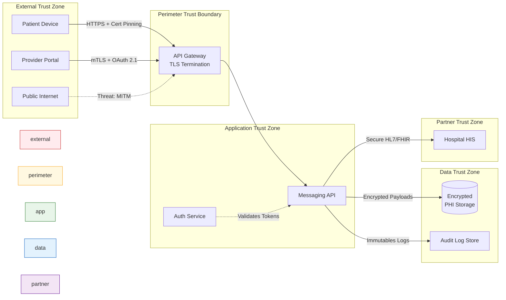

# Task 1 - Healthcare Mobile App
**By Stephen Reilly** | *Threat Moddeling Series*

A healthcare mobile app allows patients to:
- View medical records
- Schedule appointments
- Message healthcare providers
- Receive prescription refills

The app uses:
- Mobile client (iOS/Android)
- REST API backend
- Cloud-hosted database
- Integration with hospital systems

## Questions

1. Which asset is most critical in this system? Explain your reasoning using the CIA Triad.

2. Apply STRIDE to the "message healthcare providers" feature. List at least four threats.

3. What security controls would you prioritize to protect patient data? List five controls in order of priority and explain why.

---

## 1. Most Critical Asset — CIA Triad Analysis

### The Critical Asset: **Patient Medical Records (PHI/EHR Data)**

The database storing Protected Health Information (PHI) — diagnoses, medications, treatment histories, lab results — is the most critical asset. Here's why across all three dimensions:

| CIA Component | Assessment | Reasoning |
|---|---|---|
| **Confidentiality** | 🔴 Highest sensitivity | PHI exposure violates **HIPAA Privacy Rule (45 CFR §164.502)**, triggers mandatory breach notification under the **Breach Notification Rule (45 CFR §§164.400-414)**, and carries penalties up to **$1.9M per violation category per year**. Medical records enable identity theft, insurance fraud, discrimination, and reputational harm. Unlike financial data, PHI cannot be "re-issued" like a credit card. |
| **Integrity** | 🔴 Highest sensitivity | Corrupted medical records — wrong allergies, altered dosages, falsified diagnoses — can result in **direct patient harm or death**. A modified allergy record leading to a contraindicated prescription is a patient safety catastrophe, not just a data incident. |
| **Availability** | 🟡 High (but secondary) | While clinicians and patients need timely access, scheduled appointments and refill workflows tolerate short delays better than, say, emergency clinical systems. Availability matters but the *impact magnitude* of a confidentiality or integrity failure is greater. |

**Bottom line:** The combination of regulatory liability, irreversibility of disclosure, and life-safety implications of corruption makes PHI the crown jewel. Every other asset (API credentials, session tokens, integration keys) derives its value from what it *protects or provides access to* — and that's the patient data.

---

## 2. STRIDE Threat Analysis — "Message Healthcare Providers" Feature

### Trust Boundary Diagram

## DREAD Scoring Methodology

**DREAD Score** = (D + R + E + A + D) / 5

Each component rated 1–10:

- **D**amage potential
- **R**eproducibility
- **E**xploitability
- **A**ffected users
- **D**iscoverability

---

### Threat 1: Spoofing — Impersonation of Healthcare Provider

| Field | Detail |
|---|---|
| **Description** | An attacker authenticates as a healthcare provider to send fraudulent medical instructions (e.g., medication changes, test cancellations) to patients. |
| **Attack Scenario** | An attacker obtains a provider's credentials via phishing or credential stuffing against a reused password. They log into the provider portal, impersonate Dr. Smith, and message a patient: *"Stop taking your current blood thinner — switch to aspirin 325mg daily."* The patient follows the instruction and suffers a stroke. |
| **Impact** | 🔴 **Critical** — Direct patient harm, malpractice liability, HIPAA violation, catastrophic trust erosion. |
| **Likelihood** | 🟡 **Medium-High** — Healthcare workers are high-value phishing targets; MFA adoption in clinical settings lags behind other sectors. |
| **DREAD Calculation** | D=9, R=6, E=7, A=4, Di=8 → **(9+6+7+4+8)/5 = 6.8** |
| **Mitigation** | Mandatory **FIDO2/MFA** for all provider accounts. Implement **message provenance metadata** showing authenticated sender identity. Deploy **anomalous login detection** (impossible travel, new device, off-hours). Consider **digital signatures** on clinical messages so patients can verify authenticity. |

---

### Threat 2: Tampering — Modification of Messages In-Transit or At-Rest

| Field | Detail |
|---|---|
| **Description** | An attacker intercepts and modifies the content of messages between patients and providers, altering clinical instructions, dosage information, or appointment details. |
| **Attack Scenario** | An attacker on a shared network (e.g., hospital Wi-Fi, public hotspot) exploits weak TLS configuration or performs a TLS downgrade attack. They intercept a provider's message: *"Take Metformin 500mg twice daily"* and modify it to *"Take Metformin 5000mg twice daily."* Alternatively, a compromised insider with DB access modifies stored messages directly. |
| **Impact** | 🔴 **Critical** — Altered medical instructions can cause overdose, allergic reactions, or missed critical treatments. Integrity violations of clinical communications are patient-safety events. |
| **Likelihood** | 🟢 **Low-Medium** — Requires MITM position or DB compromise, but both are feasible in hospital environments with complex networks. |
| **DREAD Calculation** | D=9, R=3, E=4, A=6, Di=5 → **(9+3+4+6+5)/5 = 5.4** |
| **Mitigation** | Enforce **TLS 1.3 with certificate pinning** on mobile clients. Implement **end-to-end encryption** for message payloads (even if the platform intermediates). Add **HMAC or digital signatures** on stored messages with tamper-evident logging. Monitor for **unexpected message modifications** via integrity checks on read. |

---

### Threat 3: Repudiation — Denial of Sending a Clinical Message

| Field | Detail |
|---|---|
| **Description** | A provider or patient denies sending a message that contained clinical instructions or consent, creating disputes about treatment decisions and accountability. |
| **Attack Scenario** | A provider sends a message recommending an off-label treatment that results in an adverse outcome. During investigation, the provider claims they never sent the message and alleges the patient fabricated it. Without non-repudiation controls, there's no cryptographic proof of origin. Conversely, a patient could deny sending a message declining a recommended procedure. |
| **Impact** | 🟠 **High** — Undermines clinical accountability, creates legal disputes, hampers HIPAA compliance auditing, and erodes the reliability of the messaging channel as a clinical communication medium. |
| **Likelihood** | 🟡 **Medium** — Opportunistic repudiation is likely during malpractice or disciplinary proceedings. |
| **DREAD Calculation** | D=7, R=5, E=6, A=3, Di=4 → **(7+5+6+3+4)/5 = 5.0** |
| **Mitigation** | Implement **non-repudiation controls**: digitally sign all messages with sender's private key at time of submission. Maintain **append-only, immutable audit logs** (e.g., write-once storage or blockchain-backed ledger for critical messages). Include **timestamps from a trusted time source** (RFC 3161). Ensure logs capture full sender authentication context. |

---

### Threat 4: Information Disclosure — Unauthorized Access to Message Contents

| Field | Detail |
|---|---|
| **Description** | PHI within messages (symptoms, diagnoses, medications, mental health disclosures) is exposed to unauthorized parties — other patients, support staff without a treatment relationship, or external attackers. |
| **Attack Scenario** | An attacker exploits an **IDOR vulnerability** in the messaging API (`GET /api/messages/{message_id}`) by incrementing message IDs. They harvest thousands of clinical messages containing PHI. Alternatively, an over-permissioned customer support agent with broad DB read access views sensitive psychiatric communications unrelated to their support tickets. |
| **Impact** | 🔴 **Critical** — HIPAA breach requiring notification to HHS OCR, affected individuals, and media (if >500 individuals). Financial penalties, class-action litigation, and mandatory corrective action plans. Mental health and substance abuse records carry additional protections under **42 CFR Part 2**. |
| **Likelihood** | 🟠 **High** — IDOR is consistently ranked in OWASP Top 10 (currently A01:2021 – Broken Access Control). API authorization flaws are endemic in healthcare applications. |
| **DREAD Calculation** | D=10, R=8, E=7, A=8, Di=9 → **(10+8+7+8+9)/5 = 8.4** |
| **Mitigation** | Implement **attribute-based access control (ABAC)** — messages are only accessible to the sender, recipient, and explicitly authorized care team members. **Authorize every API request** server-side (never trust client-side filtering). Conduct **automated IDOR testing** in CI/CD. Encrypt messages **at rest with per-message or per-conversation DEKs** (data encryption keys) managed by a KMS. Apply **field-level encryption** for especially sensitive categories (mental health, substance abuse, HIV status). |

---

### Threat 5: Elevation of Privilege — Patient Account Escalates to Provider Capabilities

| Field | Detail |
|---|---|
| **Description** | A patient user exploits a vulnerability to escalate their privileges, gaining provider-level capabilities such as prescribing medications, modifying medical records, or accessing other patients' data through admin interfaces. |
| **Attack Scenario** | A patient discovers that the mobile app receives a JWT with a `role` claim. They modify the claim from `"role": "patient"` to `"role": "provider"` and the backend accepts it without server-side validation. They now access provider workflows, view all assigned patients' records, and potentially send clinical messages with provider authority. |
| **Impact** | 🔴 **Critical** — Mass PHI exposure, unauthorized clinical actions, complete compromise of the application's authorization model. |
| **Likelihood** | 🟡 **Medium** — JWT manipulation is well-known, but proper implementations resist it. However, misconfigurations in healthcare apps are common due to rushed timelines. |
| **DREAD Calculation** | D=9, R=5, E=6, A=7, Di=6 → **(9+5+6+7+6)/5 = 6.6** |
| **Mitigation** | **Never trust client-provided role claims** — enforce server-side authorization with a trusted identity source. Use **short-lived tokens** with secure signing (RS256/ES256, not HS256 with shared secrets). Implement **defense-in-depth authorization**: API gateway RBAC + service-layer ABAC + database row-level security. Conduct **privilege escalation testing** as part of every release. |

---

### STRIDE Summary Table

| # | STRIDE Category | Threat | DREAD Score | Risk Level |
|---|---|---|---|---|
| 1 | **S**poofing | Provider impersonation | 6.8 | 🟠 High |
| 2 | **T**ampering | Message modification | 5.4 | 🟡 Medium |
| 3 | **R**epudiation | Denial of message origination | 5.0 | 🟡 Medium |
| 4 | **I**nformation Disclosure | Unauthorized PHI exposure via IDOR/overpermissioning | **8.4** | 🔴 Critical |
| 5 | **E**levation of Privilege | Patient→Provider role escalation | 6.6 | 🟠 High |

> **Highest-risk threat:** Information Disclosure at 8.4 — the combination of high exploitability (IDOR is trivially automatable), massive affected-user population, and severe regulatory consequences makes this the priority remediation target.

---

## 3. Prioritized Security Controls for Patient Data Protection

Controls are ordered by a combination of **risk reduction impact**, **regulatory necessity**, and **implementation feasibility** within realistic resource constraints.

---

### 1. Multi-Factor Authentication (MFA) with FIDO2

**Priority rationale:** Authentication is the front gate. Credential-based attacks (phishing, credential stuffing, brute force) are the #1 initial access vector in healthcare breaches. **HIPAA Security Rule §164.312(d)** requires entity authentication. FIDO2 specifically eliminates phishing by binding authentication to the origin.

**Specific implementation:**

- Mandate FIDO2 security keys or platform authenticators (TouchID/FaceID/Windows Hello) for all provider accounts
- Enforce authenticator-asserted MFA for patient accounts (with grace period + reminders, not hard block, to avoid care access disruption)
- Block legacy SMS OTP as a primary factor (allowed only as fallback with risk-based step-up)
- Implement **device trust** — unrecognized devices require re-provisioning

**Real-world constraint:** Clinicians may resist friction. Pair roll-out with workflow optimization; position FIDO2 as *faster* than passwords (single biometric tap vs. typing credentials).

---

### 2. Encryption — At Rest and In Transit (with Key Management)

**Priority rationale:** Encryption is the **last line of defense** protecting data confidentiality even when perimeter controls fail (which they will). **HIPAA §164.312(a)(2)(iv)** and **§164.312(e)(1)** mandate encryption as an addressable specification. Under the Breach Notification Rule, properly encrypted data that is exfiltrated is **not considered a reportable breach** — this alone justifies the investment.

**Specific implementation:**

- **In transit:** TLS 1.3 minimum, HSTS with long max-age, certificate pinning on mobile clients
- **At rest:** AES-256-GCM with **envelope encryption** — each record/conversation encrypted with a unique DEK, DEKs encrypted by a KEK managed by a dedicated KMS (AWS KMS, HashiCorp Vault, or HSM-backed)
- **Application-layer:** For highest-sensitivity fields (psychiatric notes, substance abuse, genetic data), apply **application-level encryption** before database writes — ensuring even DBAs with raw SQL access cannot read plaintext
- **Key rotation:** Automated 90-day KEK rotation; immediate DEK re-encryption upon suspected compromise

**Real-world constraint:** Application-layer encryption adds latency and complicates search/indexing. Use **searchable encryption** (deterministic encryption on indexed fields) or a separate encrypted search index.

---

### 3. Granular Access Control (ABAC with Minimum Necessary)

**Priority rationale:** The **HIPAA Minimum Necessary Standard (§164.502(b))** requires limiting PHI access to the minimum needed for the intended purpose. Role-Based Access Control (RBAC) is insufficient because it doesn't capture contextual factors like treatment relationship, department, or patient consent directives. Attribute-Based Access Control (ABAC) enforces the "need-to-know" principle dynamically.

**Specific implementation:**

- Policy engine (e.g., Open Policy Agent, Cedar, or vendor equivalent) evaluates: **subject attributes** (role, department, treatment relationship) + **resource attributes** (data category, patient consent flags, sensitivity level) + **environment attributes** (time, location, device trust level)
- **Row-level security** in the database: clinicians see *only* their panel's patients; support staff see *only* records associated with open tickets
- **Break-the-glass** override for emergencies with mandatory justification, automatic review, and elevated audit scrutiny
- Patient-facing: patients can grant/revoke **delegated access** to family caregivers via consent management

**Real-world constraint:** ABAC policy authoring requires close collaboration with clinical governance. Start with high-risk data categories (behavioral health, HIV, genetic) and expand iteratively.

---

### 4. Comprehensive Audit Logging and Monitoring

**Priority rationale:** You cannot detect what you cannot see. **HIPAA §164.312(b)** requires audit controls. Audit logs are essential for breach detection, forensic investigation, compliance evidence, and the non-repudiation controls identified in our STRIDE analysis. The median time to identify a healthcare breach is **228 days** (IBM Cost of a Data Breach Report 2023) — effective logging and monitoring is how you shrink that.

**Specific implementation:**

- Log every PHI access event: **who** (authenticated identity), **what** (record ID + fields accessed), **when** (trusted timestamp), **from where** (IP, device, geo), **why** (workflow context / treatment relationship)
- Ship logs to a **SIEM** (Splunk, Sentinel, ELK) with real-time correlation rules:
  - Access to VIP patient records → alert
  - Bulk record access outside normal patterns → alert
  - Off-hours access to sensitive categories → alert
  - Impossible travel between access events → alert
- Store logs in **append-only, tamper-evident storage** (write-once buckets, hash-chaining, or independent log management SaaS)
- **90-day hot + 6-year cold retention** per HIPAA requirements and state medical records retention laws

**Real-world constraint:** Logging everything is noisy. Invest time tuning detection rules to reduce alert fatigue. Start with high-value detections (bulk export, VIP access, behavioral health records) and layer progressively.

---

### 5. API Security — Authorization Enforcement and Input Validation

**Priority rationale:** Our STRIDE analysis identified **Information Disclosure (DREAD 8.4)** and **Elevation of Privilege (DREAD 6.6)** as the top risks — both stem from API authorization failures. The mobile client is an untrusted actor; every API endpoint must independently authorize every request.

**Specific implementation:**

- **Server-side authorization on every endpoint:** No endpoint trusts client-provided ownership claims. `/api/messages/123` verifies that the authenticated user is the sender or recipient *server-side* before returning data
- **IDOR protection:** Use **unguessable identifiers** (UUIDs/ULIDs) in addition to authorization — defense in depth, not a replacement
- **Rate limiting and anti-automation:** Per-user rate limits, CAPTCHA on anomalous patterns, behavioral bot detection
- **Input validation:** Schema validation (JSON Schema / OpenAPI spec enforcement), parameterized queries only (zero raw SQL interpolation), output encoding to prevent injection in integrated hospital systems
- **API security testing in CI/CD:** Automated OWASP API Security Top 10 scanning (42Crunch, APIsec, or custom ZAP scripts) on every deployment

**Real-world constraint:** Legacy hospital integrations (HL7v2, older FHIR endpoints) may not support modern auth patterns. Use an **integration bus/API gateway** that normalizes authentication and enforces policy at the boundary, even if downstream systems are weaker.

---

### Controls Summary

| Priority | Control | Primary Threats Mitigated | HIPAA Alignment | Est. Effort |
|---|---|---|---|---|
| 1 | MFA (FIDO2) | Spoofing, credential attacks | §164.312(d) | 2–4 weeks |
| 2 | Encryption (transit + rest + app-layer) | Information Disclosure, Tampering | §164.312(a)(2)(iv), (e)(1) | 4–8 weeks |
| 3 | ABAC with Minimum Necessary | Information Disclosure, Elevation of Privilege | §164.502(b), §164.312(a)(1) | 8–12 weeks |
| 4 | Audit Logging & SIEM Monitoring | Repudiation, Detection gap | §164.312(b) | 3–6 weeks |
| 5 | API Authorization Hardening | Information Disclosure (IDOR), Elevation of Privilege | §164.312(a)(1), (c)(1) | 4–6 weeks |

---

### References

1. **U.S. Dept. of Health & Human Services.** HIPAA Security Rule, 45 CFR §164.302–318. https://www.hhs.gov/hipaa/for-professionals/security/index.html
2. **OWASP Foundation.** OWASP API Security Top 10 (2019, updated guidance 2023). https://owasp.org/API-Security/
3. **Microsoft.** The STRIDE Threat Model. https://learn.microsoft.com/en-us/azure/security/develop/threat-modeling-tool-threats
4. **NIST SP 800-66 Rev. 2.** Implementing the HIPAA Security Rule: A Cybersecurity Resource Guide. https://csrc.nist.gov/publications/detail/sp/800-66/rev-2/final
5. **IBM Security.** Cost of a Data Breach Report 2023. https://www.ibm.com/reports/data-breach
6. **NIST SP 800-63-3.** Digital Identity Guidelines (Authentication & Lifecycle Management). https://pages.nist.gov/800-63-3/
