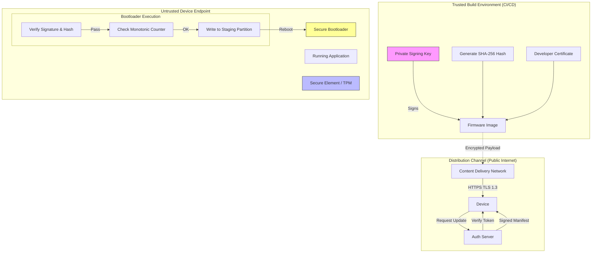

# Task 2 - IoT Smart Thermostat
**By Stephen Reilly** | *Threat Moddeling Series*

## Device Overview
A smart thermostat device:
- Connects to home Wi-Fi
- Controls heating/cooling systems
- Collects temperature data
- Receives commands from mobile app
- Updates firmware over-the-air

---

## Questions

1. **Identify IoT-specific threats** that don't typically apply to web applications. List at least five.
2. **What happens if an attacker gains physical access** to the device? Describe the attack chain and potential impacts.
3. **Design security controls** for the OTA (Over-The-Air) update process. What are the essential security requirements?

---

## 1. IoT-Specific Threats (Distinct from Web Applications)

Web applications typically operate in a constrained, virtualized environment with strict boundary controls. IoT devices like thermostats introduce unique vectors: persistent local network presence, direct interaction with physical actuators, and limited computational resources for security.

Below are five critical threats specific to this form factor, analyzed using the **DREAD** methodology.

> **DREAD Formula Reference**: Scale: 1 (Low) to 10 (High)

### Threat 1: Hardware Debug Interface Exposure (JTAG/SWD)
- **Description**: Many IoT devices leave Serial, JTAG, or UART debug ports enabled on PCB pads to facilitate manufacturing testing but fail to physically mask or electrically disable them before deployment.
- **Attack Scenario**: An attacker gains physical access (or inspects the device during installation), identifies exposed pads, and connects a logic analyzer or programmer. They can dump the flash memory to extract hardcoded API keys, Wi-Fi credentials, or root shell access via the serial console.
- **Impact**: Complete compromise of device confidentiality and integrity; potential pivot to the home network.
- **Likelihood**: Moderate (Physical access required, but common in poorly manufactured firmware).
- **Mitigation**: Physically obscure test points; fuse eFuses to disable debug interfaces post-manufacturing; implement secure boot that refuses to load unsigned kernels if debug flags are detected.

### Threat 2: Insecure Firmware Update Mechanisms (Rollback/Injection)
- **Description**: Unlike web apps which serve dynamic content, IoT devices rely on static binary images. If the update mechanism lacks cryptographic signing or version checking, an attacker can inject malicious firmware or force a downgrade to a vulnerable version.
- **Attack Scenario**: An attacker performs a Man-in-the-Middle (MitM) on the local network intercepting the OTA request. They swap the legitimate firmware blob with a modified one containing a backdoor or downgrade it to a version with known CVEs (e.g., hardcoded telnet).
- **Impact**: Persistent compromise, botnet recruitment (Mirai-style), or denial of service (bricking).
- **Likelihood**: High (Wi-Fi networks are often unencrypted or weakly secured).
- **Mitigation**: Enforce strict code signing with RSA/ECC; implement monotonic version counters to prevent rollback attacks; use encrypted transport (TLS 1.3) with certificate pinning.

### Threat 3: Unencrypted Actuator Control Channels
- **Description**: Web apps generally enforce HTTPS for all interactions. IoT devices often use legacy protocols (MQTT without TLS, plain HTTP, or proprietary UDP/TCP) for low-latency control of heating/cooling relays.
- **Attack Scenario**: An attacker sniffs traffic on the home LAN (or compromises a neighbor's router). They replay captured "Set Temp: 30°C" or "Disable Security Mode" packets to override user preferences or disable alarms.
- **Impact**: Privacy violation (inferring occupancy), financial loss (energy waste), or safety risk (freezing pipes or overheating).
- **Likelihood**: High (Common default configurations).
- **Mitigation**: Mandate TLS/mTLS for all control plane communications; implement message authentication codes (HMAC) for non-TLS protocols; enforce mutual authentication between app and device.

### Threat 4: Side-Channel Power Analysis Attacks
- **Description**: Web applications cannot be attacked via power consumption analysis. Embedded microcontrollers leak information through power spikes during cryptographic operations.
- **Attack Scenario**: An attacker with physical access uses a high-precision oscilloscope to monitor power draw while the thermostat processes a symmetric key operation (e.g., AES decryption of the Wi-Fi password stored in flash). By analyzing the timing and amplitude of power fluctuations, they reconstruct the key.
- **Impact**: Extraction of long-term secrets without breaking the encryption algorithm mathematically.
- **Likelihood**: Low (Requires high-end equipment and close proximity, but feasible for state actors).
- **Mitigation**: Use constant-time cryptographic implementations; add random noise to power lines; employ tamper-evident enclosures that short-circuit the board upon intrusion detection.

### Threat 5: Supply Chain Compromise via Pre-Shared Keys (PSK)
- **Description**: Manufacturers sometimes hardcode a single master PSK across thousands of devices to simplify provisioning, unlike web apps where each session generates unique tokens.
- **Attack Scenario**: An attacker extracts the firmware image from a cheap unit, finds the hardcoded master key used for initial provisioning or cloud communication, and uses it to authenticate and control any instance of that device model globally.
- **Impact**: Mass-scale compromise; total loss of trust in the product line.
- **Likelihood**: Medium (Prevalent in budget consumer electronics).
- **Mitigation**: Provision unique device certificates/secrets at the factory level (just-in-time provisioning); use a hardware secure element (SE) to store keys; rotate credentials immediately upon first user setup.

### DREAD Scoring Summary

| Threat | D | R | E | A | D | Score | Risk Level |
| :--- | :-: | :-: | :-: | :-: | :-: | :-: | :--- |
| Hardware Debug Exposure | 8 | 6 | 7 | 6 | 4 | **7.0** | High |
| Insecure OTA Updates | 9 | 8 | 9 | 7 | 8 | **8.3** | Critical |
| Unencrypted Controls | 6 | 9 | 9 | 8 | 9 | **8.3** | Critical |
| Side-Channel Analysis | 8 | 3 | 2 | 2 | 3 | **3.3** | Low |
| Supply Chain PSK | 10 | 8 | 8 | 10 | 6 | **8.3** | Critical |

---

## 2. Physical Access Attack Chain & Impact

If an attacker gains physical access to the thermostat, the security model shifts from "network defense" to "physical containment," which is notoriously difficult. Here is the likely attack chain:

### Phase 1: Reconnaissance & Access
1. **Tactical Entry**: The attacker removes the faceplate. Since thermostats are often mounted on walls, this requires simple tools (flathead screwdriver).
2. **Interface Identification**: Visual inspection reveals UART pins, JTAG headers, or SPI flash chips.
3. **Power Injection**: Connects an external power source or taps into the battery/24VAC lines to keep the device running while probing.

### Phase 2: Extraction & Reverse Engineering
4. **Memory Dumping**: Using a bus pirate or dedicated programmer, the attacker dumps the NOR Flash or SPI Flash chip.
5. **Firmware Analysis**: The binary is loaded into Ghidra or IDA Pro. Static analysis reveals:
   - Hardcoded credentials.
   - Unprotected command injection points in the CLI.
   - Weak crypto implementation details.
6. **Debug Port Activation**: If the bootloader allows it (via voltage glitching or specific reset sequences), the attacker enables a serial shell.

### Phase 3: Persistence & Lateral Movement
7. **Payload Injection**: A custom firmware image is flashed, or a malicious script is injected into the volatile memory.
8. **Persistence**: Modifies the startup scripts to maintain a reverse shell even after reboots.
9. **Lateral Pivot**: Uses the device's trusted relationship with the home gateway to scan the internal network for vulnerable routers, NAS drives, or other IoT devices.

### Potential Impacts
- **Safety Hazard**: Malicious alteration of HVAC schedules could lead to freezing pipes in winter or heat-related illness in summer.
- **Network Pivoting**: The device becomes a trusted foothold inside the home network, bypassing external firewalls.
- **Privacy Surveillance**: Microphones (if present) or temperature data logs can reveal occupancy patterns, enabling burglary timing.
- **Botnet Recruitment**: The device is enlisted into a DDoS botnet, consuming bandwidth and compute resources.

---

## 3. Secure OTA Update Architecture Design

To mitigate the risks identified above, the OTA process must follow a **"Zero Trust"** model for the device itself. Below is the architectural design for a secure update pipeline.

### Trust Boundary Diagram

### Essential Security Requirements

#### 1. Cryptographic Code Signing
- **Requirement**: Every firmware image must be signed with a private key stored in a Hardware Security Module (HSM) within the build environment.
- **Mechanism**: Use ECDSA (secp256r1 or secp384r1) for signatures. The public key is baked into the device's read-only memory (ROM) or Secure Element during manufacturing.
- **Verification**: The bootloader must verify the signature before handing control to the new firmware. If verification fails, the device must boot into a safe mode or remain on the previous stable image.

#### 2. Mutual Authentication & Encrypted Transport
- **Requirement**: The device must authenticate the update server, and the server must authenticate the device.
- **Mechanism**: Implement mTLS (Mutual TLS) using unique device certificates. The connection must use TLS 1.3 with strict cipher suites (e.g., `TLS_AES_256_GCM_SHA384`).
- **Payload Encryption**: Even if the transport is encrypted, the firmware payload itself should be encrypted (AES-GCM) to prevent inspection by compromised intermediate nodes.

#### 3. Anti-Rollback Protection (Monotonic Counters)
- **Requirement**: Prevent attackers from forcing the device to downgrade to a vulnerable version.
- **Mechanism**: Include a `version_number` in the signed manifest. Store a `min_version` counter in non-volatile memory (protected by the Secure Element).
- **Logic**: Before applying an update, the bootloader checks: `if (manifest.version > stored.min_version)` If the update attempts to set a lower version, the bootloader rejects it and increments the `min_version` to match the current running version to prevent future downgrades.

#### 4. A/B Partitioning with Atomic Swaps
- **Requirement**: Ensure the device never ends up in a "bricked" state if power is lost during writing.
- **Mechanism**: Maintain two partitions (`Slot_A`, `Slot_B`). The active partition boots normally. New firmware is written to the inactive partition. Only after successful write and checksum verification does the bootloader flag the inactive slot as "valid" and switch the boot pointer. If the new boot fails (watchdog timeout), the system automatically reverts to the previous slot.

#### 5. Secure Rollback & Recovery Mode
- **Requirement**: Allow recovery if all partitions are corrupted, but restrict it to authorized personnel only.
- **Mechanism**: A "Recovery Mode" accessible only via a physical button sequence (requiring physical presence) combined with a temporary recovery certificate uploaded via USB or secure BLE. This prevents remote attackers from wiping the device entirely.

---

### Implementation Constraints Consideration

- **Resource Limits**: Thermostats often have limited RAM/CPU. We must choose lightweight cryptography (e.g., Ed25519 for signatures instead of RSA-2048) and efficient streaming verification to avoid buffering the entire image in memory.
- **Bandwidth**: The update payload should be compressed (GZIP/XZ) and transmitted incrementally. Delta updates (patching only changed blocks) should be considered to save user bandwidth, provided the delta generation happens in a secure environment.
- **Cost**: Integrating a Secure Element adds BOM cost (~$0.50–$1.00). For a $150 thermostat, this is acceptable for the security gain. Alternatively, if cost is paramount, utilize the MCU's built-in Trusted Execution Environment (TEE) features if available.

---

### Conclusion

Securing a smart thermostat requires moving beyond standard web application defenses. The combination of physical exposure, actuator risks, and resource constraints demands a **hardware-rooted trust model**. By enforcing strong cryptographic signing, anti-rollback mechanisms, and secure boot processes, we can significantly raise the bar for attackers attempting to manipulate the thermal comfort or network position of your home.
