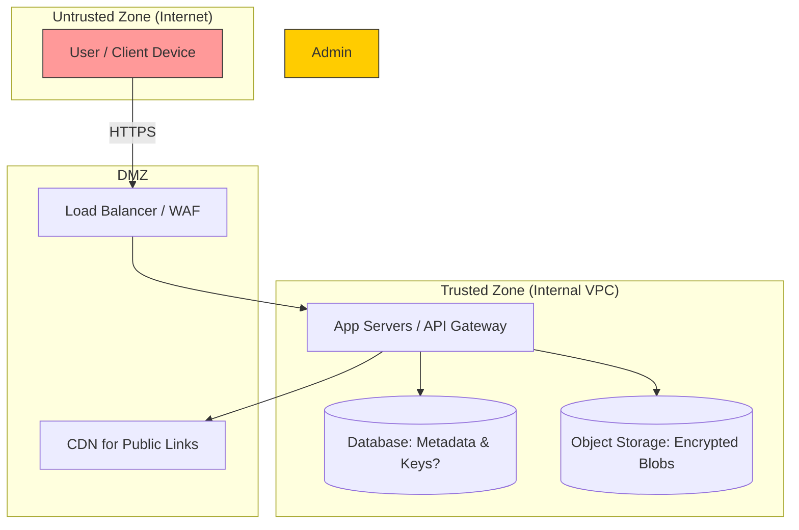

# Task 4 - Cloud Storage Service
**By Stephen Reilly** | *Threat Moddeling Series*

A cloud storage service provides:
* File upload and download
* File sharing with other users
* Public link generation
* File versioning
* Client-side and server-side encryption options

## Questions

1. Map out the attack surface. Identify all entry points and rank them by risk level.
2. A developer proposes storing encryption keys in the database for convenience. Use threat modeling to explain why this is problematic. What STRIDE threats does this introduce?
3. Create a risk matrix for the top 5 threats you've identified. Include likelihood, impact, and risk level.

---

## 1. Attack Surface Mapping & Risk Ranking

To map the attack surface effectively, we need to visualize the trust boundaries. In a system with Client-Side Encryption (CSE), the primary trust boundary is the client device itself; the server should theoretically never see plaintext data or keys. However, Server-Side Encryption (SSE) implies the server holds the keys, creating a different risk profile. The hybrid nature of your service creates complex boundaries.

### Trust Boundary Diagram

Note: The diagram above assumes a standard architecture. If Admin interfaces exist, they represent a high-value internal target.

### Attack Surface Entry Points & Risk Ranking

| Entry Point | Risk Level | Reasoning |
|-------------|------------|-----------|
| File Upload/Download Endpoints (API) | **Critical** | Direct interface for data ingestion and exfiltration. Vulnerable to BOLA (Broken Object Level Authorization), rate limiting bypasses, and malware injection if scanning is disabled for CSE files. |
| Authentication & Session Management Flows | **Critical** | Compromise here grants total access to the user's vault. If 2FA is weak or session tokens are leaked, the encryption layer becomes moot. |
| Encryption Key Management Interface (KMS/DB) | **Critical** | The single point of failure. If an attacker compromises the key store, all encrypted data is decrypted. This is the highest impact vector. |
| Public Link Generation & Retrieval | **High** | Often the easiest path for attackers to bypass authentication entirely. Predictable tokens, lack of expiration, or missing password protections lead to unauthorized data access. |
| File Versioning Logic | **Medium-High** | Can be exploited for DoS (filling storage quotas) or to preserve malicious artifacts (if version history isn't properly purged/scanned). |

---

## 2. The "Keys in Database" Proposal: A Threat Modeling Analysis

The developer's proposal to store encryption keys in the same database as the metadata (and potentially alongside encrypted data references) introduces a catastrophic architectural flaw. In a proper Zero-Knowledge or CSE model, keys should never reside on the same logical trust boundary as the data they protect without additional separation controls.

### STRIDE Analysis of Storing Keys in the Main Database

| STRIDE Category | Threat Description | Attack Scenario | Impact |
|-----------------|-------------------|-----------------|--------|
| **Information Disclosure** | Data Breach Amplification | An SQL Injection or credential leak grants access to the users table. Since keys are stored in columns like `encryption_key`, the attacker retrieves both the ciphertext and the decryption keys. They can decrypt the entire dataset offline. | **Catastrophic**: Total loss of confidentiality for all user data. |
| **Tampering** | Key Modification/Injection | An attacker injects a new row or modifies an existing key entry. If the system doesn't cryptographically verify key integrity, it might serve a corrupted key (causing denial of service) or a rogue key (allowing the attacker to read the data later). | **High**: Data integrity loss, potential for silent data corruption or unauthorized access. |
| **Repudiation** | Audit Log Spoofing | If key access logs are stored in the same DB and the attacker has DB write access, they can delete or alter audit entries showing when a key was retrieved, masking their theft. | **Medium**: Loss of forensic capability. |
| **Spoofing** | Impersonation via Key Theft | If user keys are derived from passwords but the salt/iterations are stored in the DB, an attacker can perform offline brute-force much faster than if the parameters were client-side only. | **High**: Account takeover. |
| **Elevation of Privilege** | Admin Key Escrow Exploitation | If the DB contains "master keys" or escrow keys for admin support access, a breach allows the attacker to act as any user. | **Critical**: Full system compromise. |

### Why This Is Problematic

Storing keys in the application database violates the principle of **Least Privilege** and **Defense in Depth**. It collapses the trust boundary. If the database is compromised, the encryption provides no security at all; it merely adds an obfuscation layer.

The ideal architecture separates the Key Management Service (KMS) from the data store, ideally using hardware security modules (HSMs) or envelope encryption where the master key never leaves the KMS.

---

## 3. Risk Matrix: Top 5 Threats

Calculated using the DREAD methodology (Damage, Reproducibility, Exploitability, Affected Users, Discoverability).

**Scale:** 1 (Low) to 5 (High)  
**Risk Levels:** 1-1.8 (Low), 1.9-2.7 (Medium), 2.8-3.6 (High), 3.7-5.0 (Critical)

Note: Calculations assume a realistic enterprise environment where some defenses (WAF, basic monitoring) exist but the specific flaws described are present.

### Threat 1: Unauthorized Access via Predictable Public Links

**Description:** Public links generated by the system use weak entropy (e.g., sequential IDs or short random strings) allowing attackers to guess URLs and download shared files without authentication.

**Attack Scenario:** An attacker scrapes a few valid public link formats, determines the pattern (e.g., `/share/uuid-v1` vs just `/share/1001`), writes a script to enumerate UUIDs or integers, and downloads sensitive documents belonging to other users.

**Impact:** High (Unauthorized data access).

| Metric | Score | Reasoning |
|--------|-------|-----------|
| Damage Potential | 4 | Sensitive corporate or personal data leaked. |
| Reproducibility | 4 | Scriptable once the pattern is found. |
| Exploitability | 3 | Requires minimal skill but needs some reconnaissance. |
| Affected Users | 5 | Potentially all users who generate links. |
| Discoverability | 4 | Easy to observe behavior in browser dev tools. |
| **Calculation** | **4.0** | |
| **Risk Level** | **CRITICAL** | |

**Mitigation:** Implement Cryptographically Secure Pseudo-Random Number Generators (CSPRNG) for all token generation. Enforce link expiration and optional password protection by default for public links. Add rate limiting on the link retrieval endpoint.

---

### Threat 2: Key Exfiltration via SQL Injection (Key in DB)

**Description:** As proposed by the developer, storing keys in the main DB allows a standard SQLi vulnerability to result in mass key theft.

**Attack Scenario:** An attacker finds an unsanitized input field in the file metadata update API. They inject a UNION-based SQL query to extract the `encryption_key` column alongside file metadata. They now possess the keys for millions of files.

**Impact:** Critical (Total system breach).

| Metric | Score | Reasoning |
|--------|-------|-----------|
| Damage Potential | 5 | Complete decryption of all user data. |
| Reproducibility | 5 | Automated SQLi scanners easily find these. |
| Exploitability | 4 | Common vulnerability class; easy to exploit. |
| Affected Users | 5 | All users whose keys are in the DB. |
| Discoverability | 4 | Standard automated scans detect this. |
| **Calculation** | **4.6** | |
| **Risk Level** | **CRITICAL** | |

**Mitigation:** Immediate refactor required. Separate keys into a dedicated, highly restricted Key Vault (e.g., AWS KMS, HashiCorp Vault, or separate HSM-backed DB). Never store raw keys in the relational DB with user data. Use envelope encryption.

---

### Threat 3: Broken Access Control (BOLA) on File APIs

**Description:** The upload/download endpoints fail to properly verify that the requesting user owns the file ID or has been granted permission.

**Attack Scenario:** User A downloads file_123. By intercepting the request and changing the ID to file_124 (belonging to User B), the server returns User B's file because the authorization check only validates the JWT signature, not the resource ownership.

**Impact:** High (Cross-user data leakage).

| Metric | Score | Reasoning |
|--------|-------|-----------|
| Damage Potential | 4 | Leakage of specific confidential files. |
| Reproducibility | 5 | Simple ID manipulation. |
| Exploitability | 2 | Requires understanding of API structure but low skill. |
| Affected Users | 3 | Depends on how many files are misconfigured. |
| Discoverability | 3 | Can be discovered by fuzzing IDs. |
| **Calculation** | **3.4** | |
| **Risk Level** | **HIGH** | |

**Mitigation:** Implement strict object-level authorization checks on every API call. Verify user_id in the JWT matches the owner_id in the database for the requested resource. Use indirect reference maps if possible.

---

### Threat 4: Malware Propagation via Client-Side Uploads

**Description:** Even with CSE, the server must handle the blob. If the server-side validation logic assumes CSE prevents malware (which is false; encrypted malware is still malware if decrypted by the user later), malicious files may be distributed.

**Attack Scenario:** Attacker uploads an encrypted Ransomware payload. Since the server cannot scan the content (it's encrypted), it accepts it. The file is shared with other users. When a victim downloads and decrypts, the ransomware executes.

**Impact:** High (Malware infection, reputation damage).

| Metric | Score | Reasoning |
|--------|-------|-----------|
| Damage Potential | 4 | Infection of client devices. |
| Reproducibility | 3 | Attacker needs a way to distribute the link. |
| Exploitability | 3 | No server-side mitigation blocks it by design. |
| Affected Users | 4 | Anyone receiving the shared link. |
| Discoverability | 2 | Hard to detect until execution. |
| **Calculation** | **3.2** | |
| **Risk Level** | **HIGH** | |

**Mitigation:** Implement a "sandbox" feature for previewing files. For CSE, rely on client-side scanning (scanning before encryption on upload) or provide clear warnings that shared CSE files cannot be scanned server-side. Educate users.

---

### Threat 5: Timing Attacks on Password Derivation (If SDE Is Used)

**Description:** If the system uses Server-Side Encryption (SDE) and derives keys from passwords, side-channel timing attacks could reveal password entropy.

**Attack Scenario:** Attacker measures the response time of login/key-derivation endpoints. Variations in time indicate whether the password hash matched a prefix, allowing incremental guessing of the password.

**Impact:** Medium (Brute force acceleration).

| Metric | Score | Reasoning |
|--------|-------|-----------|
| Damage Potential | 3 | Slows down cracking, but not immediate full break. |
| Reproducibility | 2 | Requires precise network conditions. |
| Exploitability | 3 | Requires advanced tooling (e.g., Burp Intruder with precision). |
| Affected Users | 2 | Only affects users with simple passwords initially. |
| Discoverability | 2 | Hard to distinguish from normal latency variance. |
| **Calculation** | **2.4** | |
| **Risk Level** | **MEDIUM** | |

**Mitigation:** Ensure constant-time comparison algorithms for password verification and key derivation functions (KDFs like Argon2id or PBKDF2). Add uniform artificial latency if necessary.

---

## Summary & Recommendation

The most critical finding here is the proposed key storage architecture. Moving forward, it's strongly recommended we reject the "keys in database" approach immediately. It turns the database into a "plaintext vault" rather than an encrypted one.

### Prioritized Action Plan

1. **Architectural Refactor:** Design a separate Key Management Service (KMS) distinct from the metadata database.
2. **Input Validation:** Audit all file upload/retrieval endpoints for BOLA and SQLi.
3. **Link Security:** Enforce CSPRNG for public links and implement mandatory expiration.
4. **Client-Side Policy:** If CSE is a core feature, clearly document that server-side malware scanning is impossible and shift responsibility to client-side pre-upload scanning.
