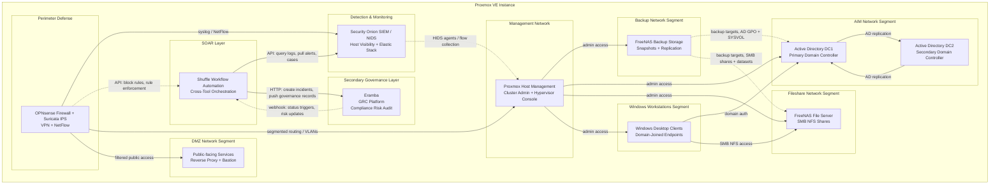

```mermaid
flowchart TB
    subgraph Proxmox["Proxmox VE Instance"]
        subgraph Perimeter["Perimeter Defense"]
            OPN["OPNsense Firewall + Suricata IPS<br/>VPN + NetFlow"]
        end

        subgraph DMZNet["DMZ Network Segment"]
            DMZ["Public-facing Services<br/>Reverse Proxy + Bastion"]
        end

        subgraph Detection["Detection & Monitoring"]
            SO["Security Onion SIEM / NIDS<br/>Host Visibility + Elastic Stack"]
        end

        subgraph Orchestration["SOAR Layer"]
            SHF["Shuffle Workflow Automation<br/>Cross-Tool Orchestration"]
        end

        subgraph Governance["Secondary Governance Layer"]
            ERA["Eramba<br/>GRC Platform<br/>Compliance Risk Audit"]
        end

        subgraph MgmtNet["Management Network"]
            MGMT["Proxmox Host Management<br/>Cluster Admin + Hypervisor Console"]
        end

        subgraph WinNet["Windows Workstations Segment"]
            WS["Windows Desktop Clients<br/>Domain-Joined Endpoints"]
        end

        subgraph BackupNet["Backup Network Segment"]
            FN1["FreeNAS Backup Storage<br/>Snapshots + Replication"]
        end

        subgraph AIMNet["AIM Network Segment"]
            DC1["Active Directory DC1<br/>Primary Domain Controller"]
            DC2["Active Directory DC2<br/>Secondary Domain Controller"]
        end

        subgraph FileShareNet["Fileshare Network Segment"]
            FN2["FreeNAS File Server<br/>SMB NFS Shares"]
        end
    end

    OPN -- "syslog / NetFlow" --> SO
    OPN -. "API: block rules, rule enforcement" .-> SHF
    SHF -- "API: query logs, pull alerts, cases" --> SO
    SHF -- "HTTP: create incidents, push governance records" --> ERA
    ERA -. "webhook: status triggers, risk updates" .-> SHF

    OPN -- "segmented routing / VLANs" --> MGMT
    OPN -- "filtered public access" --> DMZ
    MGMT -- "admin access" --> FN1
    MGMT -- "admin access" --> DC1
    MGMT -- "admin access" --> FN2
    MGMT -- "admin access" --> WS
    WS -- "domain auth" --> DC1
    WS -- "SMB NFS access" --> FN2
    DC1 -- "AD replication" --> DC2
    DC2 -- "AD replication" --> DC1
    FN1 -. "backup targets, AD GPO + SYSVOL" .-> DC1
    FN1 -. "backup targets, SMB shares + datasets" .-> FN2
    SO -. "HIDS agents / flow collection" .-> MGMT
```
