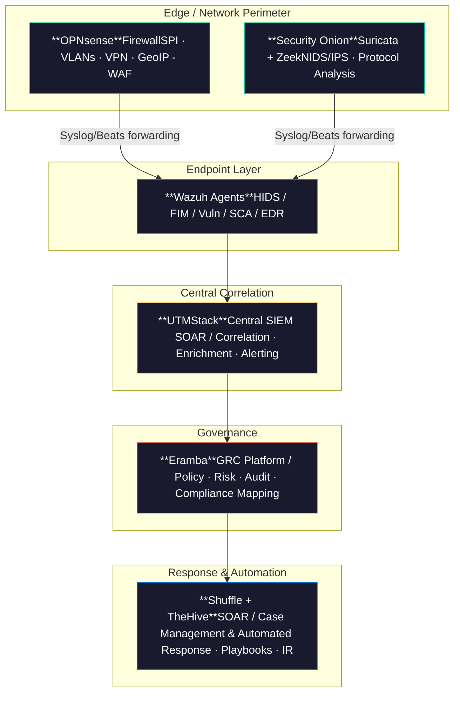

# Open-Source Security Stack Blueprint

## Firewal/WAF — OPNsense

OPNsense is the standout recommendation here. It's a fork of pfSense, built on FreeBSD, and offers stateful packet inspection, VLANs, WireGuard/IPsec VPNs, traffic shaping, GeoIP filtering, and a built-in Suricata IDS/IPS plugin. It has a modern web UI, truly open-source licensing (unlike pfSense Plus which has some commercial elements), and releases on a quarterly cadence — currently at version 26.1. It's widely favored for home labs, SMBs, and even enterprise edge deployments.

---

## NIDS — Suricata (via Security Onion or standalone)

Suricata is the de facto open-source NIDS/IPS engine — high-performance, multi-threaded, with signature-based detection (Emerging Threats ruleset) and protocol analysis. Zeek (formerly Bro) pairs beautifully alongside it for network behavior analytics and metadata logging.

**Deployment approach:** Security Onion bundles both Suricata and Zeek with Elasticsearch, Kibana, and OSSEC/Wazuh integration out of the box. This gives us a turnkey NSM platform with dashboards, alerting, and hunt capabilities. Alternatively, we can deploy Suricata/Zeek standalone and forward logs to your SIEM of choice.

---

## HIDS — Wazuh

Wazuh is the clear leader here. As we discussed earlier, its agent-based approach covers Windows, Linux, and macOS with:

- File Integrity Monitoring (FIM)
- Security Configuration Assessment (SCA) against CIS benchmarks
- Vulnerability detection (CVE scanning)
- Rootkit/malware detection (Rootcheck)
- System inventory and asset visibility
- Active response automation (quarantine, script execution, IP blocking)
- MITRE ATT&CK mapping with threat intelligence enrichment

---

## SOAR — Shuffle

Shuffle is the leading open-source SOAR platform — Apache 2.0 licensed, with a visual no-code workflow builder for alert triage, incident response, and threat remediation. It has native integrations with TheHive, Cortex, MISP, Splunk, ticketing systems, and increasingly AI-assisted enrichment via LLM integrations. Can be deployed on-prem or in any cloud container in under a minute.

**Alternatives to consider:**

- **TheHive** — Excellent for case management and incident response orchestration; pairs naturally with Cortex for automated analysis
- **Tracecat** — Newer, low-code, focused on compliance-driven playbooks

A Shuffle + TheHive combination is a popular pattern — TheHive for case management, Shuffle for workflow automation, and both feeding back into our SIEM.

---

## SIEM — Wazuh + Security Onion (or UTMStack)

### Option A — Wazuh as primary SIEM

Wazuh already unifies SIEM + XDR capabilities. Its built-in Elastic Stack backend handles log aggregation, correlation, alerting, and dashboards. We could feed Suricata/Zeek logs from Security Onion into Wazuh's ingestion pipeline and use Wazuh as the central pane.

### Option B — UTMStack as central SIEM/SOAR

UTMStack explicitly maps to compliance frameworks (CMMC, HIPAA, SOC 2, ISO 27001, PCI), does real-time correlation, and has integrated LLM-based alert analysis. We'd forward logs from Wazuh (HIDS telemetry) and Security Onion (network telemetry) into UTMStack for centralized correlation and compliance reporting.

Option B (UTMStack as the central hub) gives us the best compliance story, while Option A (Wazuh-centered) gives us the deepest endpoint visibility.

---

## GRC — Eramba

Eramba is the strongest open-source GRC option, offering policy management, risk assessment, audit management, and compliance modules with role-based access control and automated evidence collection. It supports multi-framework mapping and audit-ready reporting.

**Alternatives:**

- **SimpleRisk** — Lightweight, risk-focused with scoring and mitigation tracking; extensible with add-ons for ISO 27001 and GDPR
- **Baserow GRC** — Low-code, spreadsheet-style database for building custom risk registers and policy libraries
- **OpenGRC** — Community-driven framework mapping controls to NIST CSF, SOC 2, and ISO 27001

---

## How It All Fits Together

## Key Considerations

**Infrastructure sizing** is going to be our biggest challenge. Running Elasticsearch at scale across Wazuh, Security Onion, and potentially UTMStack simultaneously is resource-intensive. We'll want to think about whether to consolidate ELK instances or keep them separate for blast-radius isolation.

**Log pipeline architecture** — Decide early whether we're using syslog, Filebeat/Winlogbeat, or a message broker (Kafka/Redis) as our transport layer. This affects everything downstream.

**Tuning burden** — Every detection engine (Suricata, Wazuh rules, UTMStack correlations) will generate noise initially. Budget time for baselining and tuning — this is where the "free software ≠ free operations" reality bites hardest.

**Integration gaps** — There's no single vendor stitching this together for us. Expect to write custom configuration for log forwarding, API integrations between SOAR and SIEM, and GRC evidence collection pipelines.
