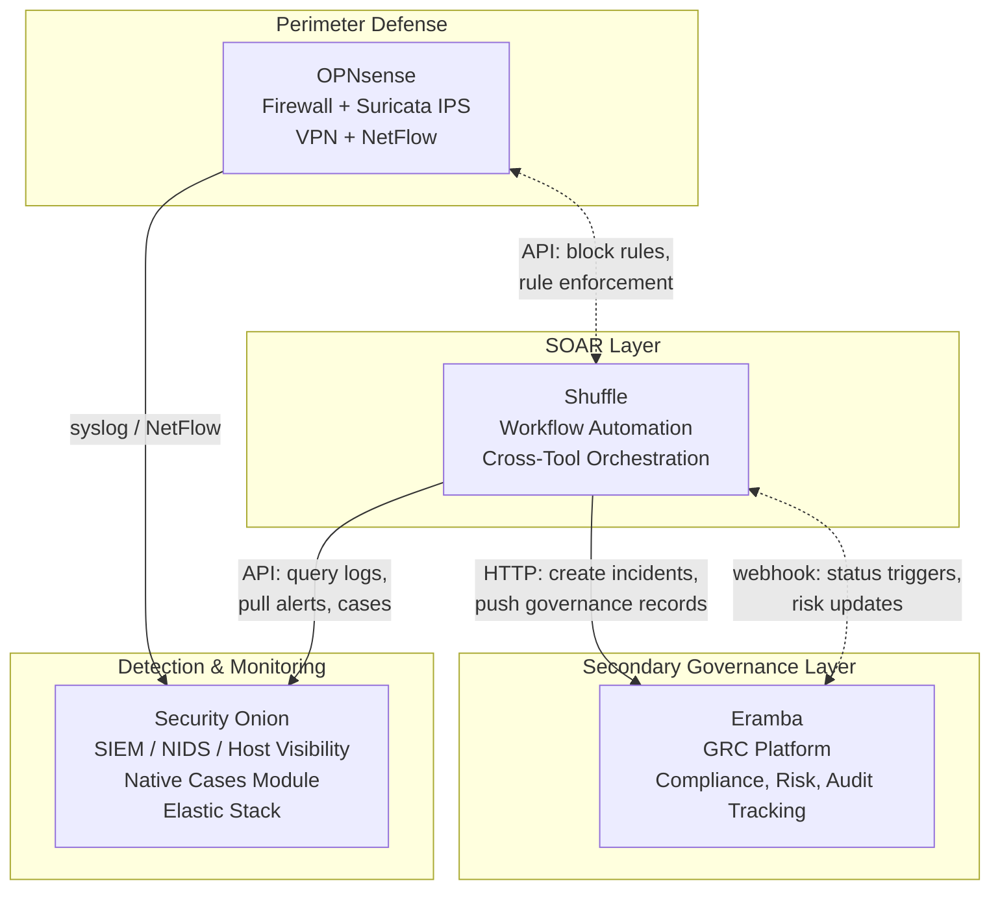
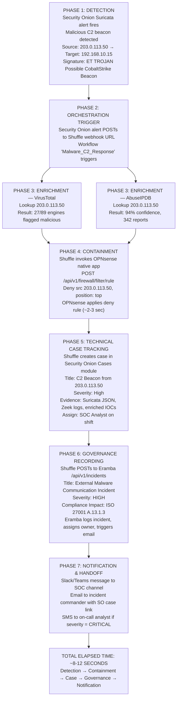

# Open-Source Security Infrastructure: OPNsense + Security Onion + Shuffle + Eramba

## 1. Architecture Overview

This stack spans three operational layers with Shuffle acting as the orchestration and automation glue binding them together:

| Layer | Tool | Role | Priority |
|-------|------|------|----------|
| Perimeter Defense | OPNsense | Firewall, routing, IDS/IPS, VPN, threat intelligence | Primary |
| Detection & Monitoring | Security Onion | SIEM, NIDS, host visibility, full packet capture, case management | Primary |
| Orchestration & Automation | Shuffle | SOAR, workflow automation, cross-tool orchestration | Orchestration Layer |
| Governance & Compliance | Eramba | GRC, policy management, risk register, compliance mapping | Secondary |

OPNsense and Security Onion form the operational core. Shuffle provides the automation and response plumbing. Eramba sits separately as a governance interface that consumes evidence when formal compliance or risk management is in scope.

## 2. Component Deep Dive

### 2.1 OPNsense: Perimeter & Network Security

OPNsense (version 26.1 "Witty Woodpecker", released January 2026) is an open-source firewall and routing platform built on FreeBSD. It controls what enters and leaves the network and feeds telemetry downstream.

**Capabilities in the stack:**

- **Stateful firewall & NAT:** Zone-based segmentation (LAN, DMZ, management), traffic filtering, address translation.
- **Inline IDS/IPS via Suricata:** Signature-based intrusion prevention on gateway interfaces. Rule sets can be managed locally or synced from Security Onion.
- **Threat intelligence integration:** Q-Feeds plugin pulls curated threat-intelligence feeds directly into firewall rules, enabling automated blocking of known-bad IPs and domains.
- **VPN:** WireGuard and IPsec/IKEv2 for remote access and site-to-site connectivity.
- **NetFlow export:** Connection metadata exported to Security Onion, complementing Zeek's protocol-level metadata.
- **Syslog forwarding:** All firewall events, rule hits, and IPS alerts forwarded to Security Onion for centralised logging.
- **REST API:** Near-complete MVC/API experience in 26.1, enabling programmatic configuration and automated response actions via Shuffle.

> **Deployment notes:** Runs on dedicated hardware or as a virtual appliance. The 26.1 SFTP backup plugin enables automated configuration backups to a remote server.

### 2.2 Security Onion: Detection, Hunting & Log Management

Security Onion (version 3.x, released March 2026) is a free, open-source platform for threat hunting, enterprise security monitoring, and log management. It is the operational centre — everything flows here for analysis and investigation.

**What's actually in Security Onion 3.x:**

| Function | Technology | Notes |
|----------|------------|-------|
| Network Intrusion Detection | Suricata | Signature-based NIDS that also handles full packet capture |
| Protocol Metadata | Zeek | Rich connection logs: DNS, TLS certificates, HTTP, file transfers, SMB, Kerberos, etc. |
| File Analysis | Strelka | File extraction and analysis for files observed traversing the network |
| Host Visibility | Elastic Agent + osquery + SysMon (Windows/Linux) | Provides log collection, live queries via osquery, and centralised management through Elastic Fleet |
| Log Management & SIEM | Elastic Stack (Elasticsearch, Logstash, Kibana) | Ingests and indexes all telemetry |
| Case Management | Native SO Cases Module | Create cases, assign analysts, attach alerts and hunt findings as evidence, track investigation status |
| Dashboards & Hunting | SO Custom Interface | Purpose-built web UI for alert review, threat hunting, and grid management |

> **Deployment notes:** Supports standalone, distributed, and air-gap deployments. Storage remains the biggest concern: NSM data (especially full packet capture) is storage-hungry. Budget for terabyte-class NVMe or SSD on sensor and search nodes.

### 2.3 Shuffle: Security Orchestration, Automation & Response

Shuffle is an open-source SOAR platform that sits as the orchestration layer between detection (Security Onion), enforcement (OPNsense), and governance (Eramba). It automates repetitive security tasks, orchestrates incident response workflows, and integrates security tools to reduce analyst toil.

**Key capabilities in the stack:**

- **Workflow Builder:** Drag-and-drop visual workflow designer. Each step represents an action against a connected tool (query Elastic logs, block an IP at the firewall, create a ticket).
- **Native Apps:** Pre-built integrations for common security tools. In this stack:
  - Security Onion API: Query Elastic logs, pull alerts, interact with cases
  - OPNsense API: List/create/modify/delete firewall rules, block/unblock IPs, retrieve system status
- **HTTP Request Action:** Generic capability for any REST API without a pre-built app. Used for Eramba integration (no native app exists)
- **Webhook Triggers:** External systems (Security Onion alerts, OPNsense events, Eramba status changes) can POST to a Shuffle webhook URL to kick off a workflow
- **Self-Hostable:** Open-source Docker deployment, minimal resource footprint (2 vCPU, 4GB RAM adequate for small instances)

**Positioning:** Shuffle does not replace Security Onion's case management. Instead, it orchestrates around it, enriching alerts before they become cases, taking automated response actions (firewall blocks, isolations), and passing governance artefacts to Eramba. It sits between the operational pipeline and the governance layer, enabling closed-loop automation.

**Common use cases in this stack:**

- Alert-triggered firewall blocking (suricata alert → block src IP at OPNsense)
- Observable enrichment (extract IPs/domains from alert → query VirusTotal/AbuseIPDB → append results to Eramba incident)
- Cross-tool incident synchronisation (create Security Onion case → create Eramba incident record → Slack/Teams notification)
- Scheduled risk reviews (cron-triggered workflow → audit Eramba risk register → report to leadership)

### 2.4 Eramba: Governance, Risk & Compliance (Secondary Layer, under review)

Eramba is an open-source GRC platform available in Community (free) and Enterprise (paid) editions. Positioned as a secondary layer, it is not part of the detection or response pipeline but serves organisations with formal compliance, audit, or risk management obligations.

**What Eramba does:**

- **Policy & Control Management:** Define security policies, map to technical controls, track implementation.
- **Risk Register & Scoring:** Assets, structured risk assessments with scoring, owners, mitigation tracking.
- **Compliance Mapping:** ISO 27001, PCI-DSS, SOC 2, GDPR, DORA packages. Maps controls to framework requirements, tracks gaps.
- **Incident Management (Organisational):** Tracks incidents from a governance perspective (regulatory notification obligations, business impact, remediation tracking) rather than technical investigation.
- **Audit Management:** Schedule audits, collect evidence, track findings, manage remediation timelines.
- **Vendor / Third-Party Risk:** Supplier security assessments and tracking.
- **Executive Reporting:** Risk heatmaps, compliance status dashboards, KPI trends for leadership.

> **The distinction:** Security Onion's case module tracks technical investigations. Eramba tracks the organisational record. These are different audiences with different needs.

## 3. Integration Architecture

### 3.1 OPNsense → Security Onion (Primary Logging Path)

Three documented integration paths:

**Path 1: Syslog Forwarding**

- **OPNsense side:** System → Settings → Logging, enable "Remote syslog server," enter Security Onion sensor IP, port 514 (UDP/TCP), select log format, ensure "Log firewall events" is checked.
- **Security Onion side:** syslog-ng listens on port 514 by default. Logs appear in Kibana tagged with OPNsense source.

**Path 2: NetFlow Export**

OPNsense exports NetFlow to Security Onion, providing connection metadata from the gateway perspective complementary to Zeek's protocol-level metadata.

**Path 3: Suricata Rule Sharing**

OPNsense's inline Suricata can pull NIDS rules from Security Onion's management interface. Alerts generated on OPNsense forward back to Security Onion via syslog for correlation.

### 3.2 Security Onion → Shuffle (Alert Triggering)

Two primary patterns:

**Pattern 1: Webhook from Security Onion Alerts**

1. Create a Shuffle workflow with a Webhook Trigger step
2. Shuffle generates a public HTTPS URL
3. Configure Security Onion alert rules to POST to that URL when matched
4. Workflow begins executing on each alert arrival

**Pattern 2: Polling via Security Onion API App**

1. Use the native Security Onion API app in Shuffle workflows
2. Authenticate with SO API credentials
3. Query Elastic logs, pull alerts, or trigger hunts programmatically
4. Useful for scheduled polling jobs rather than real-time webhook delivery

### 3.3 Shuffle ↔ OPNsense (Response Actions)

**Native App Integration:**

Shuffle includes a native OPNsense API app:

- Authentication via API key
- Pre-built actions: list/create/modify/delete firewall rules, block/unblock IPs, retrieve system status
- No middleware required — the app handles request formatting

**Workflow pattern:**

1. Security Onion alert fires → Shuffle webhook URL
2. Shuffle workflow triggers
3. Shuffle calls OPNsense API to add a deny rule blocking the malicious source
4. Notification sent to analyst team with confirmation

### 3.4 Shuffle ↔ Eramba (Governance Bridge)

**Generic HTTP Request Pattern:**

No native app exists, but both platforms are API-first:

1. Generate API token in Eramba (Settings → API)
2. In Shuffle, add an HTTP Request step to your workflow
3. Set header: `Authorization: Bearer <your_eramba_token>`
4. POST to Eramba endpoints like `/api/v1/incidents` with JSON payload matching Eramba's schema

**Webhook Outbound from Eramba:**

Eramba can send webhooks based on status triggers:

1. Configure Eramba notifications/statuses to fire on conditions (e.g., new risk created, project status updated)
2. Set notification type to "Send REST call" pointing to Shuffle webhook URL
3. Shuffle receives the webhook and triggers corresponding workflow

**Data Model Mapping:**

The main effort lies in mapping Eramba's JSON schema for incidents, risks, and assets to your Shuffle workflow variables. Eramba documents this in their learning portal under "Send REST APIs (Webhooks)."

## 4. Complete End-to-End Workflow Example

Here's a realistic automated playbook spanning all four tools:

> This workflow demonstrates Shuffle's role as the orchestration layer: Security Onion detects, Shuffle enriches and responds, OPNsense enforces, and Eramba records for governance purposes.

## 5. Deployment Considerations

### Sizing & Hardware

| Component | Small Org / Lab | Mid-Size Production |
|-----------|-----------------|---------------------|
| OPNsense | 4 vCPU, 4GB RAM, 60GB disk | 8 vCPU, 8GB RAM, SSD |
| Security Onion (standalone) | 8 vCPU, 16GB RAM, 500GB NVMe | — |
| Security Onion (distributed) | — | Manager: 8 vCPU/16GB; Search nodes: 8 vCPU/32GB/2TB+ NVMe each; Sensors: 4-8 vCPU/16GB + capture NICs |
| Shuffle | 2 vCPU, 4GB RAM, 40GB disk | 4 vCPU, 8GB RAM, SSD |
| Eramba | 2 vCPU, 4GB RAM, 40GB disk | 4 vCPU, 8GB RAM, SSD-backed MySQL |

### Network Design

- **SPAN/Mirror ports:** Security Onion sensor interfaces connect to mirror ports at network chokepoints.
- **Management network:** Dedicated management VLAN for admin interfaces, segmented behind OPNsense.
- **API accessibility:** Ensure Shuffle can reach OPNsense API (port 443) and Eramba API (port 443/80) from its deployment location.
- **Out-of-band access:** Maintain fallback path to reach OPNsense and Security Onion manager if primary network is compromised.

### Security Hardening

- Two-factor authentication on all administrative interfaces (OPNsense, Security Onion, Shuffle, Eramba).
- Certificate-based mutual TLS for API communication between tools (particularly important for Shuffle↔OPNsense automated actions).
- Deploy Elastic Agents on the OPNsense appliance and the Eramba server for host-level monitoring — Security Onion can watch the security infrastructure itself.
- Automate OPNsense config backups using the 26.1 SFTP backup plugin to an off-box, encrypted destination.
- Restrict Shuffle webhook URLs to authenticated sources where possible; implement rate limiting on webhook endpoints.

## 6. Strengths & Limitations

### Strengths

- Entirely open-source with optional enterprise tiers — no vendor lock-in, predictable costs.
- Comprehensive coverage: perimeter defense, detection, automation, case management, and governance.
- Shuffle eliminates point-to-point integration complexity — one orchestration layer connecting all tools.
- API-driven automation throughout: OPNsense REST API, Security Onion API app, Shuffle generic HTTP for Eramba.
- Scales from homelab to mid-sized enterprise with distributed deployments.
- No manual intervention needed for routine containment actions (auto-blocking known-bad IPs, disabling compromised accounts).

### Limitations

- No unified installer. Integration requires manual configuration and development effort.
- Shuffle+Eramba integration is not turn-key as it requires reading Eramba API docs and crafting JSON payloads manually.
- Storage demands remain significant for Security Onion full packet capture — budget accordingly.
- Requires in-house expertise across FreeBSD networking (OPNsense), Linux/ELK administration (Security Onion), workflow automation (Shuffle), and GRC processes (Eramba).
- Eramba Community edition lacks some automation features (notifications, custom fields) available only in Enterprise.

## 7. Phased Deployment Plan

### Phase 1: Perimeter

Deploy OPNsense as perimeter firewall. Configure zones, firewall rules, NAT, and VPN. Enable Suricata with Emerging Threats rules. Set up SFTP backup plugin. Enable syslog forwarding to a temporary collector so logs start accumulating for later ingestion.

### Phase 2: Detection & Monitoring

Deploy Security Onion 3.x — start with standalone or evaluation node. Configure a SPAN port from core switch. Verify Zeek and Suricata are capturing and analysing traffic. Point OPNsense's syslog forwarding at Security Onion sensor. Validate that firewall logs, NIDS alerts, and Zeek metadata appear in Kibana. Deploy Elastic Agents to pilot endpoints and test osquery live queries. Configure alert rules and notification thresholds.

### Phase 3: Operational Tuning

Tune Suricata rules to reduce false positives. Build Kibana dashboards tailored to your environment. Train analysts on the hunting interface and case management workflow. Establish detection content lifecycle: how new rules are tested, deployed, and retired.

### Phase 4: SOAR Layer

Install Shuffle. Configure the native Security Onion API app and OPNsense API app. Build initial workflows:

- Enrichment playbook (alert → VirusTotal/AbuseIPDB → decision node)
- Blocking playbook (confirmed IOC → OPNsense deny rule)
- Notification playbook (critical alert → Slack/email/SMS)

Test end-to-end with simulated alerts before going live.

### Phase 5: Governance Layer

Install Eramba Community edition. Import your compliance framework (ISO 27001 is a good starting point). Map existing OPNsense firewall policies and Security Onion detection coverage to controls in Eramba. Build Shuffle→Eramba HTTP workflows to push incident records into the GRC system. Begin populating the risk register and tracking mitigation activities.

### Phase 6: Advanced Automation (Ongoing)

Develop more sophisticated workflows combining multiple tools:

- Multi-stage enrichment chains (external threat intel + internal log correlation)
- Risk-based firewall tuning (when Eramba risk score increases → tighten OPNsense rules)
- Compliance validation sweeps (scheduled audit workflow pulling evidence from Security Onion, OPNsense configs, and Eramba control mappings)
- Automated remediation playbooks (endpoint isolation via network ACL, credential resets, malware scanning)

## 8. Summary

This architecture gives us enterprise-grade capability across the full security spectrum using entirely open-source tools:

| Question | Answer |
|----------|--------|
| Does this handle detection? | Yes. Security Onion's Suricata, Zeek, and Elastic Agents cover network and host visibility. |
| Does this handle prevention? | Yes. OPNsense with inline Suricata IPS, Q-Feeds threat intelligence, and rule-based firewalling. |
| Does this handle response? | Yes. Shuffle provides orchestration for automated containment (blocking, isolation, notifications). |
| Does this handle case management? | Yes. Security Onion's native Cases module replaces TheHive for operational incident tracking. |
| Does this handle compliance? | Yes. Eramba handles compliance using the framework of choice. |
| Is there vendor lock-in? | No. Every component is open-source with enterprise tiers available for commercial support if needed. |

The main investment is time and expertise in configuring integrations and building workflows. Once operational, this stack provides a cohesive security platform spanning prevention through governance with minimal ongoing licensing costs.
