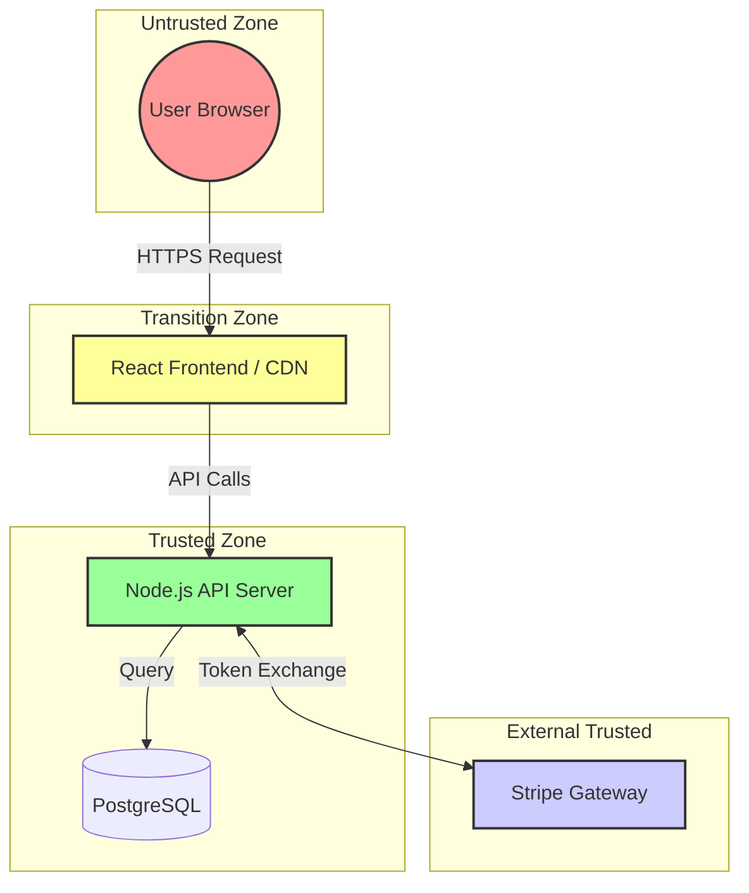

# Task 0 - E-commerce Platform

Threat modeling of an e-commerce platform where users can:
- Browse products (no authentication required)
- Add items to cart (no authentication required)
- Checkout and pay (authentication required)
- View order history (authentication required)

The system architecture includes:
- React frontend
- Node.js API backend
- PostgreSQL database
- Stripe payment integration

## Questions

### 1. Identify three STRIDE threats for the checkout process. For each threat, specify:
- STRIDE category
- Threat description
- Potential impact
- Suggested mitigation

### 2. What trust boundaries exist in this system? Describe at least three.

### 3. Rate the threat of SQL injection in the product search functionality using DREAD (provide scores for each factor and justify them).

---

## 1. STRIDE Threat Analysis: Checkout Process

The checkout process represents the critical convergence of authentication, financial data, and inventory logic. Below are three high-priority threats identified using the STRIDE methodology.

### Threat A: Price Tampering via Client-Side Manipulation

| Attribute | Details |
| :--- | :--- |
| **STRIDE Category** | **Tampering** |
| **Threat Description** | An attacker modifies the `price` or `quantity` fields in the request payload sent from the React frontend to the Node.js API. If the backend blindly trusts client-supplied pricing instead of recalculating it server-side, the attacker can purchase items for a fraction of their cost. |
| **Attack Scenario** | 1. Attacker adds a \$100 laptop to the cart. 2. Intercepts the POST request to `/api/checkout` via browser DevTools or Burp Suite. 3. Changes `"unit_price": 100.00` to `"unit_price": 1.00`. 4. Backend processes the order at \$1.00 without validation against the database. |
| **Impact** | Direct financial loss; inventory discrepancies; potential fraud triggering payment processor bans. |
| **Likelihood** | **Medium**. Requires basic HTTP manipulation skills but is a frequent oversight in rapid development cycles. |
| **Mitigation** | **Server-Side Validation Only.** The Node.js API must ignore the `price` field sent by the client. Instead, it must query the PostgreSQL database for the current price of each product ID and calculate the total internally.  **Code Example:** `const dbPrice = await db.query('SELECT price FROM products WHERE id = ?', [productId]);` `if (Math.abs(dbPrice - requestPayload.price) > 0.01) throw new Error('Price mismatch');` |

### Threat B: Session Hijacking during Payment Handoff

| Attribute | Details |
| :--- | :--- |
| **STRIDE Category** | **Information Disclosure** (leading to Impersonation) |
| **Threat Description** | Attackers intercept session tokens (JWT or cookies) during the transmission between the user and the server. If TLS is misconfigured or tokens are stored insecurely, attackers can steal credentials to impersonate users. |
| **Attack Scenario** | 1. User accesses the site on a public Wi-Fi network with a compromised router. 2. Attacker performs a Man-in-the-Middle (MitM) attack. 3. Captures the `Authorization: Bearer <token>` header from the checkout request. 4. Uses the stolen token to finalize the purchase or view sensitive order history as the victim. |
| **Impact** | Unauthorized financial transactions; identity theft; privacy violations regarding purchase history. |
| **Likelihood** | **Low to Medium**. Modern HTTPS mitigates this, but risks increase with weak HSTS configurations or mixed content errors. |
| **Mitigation** | Enforce **HTTP Strict Transport Security (HSTS)**. Ensure all cookies have `Secure`, `HttpOnly`, and `SameSite=Strict` attributes. Implement short-lived JWTs with rotation and bind tokens to specific user-agent fingerprints or IP ranges where feasible. |

### Threat C: Race Condition in Inventory Deduction

| Attribute | Details |
| :--- | :--- |
| **STRIDE Category** | **Repudiation** / **Elevation of Privilege** |
| **Threat Description** | A race condition occurs when two concurrent requests attempt to purchase the last unit of an item simultaneously. Both requests pass the stock check before either updates the database, resulting in overselling. |
| **Attack Scenario** | 1. Only 1 unit of a limited-edition sneaker remains. 2. Attacker sends two identical checkout requests milliseconds apart. 3. Both requests read `stock = 1`. 4. Both proceed to charge the customer. 5. System attempts to fulfill two orders for one item, forcing cancellations. |
| **Impact** | Operational disruption; financial reconciliation costs; loss of customer trust due to order cancellations. |
| **Likelihood** | **Medium**. High during flash sales or limited drops without proper concurrency controls. |
| **Mitigation** | Use **Database-Level Locking** in PostgreSQL. Implement atomic updates: `UPDATE products SET stock = stock - 1 WHERE id = ? AND stock > 0`. If the affected row count is 0, reject the transaction immediately. |

---

## 2. Trust Boundaries

Trust boundaries define where data transitions from untrusted to trusted zones. In your architecture, these are the critical inspection points.

### Boundary 1: Public Internet ↔ Frontend (React App)
*   **Description:** The interface between the external user's browser and the serving layer (CDN/Web Server).
*   **Trust Level:** **Untrusted**. The user controls this environment entirely.
*   **Security Implication:** No security logic should reside here. JavaScript can be modified, blocked, or bypassed. All inputs originating here are considered hostile until validated downstream.

### Boundary 2: Frontend ↔ Backend API (Node.js)
*   **Description:** The API gateway where HTTP requests enter the application logic.
*   **Trust Level:** **Transition Zone**.
*   **Security Implication:** This is the primary enforcement point for input validation, authentication (JWT/OAuth), and authorization. Every parameter crossing this boundary must be sanitized.

### Boundary 3: Backend ↔ Third-Party Payment (Stripe)
*   **Description:** The integration point exchanging financial tokens with Stripe.
*   **Trust Level:** **External Trusted**.
*   **Security Implication:** We rely on Stripe's PCI-DSS compliance. The system handles tokens, not raw credit card numbers. Trust is maintained via TLS encryption and strict API key management.

#### Visual Representation

## 3. DREAD Risk Assessment: SQL Injection in Product Search

We will assess the threat of SQL Injection (SQLi) in the product search functionality (`GET /api/products?query=...`).

### DREAD Formula

$$ \text{Risk} = \frac{\text{Damage Potential} + \text{Reproducibility} + \text{Exploitability} + \text{Affected Users} + \text{Discoverability}}{3} $$

*(Note: Some interpretations sum to 15 or average to 5. We will calculate the average score out of 10 for clarity, as per standard industry practice where each factor is 1–10.)*

### Factor Scoring & Justification

**Damage Potential (9/10):**
- **Justification:** A successful SQLi on the product search could allow an attacker to read the entire `products` table, but more critically, if the search query joins with other tables or if the DB user has excessive privileges, they could access user data (`users` table), order history, or even modify/drop tables (Denial of Service). Since this is a core search function, the blast radius is large.

**Reproducibility (8/10):**
- **Justification:** If the vulnerability exists, it is highly reproducible. An attacker only needs to craft a string containing SQL syntax (e.g., `' OR '1'='1`) and submit it. It does not require complex timing or race conditions.

**Exploitability (7/10):**
- **Justification:** The search function is public (no auth required). Tools like SQLmap can automate exploitation almost instantly. However, modern Node.js ORM libraries (like Sequelize or TypeORM) often parameterize queries by default. If the code uses raw strings (`query: SELECT * FROM products WHERE name LIKE '${userInput}'`), exploitability is near maximum. Assuming a standard web application without WAF protections specifically tuned for SQL patterns, 7 is a fair assessment.

**Affected Users (10/10):**
- **Justification:** The product search is accessible to every user of the site, including anonymous visitors. There is no barrier to entry. Any breach impacts the availability and integrity of the catalog for all customers.

**Discoverability (10/10):**
- **Justification:** The search endpoint is a primary feature of an e-commerce site. It is obvious to attackers where to target. The input vector (search bar) is visible and interactive.

### Calculation

$$ \text{Average Score} = \frac{9 + 8 + 7 + 10 + 10}{5} = \frac{44}{5} = \mathbf{8.8} $$

**Risk Rating: Critical (8.8/10)**

### Conclusion & Recommendation

With a score of 8.8, this is a critical priority. The combination of zero authentication requirements (high discoverability/exploitability) and high potential data exposure (damage) makes this a severe risk.

- **Immediate Action:** Ensure the Node.js backend uses parameterized queries (prepared statements) exclusively. Never concatenate user input into SQL strings.
- **Secondary Defense:** Implement a Web Application Firewall (WAF) rule set (e.g., OWASP Core Rule Set) to detect and block common SQLi payloads.
- **Least Privilege:** Ensure the PostgreSQL user account used by the Node.js app has `SELECT` permissions only on necessary tables, preventing `DROP` or `INSERT` commands even if injection occurs.

### References

- **OWASP Top 10 (A03:2021 - Injection):** https://owasp.org/www-project-top-ten/
- **STRIDE Threat Modeling Guide:** https://learn.microsoft.com/en-us/previous-versions/bb936563(v=msdn.10)
- **DREAD Model Original Context:** Microsoft SDL
