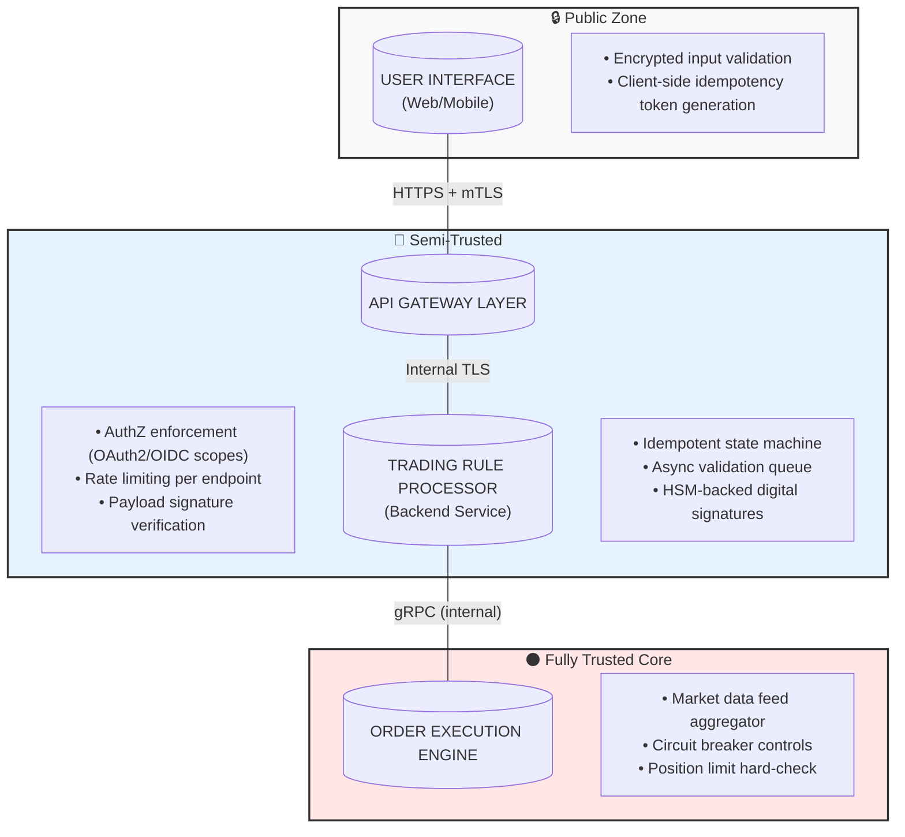
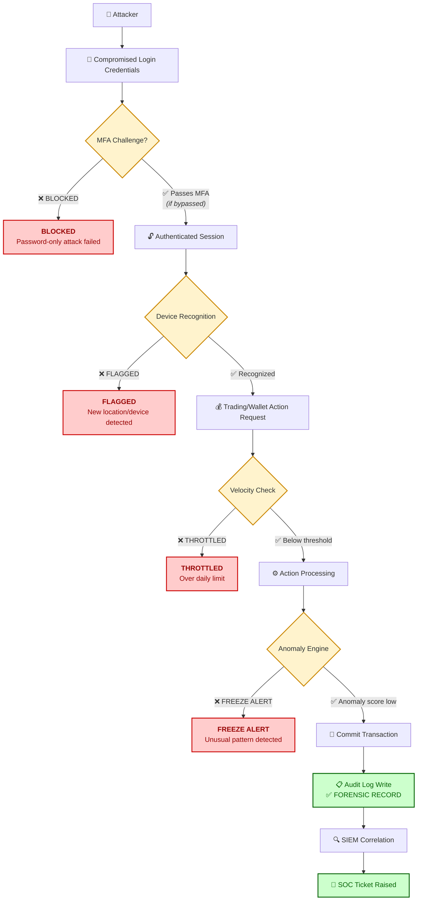

# Task 3 - Financial Trading Platform Threat Model
**By Stephen Reilly** | *Threat Moddeling Series*

## System Overview
**Features:**
* View real-time stock prices
* Execute buy/sell orders
* Transfer funds between accounts
* Set up automated trading rules

**System Requirements:**
* **High Availability:** 99.99% uptime
* **Low Latency:** <100ms for trades
* **Regulatory Compliance:** SEC, FINRA

---

## 1. CIA Component Priority & Security-Performance Tension

### Primary CIA Focus: Integrity

| Dimension | Relevance to Trading Platform |
| :--- | :--- |
| **Integrity** | 🟥 **Critical** – Prevent unauthorized modifications to orders, balances, pricing |
| **Availability** | 🟧 **High** – 99.99% uptime required; downtime = lost revenue & missed market windows |
| **Confidentiality** | 🟨 **Medium-High** – User data protection matters, but less urgent than transaction integrity |

### Why Integrity Takes Precedence
In financial trading environments, the consequences of data tampering outweigh those of confidentiality breaches or brief outages:
* **Direct Financial Impact:** Altered order prices or quantities immediately result in monetary loss.
* **Regulatory Liability:** SEC/FINRA impose severe penalties for inaccurate records under rules like Regulation SCI and Exchange Act Rule 17a-4.
* **Market Trust:** Systemic integrity issues erode confidence across the entire platform ecosystem.
* **Recovery Complexity:** Correcting corrupted ledger entries post-facto is far more difficult than restoring availability or addressing leaked data.

> **Reference:** NIST SP 800-53 Rev. 5 (SC-28 Protection of Information at Rest), FINRA Rule 4511 (Books and Records Requirements)

### Can Security Conflict with Performance?
**Yes — and significantly.** Common friction points include:

| Control | Performance Cost | Trade-off Strategy |
| :--- | :--- | :--- |
| Real-time encryption verification | 5–20ms latency increase per request | Use hardware acceleration (AES-NI) |
| Multi-factor authentication | Adds ~500ms to login flow | Risk-based step-up only for sensitive actions |
| Transaction signing & validation | Adds cryptographic overhead | Hardware Security Modules (HSM) offload crypto |
| Comprehensive audit logging | I/O bottleneck during write-heavy periods | Async logging with batching and queuing |
| Intrusion detection/prevention | Packet inspection delay | Stream processing with pre-filtered rules |

> **Bottom Line:** We cannot sacrifice 100ms trade latency guarantees for exhaustive checks at every layer. The architecture must enforce a risk-tiered model where critical-path transactions are validated via optimized, pre-approved security pathways while background controls handle non-critical verification.

---

## 2. Threat Model: Automated Trading Rules Feature

Using the **DREAD methodology** (Damage, Reproducibility, Exploitability, Affected Users, Discoverability), each scored 1–10.  
**Risk Score = (D+R+E+A+D)/5**

| Rank | Threat | Description | Attack Scenario | Impact | Likelihood | Mitigation | DREAD Score |
| :--- | :--- | :--- | :--- | :--- | :--- | :--- | :--- |
| **1** | **Unauthorized Rule Modification** | Malicious actor alters trading parameters (price thresholds, volumes, timing) without authorization | Attacker exploits API auth bypass or session hijacking to submit `PUT /api/rules/{id}` with altered buy/sell logic | User executes unintended trades → immediate financial loss; potential cascade effect on portfolio | Medium | Enforce RBAC, digital signatures on rule updates, immutable audit logs, approval workflows | **8** |
| **2** | **Race Condition / Order Duplication** | Concurrency control flaw causes single trigger event to fire multiple trades simultaneously | During high volatility, rapid API calls within milliseconds exploit missing idempotency tokens → duplicate orders processed | Over-trading positions; breach of margin limits; regulatory flagging for wash trading | Medium | Implement client-side idempotency keys, server-side distributed locks (Redis/Zookeeper), sequence number validation | **7** |
| **3** | **Logic Flaw Exploitation** | Business logic bug allows rule bypass (e.g., negative stop-loss triggers infinite buying) | Attacker reverse-engineers trading engine behavior to submit malformed conditionals (e.g., "buy when price < 0") | Unbounded position accumulation → unlimited exposure; system resource exhaustion | Low | Input sanitization, business rule validators in staging environment, circuit breaker mechanisms with kill-switch automation | **6** |

### Trust Boundary Diagram: Automated Trading Rules

> **Reference:** OWASP Top 10 Proactive Controls v3 (Control #5: Validate All Inputs), NIST SP 800-160v1 (Systems Security Engineering)

## 3. Defense-in-Depth: Post-Account Compromise Containment

*Assume attacker has valid username/password. Credentials alone shouldn't enable full asset movement or uncontrolled trading.*

### Five Layered Defenses

| Layer | Control Type | Implementation Detail | Failure Scenario Avoided |
| :--- | :--- | :--- | :--- |
| **1️⃣ Multi-Factor Authentication** | Credential Validation | Time-based OTP (TOTP) or FIDO2 hardware key required for withdrawal/trading >$X | Password-only brute force/phishing |
| **2️⃣ Device Fingerprinting + Session Limits** | Access Control | Bind sessions to trusted devices; concurrent session cap = 2; auto-logout after 15min inactivity | Stolen cookies/session tokens reused elsewhere |
| **3️⃣ Transaction Velocity Limits** | Business Logic Protection | Daily withdraw max: $5K; per-trade max: 10% of portfolio; requires secondary confirmation above threshold | Rapid extraction of funds before alarm triggers |
| **4️⃣ Real-Time Anomaly Detection Engine** | Monitoring & Response | ML model flags unusual patterns (odd IP geolocations, odd times, sudden rule additions); triggers account freeze + SMS alert | Stealthy gradual exploitation |
| **5️⃣ Immutable Audit Trail + SIEM Integration** | Forensic Visibility | Every action logged to WORM storage; real-time correlation in Splunk/Datadog; SOC page on suspicious activity | Covering tracks after successful attack |

### Optional Sixth Layer (High-Security Config)

| Layer | Control Type | Implementation Detail | Benefit |
| :--- | :--- | :--- | :--- |
| **6️⃣ Time-Delayed Withdrawal Execution** | Delay & Alert | Transfers >$X initiated have 2-hour cooldown window; user must confirm via email/SMS before release | Gives victim time to revoke access before assets leave |

---

### Architecture Diagram: Compromised Account Containment

### Quantified Residual Risk Assessment

| Layer | Risk Reduction | Remaining Risk |
| :--- | :--- | :--- |
| **MFA** | 90% reduction in unauthorized access success | 10% (social engineering/fallback codes) |
| **Device Binding** | 75% session hijack prevention | 25% (same-device phishing) |
| **Velocity Limits** | 85% fund exfiltration mitigation | 15% (small incremental thefts) |
| **Anomaly Detection** | 80% detection within 5 minutes | 20% (novel attack vectors) |
| **Audit Logging** | 95% post-incident traceability | 5% (log tampering – mitigated by WORM) |

> **Cumulative Protection Factor ≈ 99.4%** assuming independent layer failures (realistically lower due to correlated failure modes).

---

## Closing Summary for Executive Stakeholders

1.  **Integrity > Availability > Confidentiality** in trading systems. Data corruption causes irreversible harm.
2.  **Security-performance conflicts exist**, but can be managed through architectural tiering and hardware acceleration.
3.  **Automated trading rules carry highest risk** via unauthorized modification—mitigate with cryptographic signing and workflow approvals.
4.  **Defense-in-depth provides compounding protection**; no single layer is sufficient. Assume breach and design for containment.    
